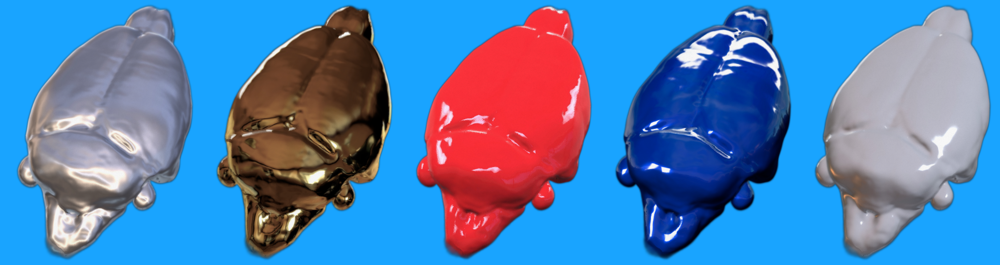

# A collaborative rat functional MRI multi-center study.
A Rat fMRI multi-center study
*updated 2021_06_22*

### Executive summary
In this international collaborative project, we seek to gather the rodent imaging community toward performing a rat fMRI multi-center comparison, within the same template as Grandjean et al. NIMG 2020. We want to examine functional connectivity (FC) parameter distribution at the population level within key networks (somatosensory and default-mode network) of the rat brain, as well as establish connectivity sensitivity and specificity in the collected datasets. To do so, we will gather rat BOLD fMRI datasets from individual labs (n=10, any protocol).
In a desire to push further, we seek to obtain additional datasets pertaining to within-laboratory **test-retest** (i.e. scans that were collected in the same control animals within a period of 6 months or less), as well as datasets in **sensory-stimulation** fMRI (limb or whisker stimulation). Finally, we would like to organize a standardized data collection arm of this study for laboratories interested. This would include the **de-novo acquisition** of a dataset (n=10) using predefined, mutually-agreed, and standardized parameters consistent across all participating laboratories.
The end-goal is to make this as an available resource to researchers and to publish an extensive description of the collective dataset in a peer-reviewed journal.  

### Goal
1. To provide a large rat fMRI collective dataset  
2. To describe reference population parameters distributions (e.g. FC, motion, SNR) 
3. To provide evidence-based recommendations for rat fMRI acquisition 
4. To foster collaborations and discussion within the community  
5. Demonstrate test-retest reliability  
6. Investigate the human-factor variability during data acquisition using a standardized protocol.   
7. Organize an international seminar on rodent data standardization at the Donders Institute (NWO Scientific Meetings and Consultations 8. Domain Science) 

### Deliverables
* OSF.io preregistered study
* Publicly available collective dataset on openneuro.org consisting of individual lab dataset
* Publicly available code to replicate the study on github.com
* Bioarxiv preprint
* Journal publication
* Symposium on rodent fMRI standards held at the Donders Institute (if funding is available and COVID permit)

### Analysis
[1. Environment preparation](scripts/proj_env.ipynb)  
[2. Asset preparation](scripts/proj_asset.ipynb)  
[3. Dataset description](scripts/proj_dataset.ipynb)   
[4. Preprocessing code](scripts/proj_preprocessing.md)   
[5. Quality control](scripts/proj_qa.ipynb)   
[6. Analysis tSNR and motion](scripts/proj_analysis_snr.ipynb)  
[7. Analysis seed-based analysis](scripts/proj_analysis_sba.ipynb)    
8. Analysis ica analysis    
[9. Analysis stimulus evoked](scripts/proj_analysis_stim.ipynb)    

### Links
[License and permissions](LICENSE.md)  
[Collaborative model and project details](scripts/proj_detail.md)  
[Preregistration DOI: 10.17605/OSF.IO/EMQ4B](https://osf.io/emq4b)  
[Lab webpage](https://grandjeanlab.github.io/)  
[Twitter](https://twitter.com/grandjeanlab)  

### Useful toolboxes
[RABIES](https://github.com/CoBrALab/RABIES), rodent fMRI preprocessing and analysis   
[BkrRaw](https://github.com/BrkRaw/bruker), convert bruker data to [BIDS](https://bids.neuroimaging.io/) format  
[SIGMA template](https://www.nature.com/articles/s41467-019-13575-7)   
[SAMRI](https://github.com/IBT-FMI/SAMRI), another rodent fMRI preprocessing pipeline   
[nirodent](https://github.com/nipreps/nirodents), a toolbox for rodent MRI processing   

### Deviations from preregistration
11.12.2020 - Use SIGMA template instead of WHS  
11.04.2021 - Changed analysis to Python   
11.04.2021 - Analysis using tSNR instead of SNR, because former is readily output in RABIES.  
11.04.2021 - reduced number volumes -> 1200 for ds 1001 (too long preprocessing time)   
11.04.2021 - cropped FOV for ds 1029, 1030, 1036 (improve registrations)   
12.04.2021 - Reduced number of seeds to S1bf, MOp, CPu, ACA because not all dataset had coverage along A-P axis, and this seemed to cause RABIES crashes. (spoiler, it wasn't the reason)    
06.06.2021 - cropped FOV for ds 1023, 1038, 1039   
22.11.2021 - added dataset 01051 even though it lacked anatomicals. Generated pseudo-anatomicals using motion-corrected temporally averaged EPI. 
09.12.2021 - cropped FOV for sub-0100106, sub-0100107, sub-0100108, sub-0100109, sub-0100306, sub-0100400, sub-0100401, sub-0100404, sub-0100505, sub-0100602, sub-0100603, sub-0100608, sub-0100805   
12.12.2021 - replaced T1 anat with motion-corrected temporally averaged EPI for ds 1021. cropped FOV for ds 1015, 1017, 1021, 1031, 1043, 1044, 1048, 1050. Additionally cropped FOV for  sub-0101007, sub-0101202, sub-0101305, sub-0101307, sub-0101309, sub-0101607, sub-0101608, sub-0102203, sub-0102303, sub-0102306, sub-0102307, sub-0102502, sub-0102600, sub-0102601, sub-0102605, sub-0102708, sub-0103004, sub-0103006, sub-0103409, sub-0103700, sub-0103801, sub-0103906, sub-0104104, sub-0104106, sub-0104600, sub-0104601, sub-0104604, sub-0104605, sub-0105201, sub-0105206, sub-0105207,sub-0105208, sub-0105302, sub-0105303, sub-0105304, sub-0105308

