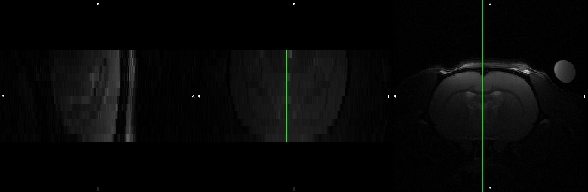

```{r setup, include=FALSE}
knitr::opts_chunk$set(echo = TRUE)
```


## Dowload and prepare the template
For this project, I will use the WHS rat template available [here](https://www.nitrc.org/projects/whs-sd-atlas).
The reference for the template is: 
Papp EA, Leergaard TB, Calabrese E, Johnson GA, Bjaalie JG (2014) "Waxholm Space atlas of the Sprague Dawley rat brain" NeuroImage 97:374-386. [doi 10.1016/j.neuroimage.2014.04.001](https://doi.org/10.1016/j.neuroimage.2014.04.001)

In this chunk, I download the template and atlas, and generate separate white (WM), gray (GM), and cerebrospinal fluid (CSF) binary maps. An additional xml file to make the atlas compatible with FSL was downloaded from this [board](https://www.nitrc.org/forum/message.php?msg_id=29057), and made available in the [assets](assets/atlas/WHS_SD_rat_atlas_v3-FSL.xml).
The final step is to downsample the templates to a workable resolution. I will use 0.1 x 0.1 x 0.1 mm3 for now. 

```{bash download template, eval=FALSE}
source bash_env.sh

mkdir -p $analysis_folder'/template'

curl https://www.nitrc.org/frs/download.php/9441/WHS_SD_rat_atlas_v2_pack.zip --output $analysis_folder'/template/WHS_SD.zip'
curl https://www.nitrc.org/frs/download.php/9746/WHS_SD_v2_white_gray_mask_clipped.nii.gz --output $analysis_folder'/template/WHS_SD_v2_white_gray_mask_clipped.nii.gz'
curl https://www.nitrc.org/frs/download.php/9748/WHS_SD_v2_brainmask_bin.nii.gz --output $analysis_folder'/template/WHS_SD_v2_brainmask_bin.nii.gz'
curl https://www.nitrc.org/frs/download.php/11404/WHS_SD_rat_atlas_v3.label --output $analysis_folder'/template/WHS_SD_rat_atlas_v3.label'
curl https://www.nitrc.org/frs/download.php/11403/WHS_SD_rat_atlas_v3.nii.gz --output $analysis_folder'/template/WHS_SD_rat_atlas_v3.nii.gz'


unzip -d $analysis_folder'/template/' $analysis_folder'/template/WHS_SD.zip' 
rm $analysis_folder'/template/WHS_SD.zip' 

fslmaths $analysis_folder'/template/WHS_SD_v2_white_gray_mask_clipped.nii.gz' -thr 1 -uthr 1 -bin $analysis_folder'/template/WHS_SD_v2_WM.nii.gz'
fslmaths $analysis_folder'/template/WHS_SD_v2_white_gray_mask_clipped.nii.gz' -thr 2 -uthr 2 -bin $analysis_folder'/template/WHS_SD_v2_GM.nii.gz'
fslmaths $analysis_folder'/template/WHS_SD_v2_white_gray_mask_clipped.nii.gz' -thr 3 -uthr 3 -bin $analysis_folder'/template/WHS_SD_v2_CSF.nii.gz'


3dresample -inset $analysis_folder'/template/WHS_SD_rat_T2star_v1.01.nii.gz' -prefix $analysis_folder'/template/WHS_SD_rat_T2star_100um.nii.gz' -dxyz 0.1 0.1 0.1 -rmode Cu
3dresample -inset $analysis_folder'/template/WHS_SD_rat_atlas_v3.nii.gz' -prefix $analysis_folder'/template/WHS_SD_rat_atlas_v3_100um.nii.gz' -dxyz 0.1 0.1 0.1 -rmode NN
3dresample -inset $analysis_folder'/template/WHS_SD_v2_brainmask_bin.nii.gz' -prefix $analysis_folder'/template/WHS_SD_v2_brainmask_bin_100um.nii.gz' -dxyz 0.1 0.1 0.1 -rmode NN
3dresample -inset $analysis_folder'/template/WHS_SD_v2_CSF.nii.gz' -prefix $analysis_folder'/template/WHS_SD_v2_CSF_100um.nii.gz' -dxyz 0.1 0.1 0.1 -rmode NN
3dresample -inset $analysis_folder'/template/WHS_SD_v2_WM.nii.gz' -prefix $analysis_folder'/template/WHS_SD_v2_WM_100um.nii.gz' -dxyz 0.1 0.1 0.1 -rmode NN
3dresample -inset $analysis_folder'/template/WHS_SD_v2_GM.nii.gz' -prefix $analysis_folder'/template/WHS_SD_v2_GM_100um.nii.gz' -dxyz 0.1 0.1 0.1 -rmode NN

```

## ROI generation
Here, I create regions-of-interest for seed-based analysis. The preregistration specifies the seeds should be 0.9 mm3 and placed on both hemispheres. It specifies the following ROIs: 
S1 barrel field area, Cingulate area, Retrosplenial area, Insula area, motor area, dorsal hippocampus, caudate putamen, amygdala, striatum, thalamus.

```{bash init ROI, eval=FALSE}
source bash_env.sh

mkdir -p $ROI
roi_name='S1bf_l'
fslmaths $template -mul 0 -add 1 -roi 33 9 237 9 134 9 0 1 $ROI$roi_name -odt int
roi_name='S1bf_r'
fslmaths $template -mul 0 -add 1 -roi 147 9 237 9 134 9 0 1 $ROI$roi_name -odt int

roi_name='ACA_l'
fslmaths $template -mul 0 -add 1 -roi 92 9 256 9 143 9 0 1 $ROI$roi_name -odt int
roi_name='RSP_l'
fslmaths $template -mul 0 -add 1 -roi 89 9 208 9 157 9 0 1 $ROI$roi_name -odt int

roi_name='AI_l'
fslmaths $template -mul 0 -add 1 -roi 45 9 268 9 99 9 0 1 $ROI$roi_name -odt int
roi_name='AI_r'
fslmaths $template -mul 0 -add 1 -roi 139 9 268 9 99 9 0 1 $ROI$roi_name -odt int

roi_name='MOp_l'
fslmaths $template -mul 0 -add 1 -roi 65 9 268 9 143 9 0 1 $ROI$roi_name -odt int
roi_name='MOp_r'
fslmaths $template -mul 0 -add 1 -roi 126 9 268 9 143 9 0 1 $ROI$roi_name -odt int


```

## Dataset preparation
Datasets included in this study were accepted in any format (bruker, dicom, nifti, minc). The first step consists of arranging all datasets within the same convention. I opted for true voxel size and **A**nterior-**P**osterior axis defined as the rostro-caudal axis. Some datasets were provided with x10 inflated voxels and the **S**uperior-**I**nferior axis defined as the rostro-caudal axis instead, e.g.:



These had to be corrected, and organized into [BIDS](https://bids.neuroimaging.io/) format manually. To do so, I wrote scripts using a combination of the following FSL and AFNI commands, `fslinfo`, `fslmerge`, `fslorient`, `fslchpixdim`, `fslswapdim`, and `3dresample`. 

Two scripts used to convert datasets are provided as examples. [Convert raw Bruker data](assets/script/convert_bruker.sh) and [convert nifti data](assets/script/convert_nifti.sh). Raw Bruker data were converted using the [Bruker2NIfTI](https://github.com/neurolabusc/Bru2Nii) v1.0.20180303 package, written by Matthew Brett, Andrew Janke, Mikaël Naveau, Chris Rorden. Please note that this software is no longer supported. New users are invited to try [BrkRaw](https://github.com/BrkRaw/bruker) instead. 

Below is an example of a corrected structural image. Note how the **S**uperior, **I**nferior, **A**nterior, **P**osterior axis labels are indicated in `fsleyes`. 


## Dataset preparation limiation
Unfortunately, I cannot ensure the **L**eft / **R**ight axis are represented correctly across all datasets. While this is less of an issue for resting-state fMRI, this is a caveat in the stimulus-evoked fMRI arm of this study, and should be acknowledged as a limitation. Similarly, I cannot ensure the slicing acquisition order, hence, preprocessing is performed without slice timing correction.  