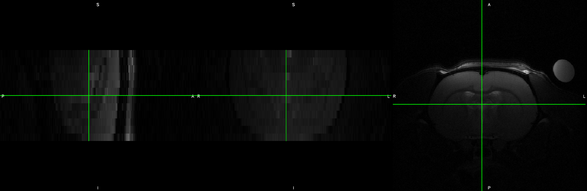
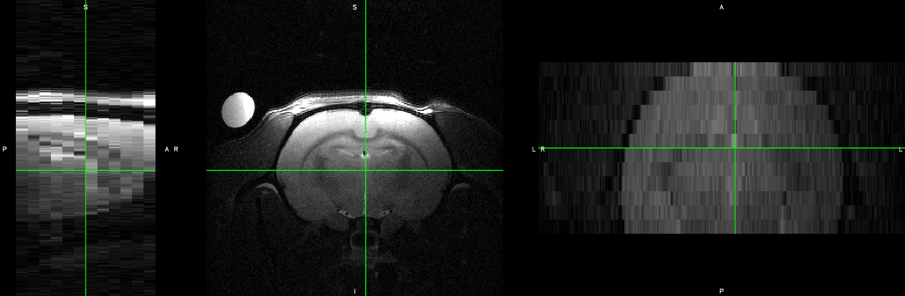

MultiRAT analysis code
================
Joanes Grandjean


# Foreword

This is a R markdown file which contains all the code for reproducing my
analysis. The code is meant to be followed step-wise. The raw fMRI
dataset will not be publicly available before the project preprint
publication on BioArxiv. The raw fMRI dataset can be made available
prior to publication upon request and review from the authors.

If re-using some of the scripts, please follow citations guidelines for
the software used. I’ve provided the links to the software wherever
possible. See also the [license](LICENSE.md) for this software.

The code is executed in `bash` (fMRI preprocessing) and `R` (analysis
and plots).

See the [environement](#Environement) section for the required software
libraries. The `R` libraries are organized using
[renv](https://rstudio.github.io/renv/).

To reproduce the code contained within this software, please follow
these steps  
1\. get the required dependencies for [bash](#Bash_environement) and
[R](#R_environement)  
2\. Update the variables `init_folder` and `analysis_folder` for both
bash and R environments

# Environement

The following was written in  
\- [R Version: 3.5.1](https://cran.r-project.org/)  
\- [rstudio Version: 1.3.959](https://rstudio.com/)

## Bash environement

  - [RABIES Version: 0.1.3](https://github.com/CoBrALab/RABIES) (see
    dependencies and install procedures)  
  - FSL Version: 6.0.1  
  - AFNI Version: AFNI\_20.2.00  
  - ANTs Version: 2.1.0.post370-ga466e  
  - Anaconda3 Version: 5.0.0  
  - Python Version: 3.6.2  
  - [Bruker2NIfTI
    Version: 1.0.20180303](https://github.com/neurolabusc/Bru2Nii)

Other bash functions  
\- curl  
\- unzip  
\- rm

Rstudio does not transfer variables between `bash` chunks. Hence, each
chunks needs to reload the environment. To achieve this seamlessly, I
use a [bash\_env.sh](bash_env.sh) file to re-initialize the environment
within each chunk. The content of it should be adapted by the user for
re-use.

``` bash

# Update this section to indicate where the code is kept (init_folder) and where the analysis is performed/stored (analysis_folder). 
init_folder="/home/traaffneu/joagra/code/MultiRat"
analysis_folder="/project/4180000.19/multiRat"

# this section is for use to import software within my HPC environment. You may change it to load software into the Rstudio terminal environment
echo 'module load ANTs/20150828' > bash_env.sh
echo 'module load anaconda3' >> bash_env.sh
echo 'source activate rabies' >> bash_env.sh


# no need to update the lines below. 
echo 'init_folder='$init_folder >> bash_env.sh
echo 'analysis_folder='$analysis_folder >> bash_env.sh

echo 'template=$analysis_folder"/template/WHS_SD_rat_T2star_v1.01.nii.gz"'  >> bash_env.sh
echo 'template_mask=$analysis_folder"/template/WHS_SD_v2_brainmask_bin.nii.gz"' >> bash_env.sh
echo 'template_WM=$analysis_folder"/template/WHS_SD_v2_WM.nii.gz"' >> bash_env.sh
echo 'template_GM=$analysis_folder"/template/WHS_SD_v2_GM.nii.gz"' >> bash_env.sh
echo 'template_CSF=$analysis_folder"/template/WHS_SD_v2_CSF.nii.gz"' >> bash_env.sh
echo 'atlas=$analysis_folder"/template/WHS_SD_rat_atlas_v3.nii.gz"'  >> bash_env.sh
```

## R environement

  - ggplot2 Version: ggplot2\_3.3.2  
  - dplyr Version: dplyr\_1.0.1  
  - here Version: here\_0.1

<!-- end list -->

``` r
# Update this section to indicate where the code is kept (init_folder) and where the analysis is performed/stored (analysis_folder). 
init_folder<-"/home/traaffneu/joagra/code/MultiRat"  
analysis_folder<-"/project/4180000.19/multiRat"  


#load the R libraries 
library('ggplot2')  
library('dplyr')  
library('here')  
```

# Asset preparation

## Dowload and prepare the template

For this project, I will use the WHS rat template available
[here](https://www.nitrc.org/projects/whs-sd-atlas). The reference for
the template is: Papp EA, Leergaard TB, Calabrese E, Johnson GA, Bjaalie
JG (2014) “Waxholm Space atlas of the Sprague Dawley rat brain”
NeuroImage 97:374-386.
[doi 10.1016/j.neuroimage.2014.04.001](https://doi.org/10.1016/j.neuroimage.2014.04.001)

In this chunk, I download the template and atlas, and generate separate
white (WM), gray (GM), and cerebrospinal fluid (CSF) binary maps. An
additional xml file to make the atlas compatible with FSL was downloaded
from this [board](https://www.nitrc.org/forum/message.php?msg_id=29057),
and made available in the
[assets](assets/atlas/WHS_SD_rat_atlas_v3-FSL.xml)

``` bash
source bash_env.sh

mkdir -p $analysis_folder'/template'

curl https://www.nitrc.org/frs/download.php/9441/WHS_SD_rat_atlas_v2_pack.zip --output $analysis_folder'/template/WHS_SD.zip'
curl https://www.nitrc.org/frs/download.php/9746/WHS_SD_v2_white_gray_mask_clipped.nii.gz --output $analysis_folder'/template/WHS_SD_v2_white_gray_mask_clipped.nii.gz'
curl https://www.nitrc.org/frs/download.php/9748/WHS_SD_v2_brainmask_bin.nii.gz --output $analysis_folder'/template/WHS_SD_v2_brainmask_bin.nii.gz'
curl https://www.nitrc.org/frs/download.php/11404/WHS_SD_rat_atlas_v3.label --output $analysis_folder'/template/WHS_SD_rat_atlas_v3.label'
curl https://www.nitrc.org/frs/download.php/11403/WHS_SD_rat_atlas_v3.nii.gz --output $analysis_folder'/template/WHS_SD_rat_atlas_v3.nii.gz'


unzip -d $analysis_folder'/template/' $analysis_folder'/template/WHS_SD.zip' 
rm $analysis_folder'/template/WHS_SD.zip' 

fslmaths $analysis_folder'/template/WHS_SD_v2_white_gray_mask_clipped.nii.gz' -thr 1 -uthr 1 -bin $analysis_folder'/template/WHS_SD_v2_WM.nii.gz'
fslmaths $analysis_folder'/template/WHS_SD_v2_white_gray_mask_clipped.nii.gz' -thr 2 -uthr 2 -bin $analysis_folder'/template/WHS_SD_v2_GM.nii.gz'
fslmaths $analysis_folder'/template/WHS_SD_v2_white_gray_mask_clipped.nii.gz' -thr 3 -uthr 3 -bin $analysis_folder'/template/WHS_SD_v2_CSF.nii.gz'
```

## Dataset preparation

Datasets included in this study were accepted in any format (bruker,
dicom, nifti, minc). The first step consists of arranging all datasets
within the same convention. I opted for true voxel size and
**A**nterior-**P**osterior axis defined as the rostro-caudal axis. Some
datasets were provided with x10 inflated voxeld and the
**S**uperior-**I**nferior axis defined as the rostro-caudal axis
instead, e.g.:



These had to be corrected, and organized into
[BIDS](https://bids.neuroimaging.io/) format manually. To do so, I wrote
scripts using a combination of the following FSL and AFNI commands,
`fslinfo`, `fslmerge`, `fslorient`, `fslchpixdim`, `fslswapdim`, and
`3dresample`.

Two scripts used to convert datasets are provided as examples. [Convert
raw Bruker data](assets/script/convert_bruker.sh) and [convert nifti
data](assets/script/convert_nifti.sh). Raw Bruker data were converted
using the [Bruker2NIfTI](https://github.com/neurolabusc/Bru2Nii)
v1.0.20180303 package, written by Matthew Brett, Andrew Janke, Mikaël
Naveau, Chris Rorden. Please note that this software is no longer
supported. New users are invited to try
[BrkRaw](https://github.com/BrkRaw/bruker) instead.

Below is an example of a corrected structural image. Note how the
**S**uperior, **I**nferior, **A**nterior, **P**osterior axis labels are
indicated in `fsleyes`.



## Dataset preparation limiation

Unfortunately, I cannot ensure the **L**eft / **R**ight axis are
represented correctly across all datasets. While this is less of an
issue for resting-state fMRI, this is a caveat in the stimulus-evoked
fMRI arm of this study, and should be acknowledged as a limitation.
Similarly, I cannot ensure the slicing acquisition order, hence,
preprocessing is performed without slice timing correction.

# Testing RABIES

This section is meant to try RABIES with rat data and this template. It
will not be kept in later versions.

``` bash
source bash_env.sh

rabies $analysis_folder/data/ds01002 $analysis_folder/preprocess/ds01002_pbs_resample --no_STC --anat_template $template --brain_mask $template_mask --WM_mask $template_WM --CSF_mask $template_CSF --labels $atlas --anatomical_resampling 0.1x0.1x0.1 --commonspace_resampling 0.3x0.3x0.3 -r light_SyN --template_reg_script light_SyN --cluster_type pbs
```
