MultiRAT analysis code
================
Joanes Grandjean


# Foreword

This is a R markdown file which contains all the code for reproducing my
analysis. The code is meant to be followed step-wise. The raw fMRI
dataset will not be publicly available before the project preprint
publication on BioArxiv. The raw fMRI dataset can be made available
prior to publication upon request and review from the authors.

If re-using some of the scripts, please follow citations guidelines for
the software used. I’ve provided the links to the software wherever
possible. See also the [license](../LICENSE.md) for this software.


```python
# init variables
init_folder='/home/traaffneu/joagra/code/MultiRat'
analysis_folder='/project/4180000.19/multiRat'
```


```python
import os
import glob
import pandas as pd
import numpy as np

df = pd.read_csv('../assets/table/meta_data_20210411_snr.tsv', sep='\t')
```


```python
# create emty columns for the different SBA parameters.
df['aromas_CPu_CPu'] = np.nan
df['aromas_MOp_MOp'] = np.nan
df['aromas_S1bf_S1bf'] = np.nan
df['aromas_S1bf_ACA'] = np.nan
df['aromas_S1bf_cat'] = np.nan

df['aromal_CPu_CPu'] = np.nan
df['aromal_MOp_MOp'] = np.nan
df['aromal_S1bf_S1bf'] = np.nan
df['aromal_S1bf_ACA'] = np.nan
df['aromal_S1bf_cat'] = np.nan

df['aromasr_CPu_CPu'] = np.nan
df['aromasr_MOp_MOp'] = np.nan
df['aromasr_S1bf_S1bf'] = np.nan
df['aromasr_S1bf_ACA'] = np.nan
df['aromasr_S1bf_cat'] = np.nan

df['WMCSFs_CPu_CPu'] = np.nan
df['WMCSFs_MOp_MOp'] = np.nan
df['WMCSFs_S1bf_S1bf'] = np.nan
df['WMCSFs_S1bf_ACA'] = np.nan
df['WMCSFs_S1bf_cat'] = np.nan

df['GSRs_CPu_CPu'] = np.nan
df['GSRs_MOp_MOp'] = np.nan
df['GSRs_S1bf_S1bf'] = np.nan
df['GSRs_S1bf_ACA'] = np.nan
df['GSRs_S1bf_cat'] = np.nan
```


```python
roi_list = glob.glob((os.path.join(analysis_folder, 'template', 'roi'))+'/*')
seed_list = glob.glob((os.path.join(analysis_folder, 'scratch', 'seed','*'))+'/*')
```


```python
import pandas as pd
pd.options.mode.chained_assignment = None

from nilearn.input_data import NiftiMasker
import re
import numpy as np

for i_orig in seed_list:
    #print(i_orig)
    i=i_orig.replace('_RAS','')
    i=i.replace('_aroma','')
    sub=int(os.path.basename(i).split('_')[0].split('-')[1])
    ses=int(os.path.basename(i).split('_')[1].split('-')[1])
    denoise=i.split('/')[6]
    seed=os.path.basename(i).split('_')[6]
    if(seed =='ACA'):
        continue
    elif(seed =='S1bf'):
        roi='ACA'
        fc_orig=df[(denoise+'_'+seed+'_'+roi)][(df['rat.sub']==sub) & (df['rat.ses']==ses)]
        fc_nan = np.isnan(fc_orig).all()
        if(fc_nan):
            r = re.compile('ACA'+'_l')
            nifti_mask=list(filter(r.findall, roi_list))[0]
            fc=NiftiMasker(nifti_mask).fit_transform(i_orig).mean()
            df[(denoise+'_'+seed+'_'+roi)][(df['rat.sub']==sub) & (df['rat.ses']==ses)]=fc
    
    roi=seed
    fc_orig=df[(denoise+'_'+seed+'_'+roi)][(df['rat.sub']==sub) & (df['rat.ses']==ses)]
    fc_nan = np.isnan(fc_orig).all()
    if(fc_nan):
        r = re.compile(seed+'_r')
        nifti_mask=list(filter(r.findall, roi_list))[0]
        fc=NiftiMasker(nifti_mask).fit_transform(i_orig).mean()
        df[(denoise+'_'+seed+'_'+roi)][(df['rat.sub']==sub) & (df['rat.ses']==ses)]=fc
    
df.to_csv('../assets/table/meta_data_20210411_snr.tsv', sep='\t', index=False)
```


```python
df_exclude = df.loc[(df['exclude'] != 'yes')].loc[(df['exp.type'] == 'resting-state')]
print('missing aromas')
print(df_exclude[np.isnan(df['aromas_S1bf_S1bf']) | np.isnan(df['aromas_S1bf_ACA']) | np.isnan(df['aromas_MOp_MOp'])  | np.isnan(df['aromas_CPu_CPu'])]['rat.ds'].unique())

print('missing aromal')
print(df_exclude[np.isnan(df['aromal_S1bf_S1bf']) | np.isnan(df['aromal_S1bf_ACA']) | np.isnan(df['aromal_MOp_MOp'])  | np.isnan(df['aromal_CPu_CPu'])]['rat.ds'].unique())

print('missing aromasr')
print(df_exclude[np.isnan(df['aromasr_S1bf_S1bf']) | np.isnan(df['aromasr_S1bf_ACA']) | np.isnan(df['aromasr_MOp_MOp'])  | np.isnan(df['aromasr_CPu_CPu'])]['rat.ds'].unique())

print('missing WMCSFs')
print(df_exclude[np.isnan(df['WMCSFs_S1bf_S1bf']) | np.isnan(df['WMCSFs_S1bf_ACA']) | np.isnan(df['WMCSFs_MOp_MOp'])  | np.isnan(df['WMCSFs_CPu_CPu'])]['rat.ds'].unique())

print('missing GSRs')
print(df_exclude[np.isnan(df['GSRs_S1bf_S1bf']) | np.isnan(df['GSRs_S1bf_ACA']) | np.isnan(df['GSRs_MOp_MOp'])  | np.isnan(df['GSRs_CPu_CPu'])]['rat.ds'].unique())

```

    missing aromas
    [1020 1022 1035]
    missing aromal
    [1020 1022 1035]
    missing aromasr
    [1020 1022 1035]
    missing WMCSFs
    [1022]
    missing GSRs
    [1022 1027]


    <ipython-input-117-25e6d1fc9ab8>:3: UserWarning: Boolean Series key will be reindexed to match DataFrame index.
      print(df_exclude[np.isnan(df['aromas_S1bf_S1bf']) | np.isnan(df['aromas_S1bf_ACA']) | np.isnan(df['aromas_MOp_MOp'])  | np.isnan(df['aromas_CPu_CPu'])]['rat.ds'].unique())
    <ipython-input-117-25e6d1fc9ab8>:6: UserWarning: Boolean Series key will be reindexed to match DataFrame index.
      print(df_exclude[np.isnan(df['aromal_S1bf_S1bf']) | np.isnan(df['aromal_S1bf_ACA']) | np.isnan(df['aromal_MOp_MOp'])  | np.isnan(df['aromal_CPu_CPu'])]['rat.ds'].unique())
    <ipython-input-117-25e6d1fc9ab8>:9: UserWarning: Boolean Series key will be reindexed to match DataFrame index.
      print(df_exclude[np.isnan(df['aromasr_S1bf_S1bf']) | np.isnan(df['aromasr_S1bf_ACA']) | np.isnan(df['aromasr_MOp_MOp'])  | np.isnan(df['aromasr_CPu_CPu'])]['rat.ds'].unique())
    <ipython-input-117-25e6d1fc9ab8>:12: UserWarning: Boolean Series key will be reindexed to match DataFrame index.
      print(df_exclude[np.isnan(df['WMCSFs_S1bf_S1bf']) | np.isnan(df['WMCSFs_S1bf_ACA']) | np.isnan(df['WMCSFs_MOp_MOp'])  | np.isnan(df['WMCSFs_CPu_CPu'])]['rat.ds'].unique())
    <ipython-input-117-25e6d1fc9ab8>:15: UserWarning: Boolean Series key will be reindexed to match DataFrame index.
      print(df_exclude[np.isnan(df['GSRs_S1bf_S1bf']) | np.isnan(df['GSRs_S1bf_ACA']) | np.isnan(df['GSRs_MOp_MOp'])  | np.isnan(df['GSRs_CPu_CPu'])]['rat.ds'].unique())


To estimate specificity, i need to assume a significance threshold.  i find that 50% of the scans have at least 340 volumes (see below). Using the following [calculations](http://vassarstats.net/tabs_r.html), I find that `r >= 0.1` corresponds to p ~ 0.05 in a one-tailed test. I therefore use this a threshold to assume `significant` inter-seed correlations for the following analysis. This is a necessary heuristic that can be applied in other studies. The limitation being that it does not apply equally to all dataset (either with fewer or more volume). 


```python
df['func.volume'].describe()
```


    count     533.000000
    mean      587.420263
    std       580.735416
    min       150.000000
    25%       300.000000
    50%       340.000000
    75%       600.000000
    max      3600.000000
    Name: func.volume, dtype: float64


```python
# This is a function to estimate functional connectivity specificity. See Grandjean 2020 for details on the reasoning 

def specific_FC(specific_roi, unspecific_ROI):
    if (specific_roi>=0.1) and (unspecific_ROI<0.1):
        cat='Specific'
    elif (specific_roi>=0.1) and (unspecific_ROI>=0.1):
        cat='Unspecific'
    elif (abs(specific_roi)<0.1) and (abs(unspecific_ROI)<0.1):
        cat='No'
    else:
        cat='Spurious'
    return cat


```


```python
for i in list(range(0,df.shape[0])):
    #---- Now doing aromas condition
    specific=df['aromas_S1bf_S1bf'][i]
    unspecific=df['aromas_S1bf_ACA'][i]
    if(np.isnan(specific) | np.isnan(unspecific)):
        print('')
    else:
        df['aromas_S1bf_cat'][i]=specific_FC(specific,unspecific)  
    
    #---- Now doing aromal condition
    specific=df['aromal_S1bf_S1bf'][i]
    unspecific=df['aromal_S1bf_ACA'][i]
    if(np.isnan(specific) | np.isnan(unspecific)):
        print('')
    else:
        df['aromal_S1bf_cat'][i]=specific_FC(specific,unspecific)        
    
    #---- Now doing aromasr condition
    specific=df['aromasr_S1bf_S1bf'][i]
    unspecific=df['aromasr_S1bf_ACA'][i]
    if(np.isnan(specific) | np.isnan(unspecific)):
        print('')
    else:
        df['aromasr_S1bf_cat'][i]=specific_FC(specific,unspecific)  
        
    #---- Now doing WMCSFs condition
    specific=df['WMCSFs_S1bf_S1bf'][i]
    unspecific=df['WMCSFs_S1bf_ACA'][i]
    if(np.isnan(specific) | np.isnan(unspecific)):
        print('')
    else:
        df['WMCSFs_S1bf_cat'][i]=specific_FC(specific,unspecific)  
        
    #---- Now doing GSRs condition
    specific=df['GSRs_S1bf_S1bf'][i]
    unspecific=df['GSRs_S1bf_ACA'][i]
    if(np.isnan(specific) | np.isnan(unspecific)):
        print('')
    else:
        df['GSRs_S1bf_cat'][i]=specific_FC(specific,unspecific)  
```

    
    
    
    
    
    
    
    
    
    
    
    
    
    
    
    
    
    
    
    
    
    
    
    
    
    
    
    
    
    
    
    
    
    
    
    
    
    
    
    
    
    
    
    
    
    
    
    
    
    
    
    
    
    
    
    
    
    
    
    
    
    
    
    
    
    
    
    
    
    
    
    
    
    
    
    
    
    
    
    
    
    
    
    
    
    
    
    
    
    
    
    
    
    
    
    
    
    
    
    
    
    
    
    
    
    
    
    
    
    
    
    
    
    
    
    
    
    
    
    
    
    
    
    
    
    
    
    
    
    
    
    
    
    
    
    
    
    
    
    
    
    
    
    
    
    
    
    
    
    
    
    
    
    
    
    
    
    
    
    
    
    
    
    
    
    
    
    
    
    
    
    
    
    
    
    
    
    
    
    
    
    
    
    
    
    
    
    
    
    
    
    
    
    
    
    
    
    
    
    
    
    
    
    
    
    
    
    
    
    
    
    
    
    
    
    
    
    
    
    
    
    
    
    
    
    
    
    
    
    
    
    
    
    
    
    
    
    
    
    
    
    
    
    
    
    
    
    
    
    
    
    
    
    
    
    
    
    
    
    
    
    
    
    
    
    
    
    
    
    
    
    
    
    
    
    
    
    
    
    
    
    
    
    
    
    
    
    
    
    
    
    
    
    
    
    
    
    
    
    
    
    
    
    
    
    
    
    
    
    
    
    
    
    
    
    
    
    
    
    
    
    
    
    
    
    
    
    
    
    
    
    
    
    
    
    
    
    
    
    
    
    
    
    
    
    
    
    
    
    
    
    
    
    
    
    
    
    
    
    
    
    
    
    
    
    
    
    
    
    
    
    
    
    
    
    
    
    
    
    
    
    
    
    
    
    
    
    
    
    
    
    
    
    
    
    
    
    
    
    
    
    
    
    
    
    
    
    
    
    
    
    
    
    
    
    
    
    
    
    
    
    
    
    
    
    
    
    
    
    
    
    
    
    
    
    
    
    
    
    
    
    
    
    
    
    
    
    
    
    
    
    
    
    
    
    
    
    
    
    
    
    
    
    
    
    
    
    
    
    
    
    
    
    
    
    
    
    
    
    
    
    
    
    
    
    
    
    
    
    
    
    
    
    
    
    
    
    
    
    
    
    
    
    
    
    
    
    
    
    
    
    
    
    
    
    
    
    
    
    
    
    
    
    
    
    
    
    
    
    
    
    
    
    
    
    
    
    
    
    
    
    
    
    
    
    
    
    
    
    
    
    
    
    
    


```python
#remove excluded scans
df_exclude = df.loc[(df['exclude'] != 'yes')].loc[(df['exp.type'] == 'resting-state')]
```


```python
import numpy as np
import matplotlib.pyplot as plt
import seaborn as sns

fig, axes = plt.subplots(nrows=2, ncols=3, figsize=(12,8))

sns.set_palette("colorblind")

ax1 = df_exclude['aromas_S1bf_cat'].value_counts(sort=False).plot.pie(title='aromas',ax=axes[0,0], autopct="%.1f%%")
ax2 = df_exclude['aromal_S1bf_cat'].value_counts(sort=False).plot.pie(title='aromal',ax=axes[0,1],autopct="%.1f%%")    
ax3 = df_exclude['aromasr_S1bf_cat'].value_counts(sort=False).plot.pie(title='aromasr',ax=axes[0,2],autopct="%.1f%%")    
ax4 = df_exclude['WMCSFs_S1bf_cat'].value_counts(sort=False).plot.pie(title='WMCSFs',ax=axes[1,0],autopct="%.1f%%")    
ax5 = df_exclude['GSRs_S1bf_cat'].value_counts(sort=False).plot.pie(title='GSRs',ax=axes[1,1],autopct="%.1f%%")    


ax1.set(xlabel="", ylabel="")
ax2.set(xlabel="", ylabel="")
ax3.set(xlabel="", ylabel="")
ax4.set(xlabel="", ylabel="")
ax5.set(xlabel="", ylabel="")

```

    /home/traaffneu/joagra/.conda/envs/multirat/lib/python3.9/site-packages/pandas/plotting/_matplotlib/tools.py:400: MatplotlibDeprecationWarning: 
    The is_first_col function was deprecated in Matplotlib 3.4 and will be removed two minor releases later. Use ax.get_subplotspec().is_first_col() instead.
      if ax.is_first_col():
    /home/traaffneu/joagra/.conda/envs/multirat/lib/python3.9/site-packages/pandas/plotting/_matplotlib/tools.py:400: MatplotlibDeprecationWarning: 
    The is_first_col function was deprecated in Matplotlib 3.4 and will be removed two minor releases later. Use ax.get_subplotspec().is_first_col() instead.
      if ax.is_first_col():
    /home/traaffneu/joagra/.conda/envs/multirat/lib/python3.9/site-packages/pandas/plotting/_matplotlib/tools.py:400: MatplotlibDeprecationWarning: 
    The is_first_col function was deprecated in Matplotlib 3.4 and will be removed two minor releases later. Use ax.get_subplotspec().is_first_col() instead.
      if ax.is_first_col():
    /home/traaffneu/joagra/.conda/envs/multirat/lib/python3.9/site-packages/pandas/plotting/_matplotlib/tools.py:400: MatplotlibDeprecationWarning: 
    The is_first_col function was deprecated in Matplotlib 3.4 and will be removed two minor releases later. Use ax.get_subplotspec().is_first_col() instead.
      if ax.is_first_col():
    /home/traaffneu/joagra/.conda/envs/multirat/lib/python3.9/site-packages/pandas/plotting/_matplotlib/tools.py:400: MatplotlibDeprecationWarning: 
    The is_first_col function was deprecated in Matplotlib 3.4 and will be removed two minor releases later. Use ax.get_subplotspec().is_first_col() instead.
      if ax.is_first_col():


    [Text(0.5, 0, ''), Text(0, 0.5, '')]


    
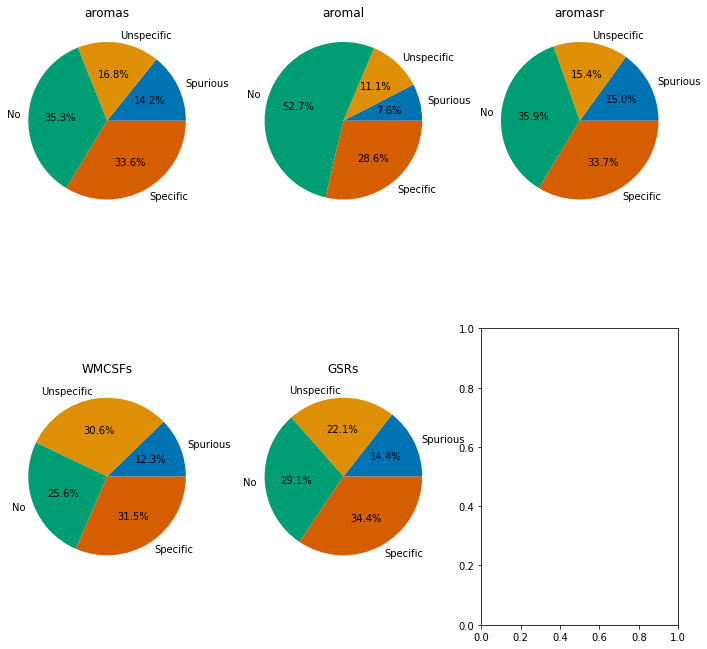
    


```python
ax6 = sns.jointplot(data=df_exclude, x='aromas_S1bf_S1bf', y='aromas_S1bf_ACA', hue='func.sequence')
ax6.plot_joint(sns.kdeplot,linestyles='dashed', zorder=0, levels=6)

ax6.fig.suptitle('Functional connectivity specificity')
ax6.fig.subplots_adjust(top=0.9)
ax6.ax_joint.set(xlabel='Specific ROI [r]', ylabel='Unspecific ROI [r]')
ax6.ax_joint.get_legend().set_title('Sequence')
ax6.ax_joint.vlines(0.1,ymin=min(df_exclude['aromas_S1bf_ACA']),ymax=max(df_exclude['aromas_S1bf_ACA']),linestyles='dashed', color='black')
ax6.ax_joint.vlines(-0.1, -0.1,0.1,linestyles='dashed', color='black')
ax6.ax_joint.hlines(-0.1, -0.1,0.1,linestyles='dashed', color='black')
ax6.ax_joint.hlines(0.1, -0.1,xmax=max(df_exclude['aromas_S1bf_S1bf']),linestyles='dashed', color='black')
ax6.ax_marg_x.axvline(x=0.1, color='black')
ax6.ax_marg_y.axhline(y=0.1, color='black')
```


    <matplotlib.lines.Line2D at 0x7f382a93abb0>


    
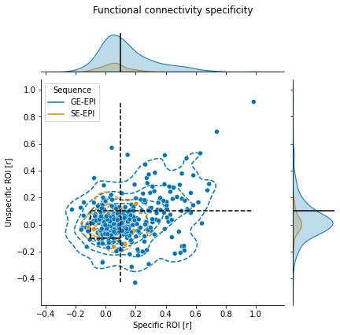
    


```python
from nilearn import plotting
bg_img=os.path.join(analysis_folder, 
             'template',
             'SIGMA_Wistar_Rat_Brain_TemplatesAndAtlases_Version1.1',
             'SIGMA_Rat_Anatomical_Imaging',
            'SIGMA_Rat_Anatomical_InVivo_Template',
            'SIGMA_InVivo_Brain_Template_Masked.nii')

tmap_filename=seed_list[3]
plotting.plot_stat_map(tmap_filename, 
                       bg_img, 
                       threshold=0.1,
                       vmax=0.5,
                       symmetric_cbar=True,
                       cmap='coolwarm',
                       black_bg=False,
                       #display_mode="y",
                       cut_coords=(0,0.14,5))
```

    /home/traaffneu/joagra/.conda/envs/multirat/lib/python3.9/site-packages/nilearn/datasets/__init__.py:87: FutureWarning: Fetchers from the nilearn.datasets module will be updated in version 0.9 to return python strings instead of bytes and Pandas dataframes instead of Numpy arrays.
      warn("Fetchers from the nilearn.datasets module will be "


    <nilearn.plotting.displays.OrthoSlicer at 0x7f67b1b59100>


    
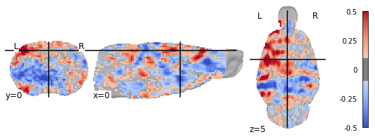
    


## ---- Plotting specific FC examples


```python
from nilearn import plotting
bg_img=os.path.join(analysis_folder, 
             'template',
             'SIGMA_Wistar_Rat_Brain_TemplatesAndAtlases_Version1.1',
             'SIGMA_Rat_Anatomical_Imaging',
            'SIGMA_Rat_Anatomical_InVivo_Template',
            'SIGMA_InVivo_Brain_Template_Masked.nii')

import re
df_specific = df_exclude[['rat.sub','rat.ses']][df_exclude['aromas_S1bf_cat']=='Specific'].sample(n = 3)

for i in list(range(0,df_specific.shape[0])):
    r = re.compile('/aromas/')
    seed_list_sub=list(filter(r.findall, seed_list))
    r = re.compile('S1bf')
    seed_list_sub=list(filter(r.findall, seed_list_sub))
    r = re.compile(df_specific['rat.sub'].iloc[i].astype(str))
    seed_list_sub=list(filter(r.findall, seed_list_sub))
    r = re.compile('ses-'+df_specific['rat.ses'].iloc[i].astype(str))
    seed_list_sub=list(filter(r.findall, seed_list_sub))


    plotting.plot_stat_map(seed_list_sub[0], 
                           bg_img, 
                           title='Specific FC, ID:'+
                                df_specific['rat.sub'].iloc[i].astype(str)+
                                ' ses: '+
                                df_specific['rat.ses'].iloc[i].astype(str),
                           threshold=0.1,
                           vmax=0.5,
                           symmetric_cbar=True,
                           cmap='coolwarm',
                           black_bg=False,
                           #display_mode="y",
                           cut_coords=(0,0.14,5))
```

    /home/traaffneu/joagra/.conda/envs/multirat/lib/python3.9/site-packages/nilearn/datasets/__init__.py:87: FutureWarning: Fetchers from the nilearn.datasets module will be updated in version 0.9 to return python strings instead of bytes and Pandas dataframes instead of Numpy arrays.
      warn("Fetchers from the nilearn.datasets module will be "


    
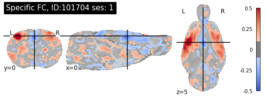
    


    
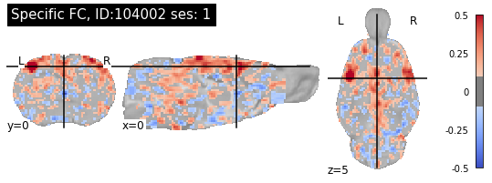
    


    
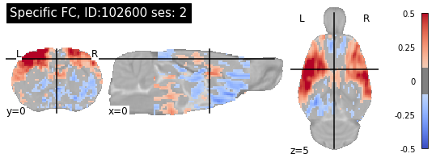
    


## ---- Plotting unspecific FC examples


```python
import re
df_specific = df_exclude[['rat.sub','rat.ses']][df_exclude['aromas_S1bf_cat']=='Unspecific'].sample(n = 3)

for i in list(range(0,df_specific.shape[0])):
    r = re.compile('/aromas/')
    seed_list_sub=list(filter(r.findall, seed_list))
    r = re.compile('S1bf')
    seed_list_sub=list(filter(r.findall, seed_list_sub))
    r = re.compile(df_specific['rat.sub'].iloc[i].astype(str))
    seed_list_sub=list(filter(r.findall, seed_list_sub))
    r = re.compile('ses-'+df_specific['rat.ses'].iloc[i].astype(str))
    seed_list_sub=list(filter(r.findall, seed_list_sub))


    plotting.plot_stat_map(seed_list_sub[0], 
                           bg_img, 
                           title='Unspecific FC, ID:'+
                                df_specific['rat.sub'].iloc[i].astype(str)+
                                ' ses: '+
                                df_specific['rat.ses'].iloc[i].astype(str),
                           threshold=0.1,
                           vmax=0.5,
                           symmetric_cbar=True,
                           cmap='coolwarm',
                           black_bg=False,
                           #display_mode="y",
                           cut_coords=(0,0.14,5))
```


    

    


    
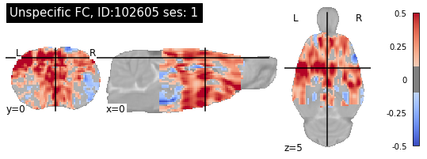
    


    
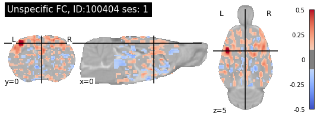
    


## ---- Plotting no FC examples


```python
import re
df_specific = df_exclude[['rat.sub','rat.ses']][df_exclude['aromas_S1bf_cat']=='No'].sample(n = 3)

for i in list(range(0,df_specific.shape[0])):
    r = re.compile('/aromas/')
    seed_list_sub=list(filter(r.findall, seed_list))
    r = re.compile('S1bf')
    seed_list_sub=list(filter(r.findall, seed_list_sub))
    r = re.compile(df_specific['rat.sub'].iloc[i].astype(str))
    seed_list_sub=list(filter(r.findall, seed_list_sub))
    r = re.compile('ses-'+df_specific['rat.ses'].iloc[i].astype(str))
    seed_list_sub=list(filter(r.findall, seed_list_sub))


    plotting.plot_stat_map(seed_list_sub[0], 
                           bg_img, 
                           title='No FC, ID:'+
                                df_specific['rat.sub'].iloc[i].astype(str)+
                                ' ses: '+
                                df_specific['rat.ses'].iloc[i].astype(str),
                           threshold=0.1,
                           vmax=0.5,
                           symmetric_cbar=True,
                           cmap='coolwarm',
                           black_bg=False,
                           #display_mode="y",
                           cut_coords=(0,0.14,5))
```


    
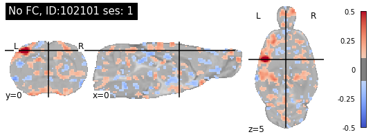
    


    
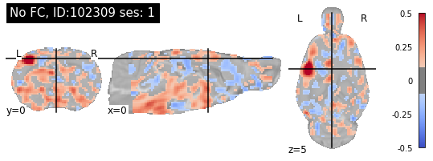
    


    
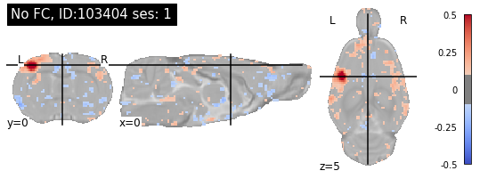
    


## ---- Plotting Spurious FC examples


```python
import re
df_specific = df_exclude[['rat.sub','rat.ses']][df_exclude['aromas_S1bf_cat']=='Spurious'].sample(n = 3)

for i in list(range(0,df_specific.shape[0])):
    r = re.compile('/aromas/')
    seed_list_sub=list(filter(r.findall, seed_list))
    r = re.compile('S1bf')
    seed_list_sub=list(filter(r.findall, seed_list_sub))
    r = re.compile(df_specific['rat.sub'].iloc[i].astype(str))
    seed_list_sub=list(filter(r.findall, seed_list_sub))
    r = re.compile('ses-'+df_specific['rat.ses'].iloc[i].astype(str))
    seed_list_sub=list(filter(r.findall, seed_list_sub))


    plotting.plot_stat_map(seed_list_sub[0], 
                           bg_img, 
                           title='Spurious FC, ID:'+
                                df_specific['rat.sub'].iloc[i].astype(str)+
                                ' ses: '+
                                df_specific['rat.ses'].iloc[i].astype(str),
                           threshold=0.1,
                           vmax=0.5,
                           symmetric_cbar=True,
                           cmap='coolwarm',
                           black_bg=False,
                           #display_mode="y",
                           cut_coords=(0,0.14,5))
```


    
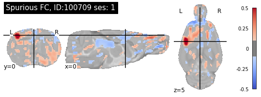
    


    
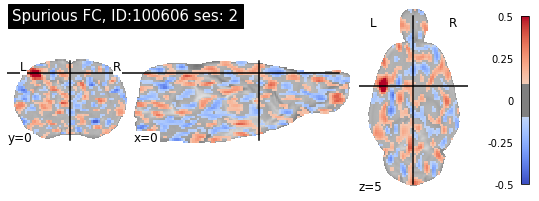
    


    
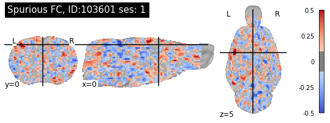
    


## Now doing a Chi2 test to see distribution of specificity among variables


```python
from scipy.stats import chi2_contingency

# now testing straing
chi_stack = df_exclude.groupby(['rat.strain', 
                    'aromas_S1bf_cat']).size().unstack('aromas_S1bf_cat')
chi_stack = chi_stack.fillna(0)
print('')
g, p, dof, expctd  = chi2_contingency(chi_stack)
chi_stack["sum"] = chi_stack.sum(axis=1)
chi_stack["Specific_percent"]= round(chi_stack['Specific']/chi_stack["sum"],2)
print(chi_stack.sort_values(by="Specific_percent",ascending=False))
print('Strain effect: g-value = '+str(g)+' dof = '+str(dof)+' p-value = '+str(p))

# now testing sex
chi_stack = df_exclude.groupby(['rat.sex', 
                    'aromas_S1bf_cat']).size().unstack('aromas_S1bf_cat')
chi_stack = chi_stack.fillna(0)
print('')
g, p, dof, expctd  = chi2_contingency(chi_stack)
chi_stack["sum"] = chi_stack.sum(axis=1)
chi_stack["Specific_percent"]= round(chi_stack['Specific']/chi_stack["sum"],2)
print(chi_stack.sort_values(by="Specific_percent",ascending=False))
print('Strain effect: g-value = '+str(g)+' dof = '+str(dof)+' p-value = '+str(p))

# now testing age
chi_stack = df_exclude.groupby(['rat.age', 
                    'aromas_S1bf_cat']).size().unstack('aromas_S1bf_cat')
chi_stack = chi_stack.fillna(0)
print('')
g, p, dof, expctd  = chi2_contingency(chi_stack)
chi_stack["sum"] = chi_stack.sum(axis=1)
chi_stack["Specific_percent"]= round(chi_stack['Specific']/chi_stack["sum"],2)
print(chi_stack.sort_values(by="Specific_percent",ascending=False))
print('Strain effect: g-value = '+str(g)+' dof = '+str(dof)+' p-value = '+str(p))

# now testing anesthesia.maintenance
chi_stack = df_exclude.groupby(['anesthesia.maintenance', 
                    'aromas_S1bf_cat']).size().unstack('aromas_S1bf_cat')
chi_stack = chi_stack.fillna(0)
print('')
g, p, dof, expctd  = chi2_contingency(chi_stack)
chi_stack["sum"] = chi_stack.sum(axis=1)
chi_stack["Specific_percent"]= round(chi_stack['Specific']/chi_stack["sum"],2)
print(chi_stack.sort_values(by="Specific_percent",ascending=False))
print('Strain effect: g-value = '+str(g)+' dof = '+str(dof)+' p-value = '+str(p))

# now testing anesthesia.breathing.assistance
chi_stack = df_exclude.groupby(['anesthesia.breathing.assistance', 
                    'aromas_S1bf_cat']).size().unstack('aromas_S1bf_cat')
chi_stack = chi_stack.fillna(0)
print('')
g, p, dof, expctd  = chi2_contingency(chi_stack)
chi_stack["sum"] = chi_stack.sum(axis=1)
chi_stack["Specific_percent"]= round(chi_stack['Specific']/chi_stack["sum"],2)
print(chi_stack.sort_values(by="Specific_percent",ascending=False))
print('Strain effect: g-value = '+str(g)+' dof = '+str(dof)+' p-value = '+str(p))


# now testing field strength
chi_stack = df_exclude.groupby(['MRI.field.strength', 
                    'aromas_S1bf_cat']).size().unstack('aromas_S1bf_cat')
chi_stack = chi_stack.fillna(0)
print('')
g, p, dof, expctd  = chi2_contingency(chi_stack)
chi_stack["sum"] = chi_stack.sum(axis=1)
chi_stack["Specific_percent"]= round(chi_stack['Specific']/chi_stack["sum"],2)
print(chi_stack.sort_values(by="Specific_percent",ascending=False))
print('Strain effect: g-value = '+str(g)+' dof = '+str(dof)+' p-value = '+str(p))

# now testing sequence
chi_stack = df_exclude.groupby(['func.sequence', 
                    'aromas_S1bf_cat']).size().unstack('aromas_S1bf_cat')
chi_stack = chi_stack.fillna(0)
print('')
g, p, dof, expctd  = chi2_contingency(chi_stack)
chi_stack["sum"] = chi_stack.sum(axis=1)
chi_stack["Specific_percent"]= round(chi_stack['Specific']/chi_stack["sum"],2)
print(chi_stack.sort_values(by="Specific_percent",ascending=False))
print('Strain effect: g-value = '+str(g)+' dof = '+str(dof)+' p-value = '+str(p))
```

    
    aromas_S1bf_cat    No  Specific  Spurious  Unspecific    sum  Specific_percent
    rat.strain                                                                    
    Lister Hooded     1.0       5.0       1.0         0.0    7.0              0.71
    Fischer 344      18.0      26.0      10.0         4.0   58.0              0.45
    Wistar           61.0      54.0      24.0        25.0  164.0              0.33
    Sprague Dawley   39.0      38.0      11.0        30.0  118.0              0.32
    Long Evans       30.0      19.0      14.0        12.0   75.0              0.25
    Strain effect: g-value = 22.204386314337317 dof = 12 p-value = 0.03529196332006069
    
    aromas_S1bf_cat  No  Specific  Spurious  Unspecific  sum  Specific_percent
    rat.sex                                                                   
    male              6         9         1           1   17              0.53
    Female           44        35        14           5   98              0.36
    Male             99        98        45          65  307              0.32
    Strain effect: g-value = 19.180460170161837 dof = 6 p-value = 0.0038694743161119087
    
    aromas_S1bf_cat    No  Specific  Spurious  Unspecific    sum  Specific_percent
    rat.age                                                                       
    14-16             0.0       2.0       0.0         0.0    2.0              1.00
    8-10              3.0       8.0       0.0         0.0   11.0              0.73
    6-8               2.0       3.0       0.0         0.0    5.0              0.60
    12-14             2.0       4.0       1.0         1.0    8.0              0.50
    4-6               8.0      10.0       1.0         3.0   22.0              0.45
    0-2              12.0      25.0      13.0        13.0   63.0              0.40
    16-18             9.0      10.0       4.0         7.0   30.0              0.33
    2-4              89.0      61.0      24.0        28.0  202.0              0.30
    18-20             2.0       1.0       3.0         0.0    6.0              0.17
    Strain effect: g-value = 40.52316649683126 dof = 24 p-value = 0.018777948488553155
    
    aromas_S1bf_cat              No  Specific  Spurious  Unspecific    sum  \
    anesthesia.maintenance                                                   
    isoflurane / medetomidine  37.0      43.0       5.0        15.0  100.0   
    isoflurane                 63.0      64.0      33.0        27.0  187.0   
    medetomidine               21.0      21.0      15.0        14.0   71.0   
    alpha-chloralose            2.0       2.0       0.0         5.0    9.0   
    urethane                   25.0      11.0       7.0         6.0   49.0   
    awake                       1.0       1.0       0.0         4.0    6.0   
    
    aromas_S1bf_cat            Specific_percent  
    anesthesia.maintenance                       
    isoflurane / medetomidine              0.43  
    isoflurane                             0.34  
    medetomidine                           0.30  
    alpha-chloralose                       0.22  
    urethane                               0.22  
    awake                                  0.17  
    Strain effect: g-value = 41.70798368854224 dof = 15 p-value = 0.00024921733263893954
    
    aromas_S1bf_cat                   No  Specific  Spurious  Unspecific  sum  \
    anesthesia.breathing.assistance                                             
    Free-breathing                     6         9         1           1   17   
    ventilated                        18        21         3          15   57   
    free-breathing                   124       111        56          51  342   
    
    aromas_S1bf_cat                  Specific_percent  
    anesthesia.breathing.assistance                    
    Free-breathing                               0.53  
    ventilated                                   0.37  
    free-breathing                               0.32  
    Strain effect: g-value = 12.648789596398302 dof = 6 p-value = 0.0489648753437889
    
    aromas_S1bf_cat       No  Specific  Spurious  Unspecific    sum  \
    MRI.field.strength                                                
    4.7                  7.0      20.0       6.0         3.0   36.0   
    14.1                 4.0      15.0       0.0        15.0   34.0   
    7.0                 79.0      65.0      35.0        26.0  205.0   
    9.4                 52.0      42.0      16.0        27.0  137.0   
    11.1                 7.0       0.0       3.0         0.0   10.0   
    
    aromas_S1bf_cat     Specific_percent  
    MRI.field.strength                    
    4.7                             0.56  
    14.1                            0.44  
    7.0                             0.32  
    9.4                             0.31  
    11.1                            0.00  
    Strain effect: g-value = 51.9701234019917 dof = 12 p-value = 6.275723348974305e-07
    
    aromas_S1bf_cat   No  Specific  Spurious  Unspecific  sum  Specific_percent
    func.sequence                                                              
    GE-EPI           115       130        47          70  362              0.36
    SE-EPI            34        12        13           1   60              0.20
    Strain effect: g-value = 25.191008778060894 dof = 3 p-value = 1.4083768244993284e-05


```python
# check how datasets are prefroming
chi_stack = df_exclude.groupby(['rat.ds', 
                    'aromas_S1bf_cat']).size().unstack('aromas_S1bf_cat')
chi_stack = chi_stack.fillna(0)
chi_stack["sum"] = chi_stack.sum(axis=1)
chi_stack["Specific_percent"]= round(chi_stack['Specific']/chi_stack["sum"],2)

print("FC specificity distribution per dataset, armoas denoising")
print(chi_stack["Specific_percent"].quantile([0.25,0.5,0.75]))
chi_stack.sort_values(by="Specific_percent",ascending=False)

```

    FC specificity distribution per dataset, armoas denoising
    0.25    0.1925
    0.50    0.3150
    0.75    0.4400
    Name: Specific_percent, dtype: float64


<div>
<style scoped>
    .dataframe tbody tr th:only-of-type {
        vertical-align: middle;
    }

    .dataframe tbody tr th {
        vertical-align: top;
    }

    .dataframe thead th {
        text-align: right;
    }
</style>
<table border="1" class="dataframe">
  <thead>
    <tr style="text-align: right;">
      <th>aromas_S1bf_cat</th>
      <th>No</th>
      <th>Specific</th>
      <th>Spurious</th>
      <th>Unspecific</th>
      <th>sum</th>
      <th>Specific_percent</th>
    </tr>
    <tr>
      <th>rat.ds</th>
      <th></th>
      <th></th>
      <th></th>
      <th></th>
      <th></th>
      <th></th>
    </tr>
  </thead>
  <tbody>
    <tr>
      <th>1031</th>
      <td>4.0</td>
      <td>14.0</td>
      <td>0.0</td>
      <td>0.0</td>
      <td>18.0</td>
      <td>0.78</td>
    </tr>
    <tr>
      <th>1015</th>
      <td>0.0</td>
      <td>7.0</td>
      <td>0.0</td>
      <td>2.0</td>
      <td>9.0</td>
      <td>0.78</td>
    </tr>
    <tr>
      <th>1020</th>
      <td>1.0</td>
      <td>5.0</td>
      <td>1.0</td>
      <td>0.0</td>
      <td>7.0</td>
      <td>0.71</td>
    </tr>
    <tr>
      <th>1022</th>
      <td>0.0</td>
      <td>6.0</td>
      <td>0.0</td>
      <td>3.0</td>
      <td>9.0</td>
      <td>0.67</td>
    </tr>
    <tr>
      <th>1039</th>
      <td>2.0</td>
      <td>5.0</td>
      <td>0.0</td>
      <td>1.0</td>
      <td>8.0</td>
      <td>0.62</td>
    </tr>
    <tr>
      <th>1013</th>
      <td>2.0</td>
      <td>3.0</td>
      <td>0.0</td>
      <td>0.0</td>
      <td>5.0</td>
      <td>0.60</td>
    </tr>
    <tr>
      <th>1028</th>
      <td>2.0</td>
      <td>5.0</td>
      <td>3.0</td>
      <td>0.0</td>
      <td>10.0</td>
      <td>0.50</td>
    </tr>
    <tr>
      <th>1024</th>
      <td>2.0</td>
      <td>5.0</td>
      <td>0.0</td>
      <td>3.0</td>
      <td>10.0</td>
      <td>0.50</td>
    </tr>
    <tr>
      <th>1034</th>
      <td>3.0</td>
      <td>5.0</td>
      <td>0.0</td>
      <td>2.0</td>
      <td>10.0</td>
      <td>0.50</td>
    </tr>
    <tr>
      <th>1035</th>
      <td>3.0</td>
      <td>4.0</td>
      <td>1.0</td>
      <td>1.0</td>
      <td>9.0</td>
      <td>0.44</td>
    </tr>
    <tr>
      <th>1017</th>
      <td>3.0</td>
      <td>8.0</td>
      <td>0.0</td>
      <td>7.0</td>
      <td>18.0</td>
      <td>0.44</td>
    </tr>
    <tr>
      <th>1005</th>
      <td>0.0</td>
      <td>4.0</td>
      <td>0.0</td>
      <td>5.0</td>
      <td>9.0</td>
      <td>0.44</td>
    </tr>
    <tr>
      <th>1040</th>
      <td>4.0</td>
      <td>4.0</td>
      <td>1.0</td>
      <td>0.0</td>
      <td>9.0</td>
      <td>0.44</td>
    </tr>
    <tr>
      <th>1009</th>
      <td>5.0</td>
      <td>4.0</td>
      <td>0.0</td>
      <td>1.0</td>
      <td>10.0</td>
      <td>0.40</td>
    </tr>
    <tr>
      <th>1032</th>
      <td>4.0</td>
      <td>4.0</td>
      <td>2.0</td>
      <td>0.0</td>
      <td>10.0</td>
      <td>0.40</td>
    </tr>
    <tr>
      <th>1026</th>
      <td>1.0</td>
      <td>6.0</td>
      <td>0.0</td>
      <td>8.0</td>
      <td>15.0</td>
      <td>0.40</td>
    </tr>
    <tr>
      <th>1016</th>
      <td>0.0</td>
      <td>4.0</td>
      <td>5.0</td>
      <td>1.0</td>
      <td>10.0</td>
      <td>0.40</td>
    </tr>
    <tr>
      <th>1004</th>
      <td>5.0</td>
      <td>4.0</td>
      <td>0.0</td>
      <td>1.0</td>
      <td>10.0</td>
      <td>0.40</td>
    </tr>
    <tr>
      <th>1010</th>
      <td>5.0</td>
      <td>3.0</td>
      <td>1.0</td>
      <td>0.0</td>
      <td>9.0</td>
      <td>0.33</td>
    </tr>
    <tr>
      <th>1019</th>
      <td>6.0</td>
      <td>3.0</td>
      <td>0.0</td>
      <td>0.0</td>
      <td>9.0</td>
      <td>0.33</td>
    </tr>
    <tr>
      <th>1033</th>
      <td>0.0</td>
      <td>3.0</td>
      <td>0.0</td>
      <td>7.0</td>
      <td>10.0</td>
      <td>0.30</td>
    </tr>
    <tr>
      <th>1018</th>
      <td>9.0</td>
      <td>6.0</td>
      <td>4.0</td>
      <td>1.0</td>
      <td>20.0</td>
      <td>0.30</td>
    </tr>
    <tr>
      <th>1030</th>
      <td>3.0</td>
      <td>3.0</td>
      <td>4.0</td>
      <td>0.0</td>
      <td>10.0</td>
      <td>0.30</td>
    </tr>
    <tr>
      <th>1006</th>
      <td>8.0</td>
      <td>5.0</td>
      <td>7.0</td>
      <td>0.0</td>
      <td>20.0</td>
      <td>0.25</td>
    </tr>
    <tr>
      <th>1021</th>
      <td>10.0</td>
      <td>4.0</td>
      <td>2.0</td>
      <td>3.0</td>
      <td>19.0</td>
      <td>0.21</td>
    </tr>
    <tr>
      <th>1002</th>
      <td>3.0</td>
      <td>3.0</td>
      <td>6.0</td>
      <td>2.0</td>
      <td>14.0</td>
      <td>0.21</td>
    </tr>
    <tr>
      <th>1025</th>
      <td>3.0</td>
      <td>2.0</td>
      <td>0.0</td>
      <td>5.0</td>
      <td>10.0</td>
      <td>0.20</td>
    </tr>
    <tr>
      <th>1027</th>
      <td>7.0</td>
      <td>2.0</td>
      <td>0.0</td>
      <td>1.0</td>
      <td>10.0</td>
      <td>0.20</td>
    </tr>
    <tr>
      <th>1012</th>
      <td>7.0</td>
      <td>2.0</td>
      <td>1.0</td>
      <td>0.0</td>
      <td>10.0</td>
      <td>0.20</td>
    </tr>
    <tr>
      <th>1007</th>
      <td>4.0</td>
      <td>2.0</td>
      <td>3.0</td>
      <td>1.0</td>
      <td>10.0</td>
      <td>0.20</td>
    </tr>
    <tr>
      <th>1023</th>
      <td>1.0</td>
      <td>1.0</td>
      <td>0.0</td>
      <td>4.0</td>
      <td>6.0</td>
      <td>0.17</td>
    </tr>
    <tr>
      <th>1003</th>
      <td>8.0</td>
      <td>2.0</td>
      <td>0.0</td>
      <td>3.0</td>
      <td>13.0</td>
      <td>0.15</td>
    </tr>
    <tr>
      <th>1036</th>
      <td>1.0</td>
      <td>1.0</td>
      <td>4.0</td>
      <td>1.0</td>
      <td>7.0</td>
      <td>0.14</td>
    </tr>
    <tr>
      <th>1014</th>
      <td>3.0</td>
      <td>1.0</td>
      <td>2.0</td>
      <td>2.0</td>
      <td>8.0</td>
      <td>0.12</td>
    </tr>
    <tr>
      <th>1011</th>
      <td>7.0</td>
      <td>1.0</td>
      <td>2.0</td>
      <td>0.0</td>
      <td>10.0</td>
      <td>0.10</td>
    </tr>
    <tr>
      <th>1001</th>
      <td>1.0</td>
      <td>1.0</td>
      <td>3.0</td>
      <td>5.0</td>
      <td>10.0</td>
      <td>0.10</td>
    </tr>
    <tr>
      <th>1029</th>
      <td>6.0</td>
      <td>0.0</td>
      <td>2.0</td>
      <td>1.0</td>
      <td>9.0</td>
      <td>0.00</td>
    </tr>
    <tr>
      <th>1008</th>
      <td>7.0</td>
      <td>0.0</td>
      <td>3.0</td>
      <td>0.0</td>
      <td>10.0</td>
      <td>0.00</td>
    </tr>
    <tr>
      <th>1037</th>
      <td>5.0</td>
      <td>0.0</td>
      <td>3.0</td>
      <td>0.0</td>
      <td>8.0</td>
      <td>0.00</td>
    </tr>
    <tr>
      <th>1038</th>
      <td>4.0</td>
      <td>0.0</td>
      <td>0.0</td>
      <td>0.0</td>
      <td>4.0</td>
      <td>0.00</td>
    </tr>
  </tbody>
</table>
</div>


## Now looking at FC sensitivity


```python
import matplotlib.pyplot as plt
import seaborn as sns

fig, axes = plt.subplots(nrows=2, ncols=2, figsize=(8,8))
sns.set_palette("colorblind")

ax1 = sns.distplot(df_exclude['aromas_S1bf_S1bf'],ax=axes[0,0])
ax2 = sns.distplot(df_exclude['aromas_MOp_MOp'],ax=axes[0,1])
ax3 = sns.distplot(df_exclude['aromas_CPu_CPu'],ax=axes[1,0])
ax4 = sns.distplot(df_exclude['aromas_S1bf_ACA'],ax=axes[1,1])

ax1.set(xlabel='S1bf-S1bf FC [r]', ylabel='Frequency', title='Seed-based analysis')
ax2.set(xlabel='MOp-MOp FC [r]', ylabel='Frequency', title='Seed-based analysis')
ax3.set(xlabel='CPu-CPu  FC [r]', ylabel='Frequency', title='Seed-based analysis')
ax4.set(xlabel='S1-ACA  FC [r]', ylabel='Frequency', title='Seed-based analysis')

ax1.axvline(df_exclude['aromas_S1bf_S1bf'].quantile(0.25),ls='--',alpha=0.5)
ax1.axvline(df_exclude['aromas_S1bf_S1bf'].quantile(0.50),ls='--',alpha=0.5)
ax1.axvline(df_exclude['aromas_S1bf_S1bf'].quantile(0.75),ls='--',alpha=0.5)

ax2.axvline(df_exclude['aromas_MOp_MOp'].quantile(0.25),ls='--',alpha=0.5)
ax2.axvline(df_exclude['aromas_MOp_MOp'].quantile(0.50),ls='--',alpha=0.5)
ax2.axvline(df_exclude['aromas_MOp_MOp'].quantile(0.75),ls='--',alpha=0.5)


ax3.axvline(df_exclude['aromas_CPu_CPu'].quantile(0.25),ls='--',alpha=0.5)
ax3.axvline(df_exclude['aromas_CPu_CPu'].quantile(0.50),ls='--',alpha=0.5)
ax3.axvline(df_exclude['aromas_CPu_CPu'].quantile(0.75),ls='--',alpha=0.5)

ax4.axvline(df_exclude['aromas_S1bf_ACA'].quantile(0.25),ls='--',alpha=0.5)
ax4.axvline(df_exclude['aromas_S1bf_ACA'].quantile(0.50),ls='--',alpha=0.5)
ax4.axvline(df_exclude['aromas_S1bf_ACA'].quantile(0.75),ls='--',alpha=0.5)


plt.tight_layout()
```

    /home/traaffneu/joagra/.conda/envs/multirat/lib/python3.9/site-packages/seaborn/distributions.py:2557: FutureWarning: `distplot` is a deprecated function and will be removed in a future version. Please adapt your code to use either `displot` (a figure-level function with similar flexibility) or `histplot` (an axes-level function for histograms).
      warnings.warn(msg, FutureWarning)
    /home/traaffneu/joagra/.conda/envs/multirat/lib/python3.9/site-packages/seaborn/distributions.py:2557: FutureWarning: `distplot` is a deprecated function and will be removed in a future version. Please adapt your code to use either `displot` (a figure-level function with similar flexibility) or `histplot` (an axes-level function for histograms).
      warnings.warn(msg, FutureWarning)
    /home/traaffneu/joagra/.conda/envs/multirat/lib/python3.9/site-packages/seaborn/distributions.py:2557: FutureWarning: `distplot` is a deprecated function and will be removed in a future version. Please adapt your code to use either `displot` (a figure-level function with similar flexibility) or `histplot` (an axes-level function for histograms).
      warnings.warn(msg, FutureWarning)
    /home/traaffneu/joagra/.conda/envs/multirat/lib/python3.9/site-packages/seaborn/distributions.py:2557: FutureWarning: `distplot` is a deprecated function and will be removed in a future version. Please adapt your code to use either `displot` (a figure-level function with similar flexibility) or `histplot` (an axes-level function for histograms).
      warnings.warn(msg, FutureWarning)


    
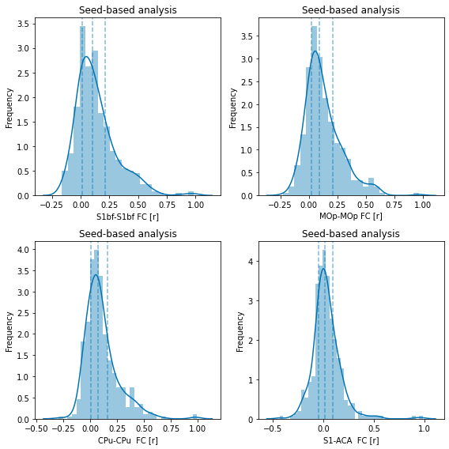
    


```python
#extracting quartiles for the functional connectivity parameters
df_exclude[['aromas_S1bf_S1bf','aromas_MOp_MOp','aromas_CPu_CPu','aromas_S1bf_ACA']].quantile([0.25,0.5,0.75])
```


<div>
<style scoped>
    .dataframe tbody tr th:only-of-type {
        vertical-align: middle;
    }

    .dataframe tbody tr th {
        vertical-align: top;
    }

    .dataframe thead th {
        text-align: right;
    }
</style>
<table border="1" class="dataframe">
  <thead>
    <tr style="text-align: right;">
      <th></th>
      <th>aromas_S1bf_S1bf</th>
      <th>aromas_MOp_MOp</th>
      <th>aromas_CPu_CPu</th>
      <th>aromas_S1bf_ACA</th>
    </tr>
  </thead>
  <tbody>
    <tr>
      <th>0.25</th>
      <td>0.011382</td>
      <td>0.022202</td>
      <td>0.001946</td>
      <td>-0.042448</td>
    </tr>
    <tr>
      <th>0.50</th>
      <td>0.102565</td>
      <td>0.092497</td>
      <td>0.072054</td>
      <td>0.017157</td>
    </tr>
    <tr>
      <th>0.75</th>
      <td>0.211400</td>
      <td>0.210819</td>
      <td>0.161968</td>
      <td>0.092461</td>
    </tr>
  </tbody>
</table>
</div>


```python
import matplotlib.pyplot as plt
import seaborn as sns
#plotting as a function of different parameters

fig, axes = plt.subplots(nrows=3, ncols=2,figsize=(16, 12),constrained_layout=True)


sns.set_palette("colorblind")
df_exclude = df.loc[(df['exclude'] != 'yes')]

ax0 = sns.swarmplot(data=df_exclude, x="rat.strain",
                    y="aromas_S1bf_S1bf", hue="func.sequence",ax=axes[0,0])
ax1 = sns.swarmplot(data=df_exclude, x="anesthesia.maintenance",
                    y="aromas_S1bf_S1bf", hue="func.sequence",ax=axes[0,1])
ax2 = sns.swarmplot(data=df_exclude, x="MRI.field.strength",
                    y="aromas_S1bf_S1bf", hue="func.sequence",ax=axes[1,0])
ax3 = sns.scatterplot(data=df_exclude, x="func.TR",
                    y="aromas_S1bf_S1bf", hue="func.sequence",ax=axes[1,1])
ax4 = sns.scatterplot(data=df_exclude, x="func.TE",
                    y="aromas_S1bf_S1bf", hue="func.sequence",ax=axes[2,0])
ax5 = sns.scatterplot(data=df_exclude, x="tsnr.S1",
                    y="aromas_S1bf_S1bf", hue="func.sequence",ax=axes[2,1])


ax0.set(xlabel='Strain', ylabel='FC [r]', title='S1bf - S1bf FC')
ax0.get_legend().set_title('Sequence')

ax1.set(xlabel='Anesthesia', ylabel='FC [r]')
ax1.get_legend().remove()
ax1.set_xticklabels(ax1.get_xticklabels(), rotation=30, ha='right')

ax2.set(xlabel='Field strength', ylabel='FC [r]')
ax2.get_legend().remove()

ax3.set(xlabel='Repetition time [s]', ylabel='FC [r]')
ax3.get_legend().remove()

ax4.set(xlabel='Echo time [s]', ylabel='FC [r]')
ax4.get_legend().remove()

ax5.set(xlabel='tSNR S1 [a.u.]', ylabel='FC [r]')
ax5.get_legend().remove()

#plt.constrained_layout()

```

    /home/traaffneu/joagra/.conda/envs/multirat/lib/python3.9/site-packages/seaborn/categorical.py:1296: UserWarning: 12.3% of the points cannot be placed; you may want to decrease the size of the markers or use stripplot.
      warnings.warn(msg, UserWarning)
    /home/traaffneu/joagra/.conda/envs/multirat/lib/python3.9/site-packages/seaborn/categorical.py:1296: UserWarning: 24.2% of the points cannot be placed; you may want to decrease the size of the markers or use stripplot.
      warnings.warn(msg, UserWarning)
    /home/traaffneu/joagra/.conda/envs/multirat/lib/python3.9/site-packages/seaborn/categorical.py:1296: UserWarning: 6.0% of the points cannot be placed; you may want to decrease the size of the markers or use stripplot.
      warnings.warn(msg, UserWarning)
    /home/traaffneu/joagra/.conda/envs/multirat/lib/python3.9/site-packages/seaborn/categorical.py:1296: UserWarning: 20.6% of the points cannot be placed; you may want to decrease the size of the markers or use stripplot.
      warnings.warn(msg, UserWarning)
    /home/traaffneu/joagra/.conda/envs/multirat/lib/python3.9/site-packages/seaborn/categorical.py:1296: UserWarning: 8.7% of the points cannot be placed; you may want to decrease the size of the markers or use stripplot.
      warnings.warn(msg, UserWarning)


    
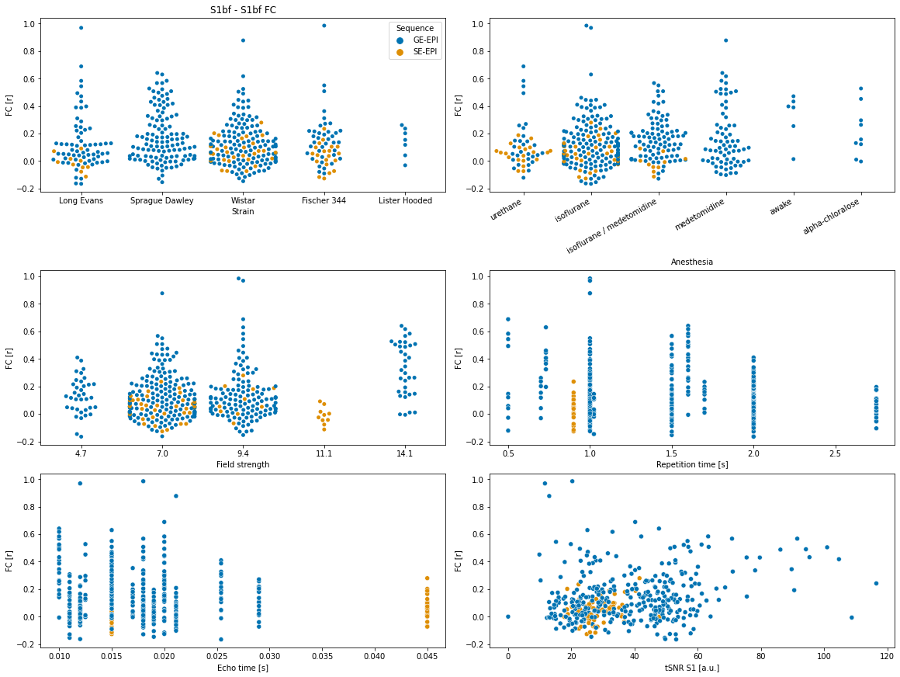
    


```python
df_sub = df_exclude[['aromas_S1bf_S1bf',
             'aromas_MOp_MOp',
             'aromas_CPu_CPu',
             'aromas_S1bf_ACA',
             'rat.sex',
             'rat.strain',
             'rat.age',
             'rat.weight',
             'exp.type',
             'anesthesia.maintenance',
            'anesthesia.breathing.rate',
            'anesthesia.heart.rate',
            'MRI.vendor',
            'MRI.field.strength',
            'func.sequence',
            'func.TR',
            'func.TE']]

df_sub['MRI.field.strength']=df_sub['MRI.field.strength'].astype('int')

```


```python
sns.pairplot(df_sub, hue="func.sequence")
```


    <seaborn.axisgrid.PairGrid at 0x7f4893b06ee0>


    
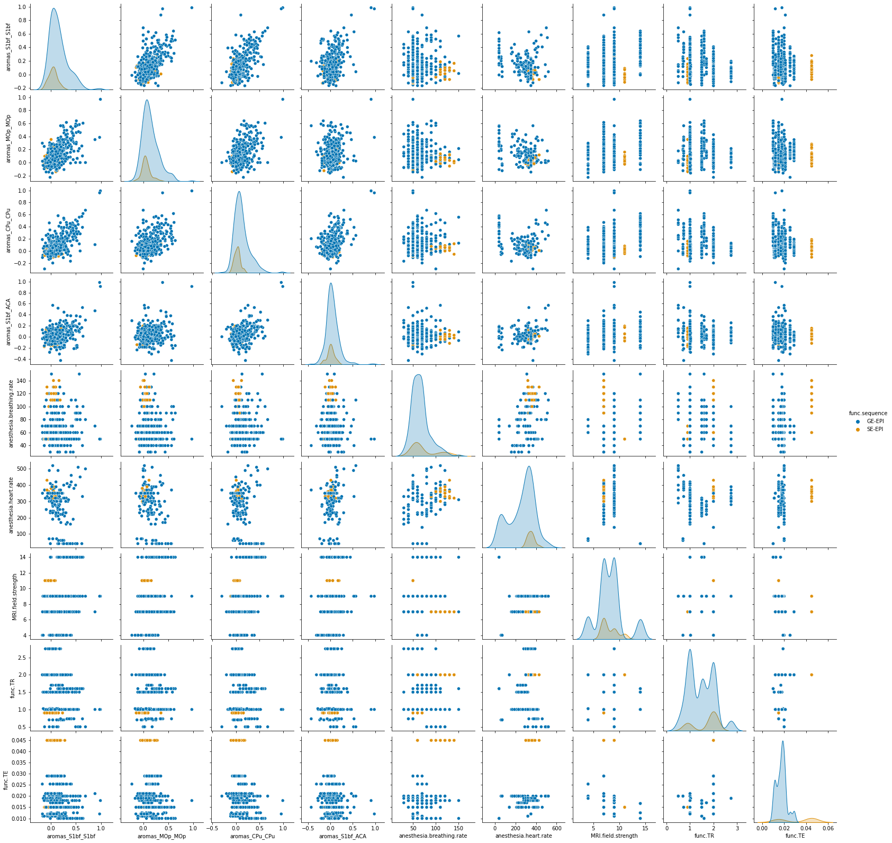
    


```python
import pandas as pd
from statsmodels.formula.api import ols
from statsmodels.stats.anova import anova_lm

#because statsmodels doesn't like columns with dots. the stats were originally planned in R. :-( )
df_exclude.columns=df_exclude.columns.str.replace('[\.]', '')

# Full model
m01 = ols('aromas_S1bf_S1bf ~ ratstrain + anesthesiamaintenance + MRIfieldstrength + funcsequence + funcTR + funcTE + tsnrS1', data=df_exclude).fit()
print(m01.summary())

print('testing for the effect of strain')
m02 = ols('aromas_S1bf_S1bf ~ anesthesiamaintenance + MRIfieldstrength + funcsequence + funcTR + funcTE + tsnrS1', data=df_exclude).fit()
print(anova_lm(m02, m01))

print('')
print('testing for the effect of anesthesia maintenance')
m02 = ols('aromas_S1bf_S1bf ~ ratstrain  + MRIfieldstrength + funcsequence + funcTR + funcTE + tsnrS1', data=df_exclude).fit()
print(anova_lm(m02, m01))

print('')
print('testing for the effect of field strength')
m02 = ols('aromas_S1bf_S1bf ~ ratstrain + anesthesiamaintenance + funcsequence + funcTR + funcTE + tsnrS1', data=df_exclude).fit()
print(anova_lm(m02, m01))

print('')
print('testing for the effect of sequence')
m02 = ols('aromas_S1bf_S1bf ~ ratstrain + anesthesiamaintenance + MRIfieldstrength + funcTR + funcTE + tsnrS1', data=df_exclude).fit()
print(anova_lm(m02, m01))

print('')
print('testing for the effect of TR')
m02 = ols('aromas_S1bf_S1bf ~ MRIfieldstrength + funcsequence + funcTE + tsnrS1', data=df_exclude).fit()
print(anova_lm(m02, m01))

print('')
print('testing for the effect of TE')
m02 = ols('aromas_S1bf_S1bf ~ ratstrain + anesthesiamaintenance + MRIfieldstrength + funcsequence + funcTR + tsnrS1', data=df_exclude).fit()
print(anova_lm(m02, m01))

print('')
print('testing for the effect of tSNR')
m02 = ols('aromas_S1bf_S1bf ~ ratstrain + anesthesiamaintenance + MRIfieldstrength + funcsequence + funcTR + funcTE', data=df_exclude).fit()
print(anova_lm(m02, m01))

```

    <ipython-input-9-c80f1f1ecfdb>:6: FutureWarning: The default value of regex will change from True to False in a future version.
      df_exclude.columns=df_exclude.columns.str.replace('[\.]', '')


                                OLS Regression Results                            
    ==============================================================================
    Dep. Variable:       aromas_S1bf_S1bf   R-squared:                       0.240
    Model:                            OLS   Adj. R-squared:                  0.212
    Method:                 Least Squares   F-statistic:                     8.752
    Date:                Wed, 28 Apr 2021   Prob (F-statistic):           1.29e-16
    Time:                        09:35:36   Log-Likelihood:                 179.66
    No. Observations:                 404   AIC:                            -329.3
    Df Residuals:                     389   BIC:                            -269.3
    Df Model:                          14                                         
    Covariance Type:            nonrobust                                         
    ======================================================================================================================
                                                             coef    std err          t      P>|t|      [0.025      0.975]
    ----------------------------------------------------------------------------------------------------------------------
    Intercept                                             -0.1506      0.088     -1.713      0.087      -0.323       0.022
    ratstrain[T.Lister Hooded]                            -0.0514      0.067     -0.773      0.440      -0.182       0.079
    ratstrain[T.Long Evans]                               -0.0181      0.032     -0.567      0.571      -0.081       0.045
    ratstrain[T.Sprague Dawley]                            0.0275      0.031      0.888      0.375      -0.033       0.088
    ratstrain[T.Wistar]                                   -0.0527      0.030     -1.745      0.082      -0.112       0.007
    anesthesiamaintenance[T.awake]                         0.2770      0.092      3.023      0.003       0.097       0.457
    anesthesiamaintenance[T.isoflurane]                    0.0536      0.063      0.846      0.398      -0.071       0.178
    anesthesiamaintenance[T.isoflurane / medetomidine]     0.0573      0.063      0.904      0.366      -0.067       0.182
    anesthesiamaintenance[T.medetomidine]                  0.0935      0.063      1.478      0.140      -0.031       0.218
    anesthesiamaintenance[T.urethane]                      0.0007      0.068      0.010      0.992      -0.134       0.135
    funcsequence[T.SE-EPI]                                -0.1087      0.029     -3.717      0.000      -0.166      -0.051
    MRIfieldstrength                                       0.0218      0.005      4.682      0.000       0.013       0.031
    funcTR                                                -0.1014      0.019     -5.264      0.000      -0.139      -0.064
    funcTE                                                 7.0521      1.545      4.563      0.000       4.014      10.091
    tsnrS1                                                 0.0026      0.001      5.110      0.000       0.002       0.004
    ==============================================================================
    Omnibus:                      112.234   Durbin-Watson:                   1.777
    Prob(Omnibus):                  0.000   Jarque-Bera (JB):              460.831
    Skew:                           1.162   Prob(JB):                    8.55e-101
    Kurtosis:                       7.688   Cond. No.                     8.31e+03
    ==============================================================================
    
    Notes:
    [1] Standard Errors assume that the covariance matrix of the errors is correctly specified.
    [2] The condition number is large, 8.31e+03. This might indicate that there are
    strong multicollinearity or other numerical problems.
    testing for the effect of strain
       df_resid       ssr  df_diff   ss_diff         F   Pr(>F)
    0     393.0  9.975332      0.0       NaN       NaN      NaN
    1     389.0  9.719463      4.0  0.255869  2.560149  0.03823
    
    testing for the effect of anesthesia maintenance
       df_resid        ssr  df_diff   ss_diff         F    Pr(>F)
    0     394.0  10.201615      0.0       NaN       NaN       NaN
    1     389.0   9.719463      5.0  0.482152  3.859415  0.002001
    
    testing for the effect of field strength
       df_resid        ssr  df_diff   ss_diff          F    Pr(>F)
    0     390.0  10.267276      0.0       NaN        NaN       NaN
    1     389.0   9.719463      1.0  0.547813  21.925011  0.000004
    
    testing for the effect of sequence
       df_resid        ssr  df_diff   ss_diff          F    Pr(>F)
    0     390.0  10.064691      0.0       NaN        NaN       NaN
    1     389.0   9.719463      1.0  0.345228  13.816983  0.000231
    
    testing for the effect of TR
       df_resid        ssr  df_diff   ss_diff         F        Pr(>F)
    0     399.0  11.059375      0.0       NaN       NaN           NaN
    1     389.0   9.719463     10.0  1.339912  5.362703  1.943417e-07
    
    testing for the effect of TE
       df_resid        ssr  df_diff  ss_diff          F    Pr(>F)
    0     390.0  10.239703      0.0      NaN        NaN       NaN
    1     389.0   9.719463      1.0  0.52024  20.821471  0.000007
    
    testing for the effect of tSNR
       df_resid        ssr  df_diff   ss_diff         F    Pr(>F)
    0     408.0  10.733986      0.0       NaN       NaN       NaN
    1     389.0   9.719463     19.0  1.014523  2.137055  0.003856

