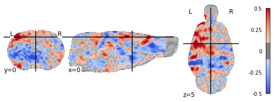
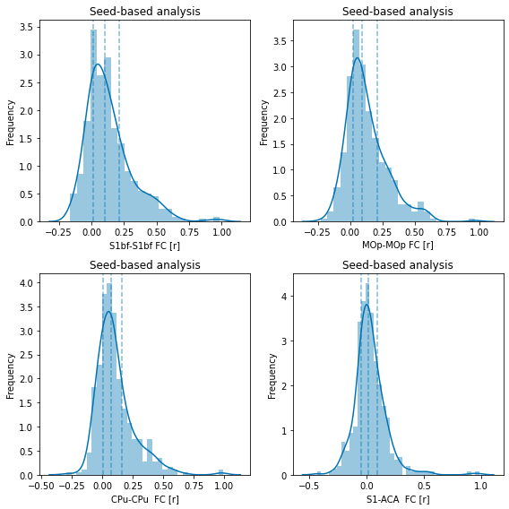
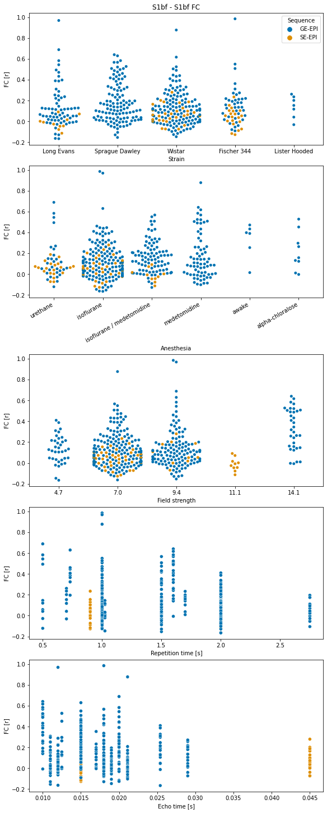

MultiRAT analysis code
================
Joanes Grandjean


# Foreword

This is a R markdown file which contains all the code for reproducing my
analysis. The code is meant to be followed step-wise. The raw fMRI
dataset will not be publicly available before the project preprint
publication on BioArxiv. The raw fMRI dataset can be made available
prior to publication upon request and review from the authors.

If re-using some of the scripts, please follow citations guidelines for
the software used. I’ve provided the links to the software wherever
possible. See also the [license](../LICENSE.md) for this software.


```python
# init variables
init_folder='/home/traaffneu/joagra/code/MultiRat'
analysis_folder='/project/4180000.19/multiRat'
```


```python
import os
import glob
import pandas as pd
import numpy as np

df = pd.read_csv('../assets/table/meta_data_20210411_snr.tsv', sep='\t')
```


```python
# create emty columns for the different SBA parameters.
df['aromas_CPu_CPu'] = np.nan
df['aromas_MOp_MOp'] = np.nan
df['aromas_S1bf_S1bf'] = np.nan
df['aromas_S1bf_ACA'] = np.nan
df['aromas_S1bf_cat'] = np.nan

df['aromal_CPu_CPu'] = np.nan
df['aromal_MOp_MOp'] = np.nan
df['aromal_S1bf_S1bf'] = np.nan
df['aromal_S1bf_ACA'] = np.nan
df['aromal_S1bf_cat'] = np.nan

df['aromasr_CPu_CPu'] = np.nan
df['aromasr_MOp_MOp'] = np.nan
df['aromasr_S1bf_S1bf'] = np.nan
df['aromasr_S1bf_ACA'] = np.nan
df['aromasr_S1bf_cat'] = np.nan

df['WMCSFs_CPu_CPu'] = np.nan
df['WMCSFs_MOp_MOp'] = np.nan
df['WMCSFs_S1bf_S1bf'] = np.nan
df['WMCSFs_S1bf_ACA'] = np.nan
df['WMCSFs_S1bf_cat'] = np.nan

df['GSRs_CPu_CPu'] = np.nan
df['GSRs_MOp_MOp'] = np.nan
df['GSRs_S1bf_S1bf'] = np.nan
df['GSRs_S1bf_ACA'] = np.nan
df['GSRs_S1bf_cat'] = np.nan
```


```python
roi_list = glob.glob((os.path.join(analysis_folder, 'template', 'roi'))+'/*')
seed_list = glob.glob((os.path.join(analysis_folder, 'scratch', 'seed','*'))+'/*')
```


```python
import pandas as pd
pd.options.mode.chained_assignment = None

from nilearn.input_data import NiftiMasker
import re
import numpy as np

for i_orig in seed_list:
    #print(i_orig)
    i=i_orig.replace('_RAS','')
    i=i.replace('_aroma','')
    sub=int(os.path.basename(i).split('_')[0].split('-')[1])
    ses=int(os.path.basename(i).split('_')[1].split('-')[1])
    denoise=i.split('/')[6]
    seed=os.path.basename(i).split('_')[6]
    if(seed =='ACA'):
        continue
    elif(seed =='S1bf'):
        roi='ACA'
        r = re.compile('ACA'+'_l')
        nifti_mask=list(filter(r.findall, roi_list))[0]
        fc=NiftiMasker(nifti_mask).fit_transform(i_orig).mean()
        df[(denoise+'_'+seed+'_'+roi)][(df['rat.sub']==sub) & (df['rat.ses']==ses)]=fc
    
    roi=seed
    r = re.compile(seed+'_r')
    nifti_mask=list(filter(r.findall, roi_list))[0]
    fc=NiftiMasker(nifti_mask).fit_transform(i_orig).mean()
    df[(denoise+'_'+seed+'_'+roi)][(df['rat.sub']==sub) & (df['rat.ses']==ses)]=fc
    
df.to_csv('../assets/table/meta_data_20210411_snr.tsv', sep='\t')
```

    /home/traaffneu/joagra/.conda/envs/multirat/lib/python3.9/site-packages/nilearn/image/resampling.py:527: UserWarning: Casting data from int16 to float32
      warnings.warn("Casting data from %s to %s" % (data.dtype.name, aux))
    /home/traaffneu/joagra/.conda/envs/multirat/lib/python3.9/site-packages/nilearn/image/resampling.py:527: UserWarning: Casting data from int16 to float32
      warnings.warn("Casting data from %s to %s" % (data.dtype.name, aux))
    /home/traaffneu/joagra/.conda/envs/multirat/lib/python3.9/site-packages/nilearn/image/resampling.py:527: UserWarning: Casting data from int16 to float32
      warnings.warn("Casting data from %s to %s" % (data.dtype.name, aux))
    /home/traaffneu/joagra/.conda/envs/multirat/lib/python3.9/site-packages/nilearn/image/resampling.py:527: UserWarning: Casting data from int16 to float32
      warnings.warn("Casting data from %s to %s" % (data.dtype.name, aux))
    /home/traaffneu/joagra/.conda/envs/multirat/lib/python3.9/site-packages/nilearn/image/resampling.py:527: UserWarning: Casting data from int16 to float32
      warnings.warn("Casting data from %s to %s" % (data.dtype.name, aux))
    /home/traaffneu/joagra/.conda/envs/multirat/lib/python3.9/site-packages/nilearn/image/resampling.py:527: UserWarning: Casting data from int16 to float32
      warnings.warn("Casting data from %s to %s" % (data.dtype.name, aux))
    /home/traaffneu/joagra/.conda/envs/multirat/lib/python3.9/site-packages/nilearn/image/resampling.py:527: UserWarning: Casting data from int16 to float32
      warnings.warn("Casting data from %s to %s" % (data.dtype.name, aux))
    /home/traaffneu/joagra/.conda/envs/multirat/lib/python3.9/site-packages/nilearn/image/resampling.py:527: UserWarning: Casting data from int16 to float32
      warnings.warn("Casting data from %s to %s" % (data.dtype.name, aux))
    /home/traaffneu/joagra/.conda/envs/multirat/lib/python3.9/site-packages/nilearn/image/resampling.py:527: UserWarning: Casting data from int16 to float32
      warnings.warn("Casting data from %s to %s" % (data.dtype.name, aux))
    /home/traaffneu/joagra/.conda/envs/multirat/lib/python3.9/site-packages/nilearn/image/resampling.py:527: UserWarning: Casting data from int16 to float32
      warnings.warn("Casting data from %s to %s" % (data.dtype.name, aux))
    /home/traaffneu/joagra/.conda/envs/multirat/lib/python3.9/site-packages/nilearn/image/resampling.py:527: UserWarning: Casting data from int16 to float32
      warnings.warn("Casting data from %s to %s" % (data.dtype.name, aux))
    /home/traaffneu/joagra/.conda/envs/multirat/lib/python3.9/site-packages/nilearn/image/resampling.py:527: UserWarning: Casting data from int16 to float32
      warnings.warn("Casting data from %s to %s" % (data.dtype.name, aux))
    /home/traaffneu/joagra/.conda/envs/multirat/lib/python3.9/site-packages/nilearn/image/resampling.py:527: UserWarning: Casting data from int16 to float32
      warnings.warn("Casting data from %s to %s" % (data.dtype.name, aux))
    /home/traaffneu/joagra/.conda/envs/multirat/lib/python3.9/site-packages/nilearn/image/resampling.py:527: UserWarning: Casting data from int16 to float32
      warnings.warn("Casting data from %s to %s" % (data.dtype.name, aux))
    /home/traaffneu/joagra/.conda/envs/multirat/lib/python3.9/site-packages/nilearn/image/resampling.py:527: UserWarning: Casting data from int16 to float32
      warnings.warn("Casting data from %s to %s" % (data.dtype.name, aux))
    /home/traaffneu/joagra/.conda/envs/multirat/lib/python3.9/site-packages/nilearn/image/resampling.py:527: UserWarning: Casting data from int16 to float32
      warnings.warn("Casting data from %s to %s" % (data.dtype.name, aux))
    /home/traaffneu/joagra/.conda/envs/multirat/lib/python3.9/site-packages/nilearn/image/resampling.py:527: UserWarning: Casting data from int16 to float32
      warnings.warn("Casting data from %s to %s" % (data.dtype.name, aux))
    /home/traaffneu/joagra/.conda/envs/multirat/lib/python3.9/site-packages/nilearn/image/resampling.py:527: UserWarning: Casting data from int16 to float32
      warnings.warn("Casting data from %s to %s" % (data.dtype.name, aux))
    /home/traaffneu/joagra/.conda/envs/multirat/lib/python3.9/site-packages/nilearn/image/resampling.py:527: UserWarning: Casting data from int16 to float32
      warnings.warn("Casting data from %s to %s" % (data.dtype.name, aux))
    /home/traaffneu/joagra/.conda/envs/multirat/lib/python3.9/site-packages/nilearn/image/resampling.py:527: UserWarning: Casting data from int16 to float32
      warnings.warn("Casting data from %s to %s" % (data.dtype.name, aux))
    /home/traaffneu/joagra/.conda/envs/multirat/lib/python3.9/site-packages/nilearn/image/resampling.py:527: UserWarning: Casting data from int16 to float32
      warnings.warn("Casting data from %s to %s" % (data.dtype.name, aux))
    /home/traaffneu/joagra/.conda/envs/multirat/lib/python3.9/site-packages/nilearn/image/resampling.py:527: UserWarning: Casting data from int16 to float32
      warnings.warn("Casting data from %s to %s" % (data.dtype.name, aux))
    /home/traaffneu/joagra/.conda/envs/multirat/lib/python3.9/site-packages/nilearn/image/resampling.py:527: UserWarning: Casting data from int16 to float32
      warnings.warn("Casting data from %s to %s" % (data.dtype.name, aux))
    /home/traaffneu/joagra/.conda/envs/multirat/lib/python3.9/site-packages/nilearn/image/resampling.py:527: UserWarning: Casting data from int16 to float32
      warnings.warn("Casting data from %s to %s" % (data.dtype.name, aux))
    /home/traaffneu/joagra/.conda/envs/multirat/lib/python3.9/site-packages/nilearn/image/resampling.py:527: UserWarning: Casting data from int16 to float32
      warnings.warn("Casting data from %s to %s" % (data.dtype.name, aux))
    /home/traaffneu/joagra/.conda/envs/multirat/lib/python3.9/site-packages/nilearn/image/resampling.py:527: UserWarning: Casting data from int16 to float32
      warnings.warn("Casting data from %s to %s" % (data.dtype.name, aux))
    /home/traaffneu/joagra/.conda/envs/multirat/lib/python3.9/site-packages/nilearn/image/resampling.py:527: UserWarning: Casting data from int16 to float32
      warnings.warn("Casting data from %s to %s" % (data.dtype.name, aux))
    /home/traaffneu/joagra/.conda/envs/multirat/lib/python3.9/site-packages/nilearn/image/resampling.py:527: UserWarning: Casting data from int16 to float32
      warnings.warn("Casting data from %s to %s" % (data.dtype.name, aux))
    /home/traaffneu/joagra/.conda/envs/multirat/lib/python3.9/site-packages/nilearn/image/resampling.py:527: UserWarning: Casting data from int16 to float32
      warnings.warn("Casting data from %s to %s" % (data.dtype.name, aux))
    /home/traaffneu/joagra/.conda/envs/multirat/lib/python3.9/site-packages/nilearn/image/resampling.py:527: UserWarning: Casting data from int16 to float32
      warnings.warn("Casting data from %s to %s" % (data.dtype.name, aux))
    /home/traaffneu/joagra/.conda/envs/multirat/lib/python3.9/site-packages/nilearn/image/resampling.py:527: UserWarning: Casting data from int16 to float32
      warnings.warn("Casting data from %s to %s" % (data.dtype.name, aux))
    /home/traaffneu/joagra/.conda/envs/multirat/lib/python3.9/site-packages/nilearn/image/resampling.py:527: UserWarning: Casting data from int16 to float32
      warnings.warn("Casting data from %s to %s" % (data.dtype.name, aux))
    /home/traaffneu/joagra/.conda/envs/multirat/lib/python3.9/site-packages/nilearn/image/resampling.py:527: UserWarning: Casting data from int16 to float32
      warnings.warn("Casting data from %s to %s" % (data.dtype.name, aux))
    /home/traaffneu/joagra/.conda/envs/multirat/lib/python3.9/site-packages/nilearn/image/resampling.py:527: UserWarning: Casting data from int16 to float32
      warnings.warn("Casting data from %s to %s" % (data.dtype.name, aux))
    /home/traaffneu/joagra/.conda/envs/multirat/lib/python3.9/site-packages/nilearn/image/resampling.py:527: UserWarning: Casting data from int16 to float32
      warnings.warn("Casting data from %s to %s" % (data.dtype.name, aux))
    /home/traaffneu/joagra/.conda/envs/multirat/lib/python3.9/site-packages/nilearn/image/resampling.py:527: UserWarning: Casting data from int16 to float32
      warnings.warn("Casting data from %s to %s" % (data.dtype.name, aux))
    /home/traaffneu/joagra/.conda/envs/multirat/lib/python3.9/site-packages/nilearn/image/resampling.py:527: UserWarning: Casting data from int16 to float32
      warnings.warn("Casting data from %s to %s" % (data.dtype.name, aux))
    /home/traaffneu/joagra/.conda/envs/multirat/lib/python3.9/site-packages/nilearn/image/resampling.py:527: UserWarning: Casting data from int16 to float32
      warnings.warn("Casting data from %s to %s" % (data.dtype.name, aux))
    /home/traaffneu/joagra/.conda/envs/multirat/lib/python3.9/site-packages/nilearn/image/resampling.py:527: UserWarning: Casting data from int16 to float32
      warnings.warn("Casting data from %s to %s" % (data.dtype.name, aux))
    /home/traaffneu/joagra/.conda/envs/multirat/lib/python3.9/site-packages/nilearn/image/resampling.py:527: UserWarning: Casting data from int16 to float32
      warnings.warn("Casting data from %s to %s" % (data.dtype.name, aux))
    /home/traaffneu/joagra/.conda/envs/multirat/lib/python3.9/site-packages/nilearn/image/resampling.py:527: UserWarning: Casting data from int16 to float32
      warnings.warn("Casting data from %s to %s" % (data.dtype.name, aux))
    /home/traaffneu/joagra/.conda/envs/multirat/lib/python3.9/site-packages/nilearn/image/resampling.py:527: UserWarning: Casting data from int16 to float32
      warnings.warn("Casting data from %s to %s" % (data.dtype.name, aux))
    /home/traaffneu/joagra/.conda/envs/multirat/lib/python3.9/site-packages/nilearn/image/resampling.py:527: UserWarning: Casting data from int16 to float32
      warnings.warn("Casting data from %s to %s" % (data.dtype.name, aux))
    /home/traaffneu/joagra/.conda/envs/multirat/lib/python3.9/site-packages/nilearn/image/resampling.py:527: UserWarning: Casting data from int16 to float32
      warnings.warn("Casting data from %s to %s" % (data.dtype.name, aux))
    /home/traaffneu/joagra/.conda/envs/multirat/lib/python3.9/site-packages/nilearn/image/resampling.py:527: UserWarning: Casting data from int16 to float32
      warnings.warn("Casting data from %s to %s" % (data.dtype.name, aux))
    /home/traaffneu/joagra/.conda/envs/multirat/lib/python3.9/site-packages/nilearn/image/resampling.py:527: UserWarning: Casting data from int16 to float32
      warnings.warn("Casting data from %s to %s" % (data.dtype.name, aux))
    /home/traaffneu/joagra/.conda/envs/multirat/lib/python3.9/site-packages/nilearn/image/resampling.py:527: UserWarning: Casting data from int16 to float32
      warnings.warn("Casting data from %s to %s" % (data.dtype.name, aux))
    /home/traaffneu/joagra/.conda/envs/multirat/lib/python3.9/site-packages/nilearn/image/resampling.py:527: UserWarning: Casting data from int16 to float32
      warnings.warn("Casting data from %s to %s" % (data.dtype.name, aux))
    /home/traaffneu/joagra/.conda/envs/multirat/lib/python3.9/site-packages/nilearn/image/resampling.py:527: UserWarning: Casting data from int16 to float32
      warnings.warn("Casting data from %s to %s" % (data.dtype.name, aux))
    /home/traaffneu/joagra/.conda/envs/multirat/lib/python3.9/site-packages/nilearn/image/resampling.py:527: UserWarning: Casting data from int16 to float32
      warnings.warn("Casting data from %s to %s" % (data.dtype.name, aux))
    /home/traaffneu/joagra/.conda/envs/multirat/lib/python3.9/site-packages/nilearn/image/resampling.py:527: UserWarning: Casting data from int16 to float32
      warnings.warn("Casting data from %s to %s" % (data.dtype.name, aux))
    /home/traaffneu/joagra/.conda/envs/multirat/lib/python3.9/site-packages/nilearn/image/resampling.py:527: UserWarning: Casting data from int16 to float32
      warnings.warn("Casting data from %s to %s" % (data.dtype.name, aux))
    /home/traaffneu/joagra/.conda/envs/multirat/lib/python3.9/site-packages/nilearn/image/resampling.py:527: UserWarning: Casting data from int16 to float32
      warnings.warn("Casting data from %s to %s" % (data.dtype.name, aux))
    /home/traaffneu/joagra/.conda/envs/multirat/lib/python3.9/site-packages/nilearn/image/resampling.py:527: UserWarning: Casting data from int16 to float32
      warnings.warn("Casting data from %s to %s" % (data.dtype.name, aux))
    /home/traaffneu/joagra/.conda/envs/multirat/lib/python3.9/site-packages/nilearn/image/resampling.py:527: UserWarning: Casting data from int16 to float32
      warnings.warn("Casting data from %s to %s" % (data.dtype.name, aux))
    /home/traaffneu/joagra/.conda/envs/multirat/lib/python3.9/site-packages/nilearn/image/resampling.py:527: UserWarning: Casting data from int16 to float32
      warnings.warn("Casting data from %s to %s" % (data.dtype.name, aux))
    /home/traaffneu/joagra/.conda/envs/multirat/lib/python3.9/site-packages/nilearn/image/resampling.py:527: UserWarning: Casting data from int16 to float32
      warnings.warn("Casting data from %s to %s" % (data.dtype.name, aux))
    /home/traaffneu/joagra/.conda/envs/multirat/lib/python3.9/site-packages/nilearn/image/resampling.py:527: UserWarning: Casting data from int16 to float32
      warnings.warn("Casting data from %s to %s" % (data.dtype.name, aux))
    /home/traaffneu/joagra/.conda/envs/multirat/lib/python3.9/site-packages/nilearn/image/resampling.py:527: UserWarning: Casting data from int16 to float32
      warnings.warn("Casting data from %s to %s" % (data.dtype.name, aux))
    /home/traaffneu/joagra/.conda/envs/multirat/lib/python3.9/site-packages/nilearn/image/resampling.py:527: UserWarning: Casting data from int16 to float32
      warnings.warn("Casting data from %s to %s" % (data.dtype.name, aux))
    /home/traaffneu/joagra/.conda/envs/multirat/lib/python3.9/site-packages/nilearn/image/resampling.py:527: UserWarning: Casting data from int16 to float32
      warnings.warn("Casting data from %s to %s" % (data.dtype.name, aux))
    /home/traaffneu/joagra/.conda/envs/multirat/lib/python3.9/site-packages/nilearn/image/resampling.py:527: UserWarning: Casting data from int16 to float32
      warnings.warn("Casting data from %s to %s" % (data.dtype.name, aux))
    /home/traaffneu/joagra/.conda/envs/multirat/lib/python3.9/site-packages/nilearn/image/resampling.py:527: UserWarning: Casting data from int16 to float32
      warnings.warn("Casting data from %s to %s" % (data.dtype.name, aux))
    /home/traaffneu/joagra/.conda/envs/multirat/lib/python3.9/site-packages/nilearn/image/resampling.py:527: UserWarning: Casting data from int16 to float32
      warnings.warn("Casting data from %s to %s" % (data.dtype.name, aux))
    /home/traaffneu/joagra/.conda/envs/multirat/lib/python3.9/site-packages/nilearn/image/resampling.py:527: UserWarning: Casting data from int16 to float32
      warnings.warn("Casting data from %s to %s" % (data.dtype.name, aux))
    /home/traaffneu/joagra/.conda/envs/multirat/lib/python3.9/site-packages/nilearn/image/resampling.py:527: UserWarning: Casting data from int16 to float32
      warnings.warn("Casting data from %s to %s" % (data.dtype.name, aux))
    /home/traaffneu/joagra/.conda/envs/multirat/lib/python3.9/site-packages/nilearn/image/resampling.py:527: UserWarning: Casting data from int16 to float32
      warnings.warn("Casting data from %s to %s" % (data.dtype.name, aux))
    /home/traaffneu/joagra/.conda/envs/multirat/lib/python3.9/site-packages/nilearn/image/resampling.py:527: UserWarning: Casting data from int16 to float32
      warnings.warn("Casting data from %s to %s" % (data.dtype.name, aux))
    /home/traaffneu/joagra/.conda/envs/multirat/lib/python3.9/site-packages/nilearn/image/resampling.py:527: UserWarning: Casting data from int16 to float32
      warnings.warn("Casting data from %s to %s" % (data.dtype.name, aux))
    /home/traaffneu/joagra/.conda/envs/multirat/lib/python3.9/site-packages/nilearn/image/resampling.py:527: UserWarning: Casting data from int16 to float32
      warnings.warn("Casting data from %s to %s" % (data.dtype.name, aux))
    /home/traaffneu/joagra/.conda/envs/multirat/lib/python3.9/site-packages/nilearn/image/resampling.py:527: UserWarning: Casting data from int16 to float32
      warnings.warn("Casting data from %s to %s" % (data.dtype.name, aux))
    /home/traaffneu/joagra/.conda/envs/multirat/lib/python3.9/site-packages/nilearn/image/resampling.py:527: UserWarning: Casting data from int16 to float32
      warnings.warn("Casting data from %s to %s" % (data.dtype.name, aux))
    /home/traaffneu/joagra/.conda/envs/multirat/lib/python3.9/site-packages/nilearn/image/resampling.py:527: UserWarning: Casting data from int16 to float32
      warnings.warn("Casting data from %s to %s" % (data.dtype.name, aux))
    /home/traaffneu/joagra/.conda/envs/multirat/lib/python3.9/site-packages/nilearn/image/resampling.py:527: UserWarning: Casting data from int16 to float32
      warnings.warn("Casting data from %s to %s" % (data.dtype.name, aux))
    /home/traaffneu/joagra/.conda/envs/multirat/lib/python3.9/site-packages/nilearn/image/resampling.py:527: UserWarning: Casting data from int16 to float32
      warnings.warn("Casting data from %s to %s" % (data.dtype.name, aux))
    /home/traaffneu/joagra/.conda/envs/multirat/lib/python3.9/site-packages/nilearn/image/resampling.py:527: UserWarning: Casting data from int16 to float32
      warnings.warn("Casting data from %s to %s" % (data.dtype.name, aux))
    /home/traaffneu/joagra/.conda/envs/multirat/lib/python3.9/site-packages/nilearn/image/resampling.py:527: UserWarning: Casting data from int16 to float32
      warnings.warn("Casting data from %s to %s" % (data.dtype.name, aux))
    /home/traaffneu/joagra/.conda/envs/multirat/lib/python3.9/site-packages/nilearn/image/resampling.py:527: UserWarning: Casting data from int16 to float32
      warnings.warn("Casting data from %s to %s" % (data.dtype.name, aux))
    /home/traaffneu/joagra/.conda/envs/multirat/lib/python3.9/site-packages/nilearn/image/resampling.py:527: UserWarning: Casting data from int16 to float32
      warnings.warn("Casting data from %s to %s" % (data.dtype.name, aux))
    /home/traaffneu/joagra/.conda/envs/multirat/lib/python3.9/site-packages/nilearn/image/resampling.py:527: UserWarning: Casting data from int16 to float32
      warnings.warn("Casting data from %s to %s" % (data.dtype.name, aux))
    /home/traaffneu/joagra/.conda/envs/multirat/lib/python3.9/site-packages/nilearn/image/resampling.py:527: UserWarning: Casting data from int16 to float32
      warnings.warn("Casting data from %s to %s" % (data.dtype.name, aux))
    /home/traaffneu/joagra/.conda/envs/multirat/lib/python3.9/site-packages/nilearn/image/resampling.py:527: UserWarning: Casting data from int16 to float32
      warnings.warn("Casting data from %s to %s" % (data.dtype.name, aux))
    /home/traaffneu/joagra/.conda/envs/multirat/lib/python3.9/site-packages/nilearn/image/resampling.py:527: UserWarning: Casting data from int16 to float32
      warnings.warn("Casting data from %s to %s" % (data.dtype.name, aux))
    /home/traaffneu/joagra/.conda/envs/multirat/lib/python3.9/site-packages/nilearn/image/resampling.py:527: UserWarning: Casting data from int16 to float32
      warnings.warn("Casting data from %s to %s" % (data.dtype.name, aux))
    /home/traaffneu/joagra/.conda/envs/multirat/lib/python3.9/site-packages/nilearn/image/resampling.py:527: UserWarning: Casting data from int16 to float32
      warnings.warn("Casting data from %s to %s" % (data.dtype.name, aux))
    /home/traaffneu/joagra/.conda/envs/multirat/lib/python3.9/site-packages/nilearn/image/resampling.py:527: UserWarning: Casting data from int16 to float32
      warnings.warn("Casting data from %s to %s" % (data.dtype.name, aux))
    /home/traaffneu/joagra/.conda/envs/multirat/lib/python3.9/site-packages/nilearn/image/resampling.py:527: UserWarning: Casting data from int16 to float32
      warnings.warn("Casting data from %s to %s" % (data.dtype.name, aux))
    /home/traaffneu/joagra/.conda/envs/multirat/lib/python3.9/site-packages/nilearn/image/resampling.py:527: UserWarning: Casting data from int16 to float32
      warnings.warn("Casting data from %s to %s" % (data.dtype.name, aux))
    /home/traaffneu/joagra/.conda/envs/multirat/lib/python3.9/site-packages/nilearn/image/resampling.py:527: UserWarning: Casting data from int16 to float32
      warnings.warn("Casting data from %s to %s" % (data.dtype.name, aux))
    /home/traaffneu/joagra/.conda/envs/multirat/lib/python3.9/site-packages/nilearn/image/resampling.py:527: UserWarning: Casting data from int16 to float32
      warnings.warn("Casting data from %s to %s" % (data.dtype.name, aux))


```python
df_exclude = df.loc[(df['exclude'] != 'yes')].loc[(df['exp.type'] == 'resting-state')]
print('missing aromas')
print(df_exclude[np.isnan(df['aromas_S1bf_S1bf']) | np.isnan(df['aromas_S1bf_ACA']) | np.isnan(df['aromas_MOp_MOp'])  | np.isnan(df['aromas_CPu_CPu'])]['rat.ds'].unique())

print('missing aromal')
print(df_exclude[np.isnan(df['aromal_S1bf_S1bf']) | np.isnan(df['aromal_S1bf_ACA']) | np.isnan(df['aromal_MOp_MOp'])  | np.isnan(df['aromal_CPu_CPu'])]['rat.ds'].unique())

print('missing aromasr')
print(df_exclude[np.isnan(df['aromasr_S1bf_S1bf']) | np.isnan(df['aromasr_S1bf_ACA']) | np.isnan(df['aromasr_MOp_MOp'])  | np.isnan(df['aromasr_CPu_CPu'])]['rat.ds'].unique())

print('missing WMCSFs')
print(df_exclude[np.isnan(df['WMCSFs_S1bf_S1bf']) | np.isnan(df['WMCSFs_S1bf_ACA']) | np.isnan(df['WMCSFs_MOp_MOp'])  | np.isnan(df['WMCSFs_CPu_CPu'])]['rat.ds'].unique())

print('missing GSRs')
print(df_exclude[np.isnan(df['GSRs_S1bf_S1bf']) | np.isnan(df['GSRs_S1bf_ACA']) | np.isnan(df['GSRs_MOp_MOp'])  | np.isnan(df['GSRs_CPu_CPu'])]['rat.ds'].unique())

```

    missing aromas
    [1020 1022 1035]
    missing aromal
    [1007 1018 1020 1022 1026 1035]
    missing aromasr
    [1001 1004 1006 1007 1009 1010 1020 1022 1025 1027 1033 1034 1035]
    missing WMCSFs
    [1006 1010 1017 1022 1025 1033 1034]
    missing GSRs
    [1001 1006 1009 1020 1022 1025 1027 1034 1036]


    <ipython-input-26-25e6d1fc9ab8>:3: UserWarning: Boolean Series key will be reindexed to match DataFrame index.
      print(df_exclude[np.isnan(df['aromas_S1bf_S1bf']) | np.isnan(df['aromas_S1bf_ACA']) | np.isnan(df['aromas_MOp_MOp'])  | np.isnan(df['aromas_CPu_CPu'])]['rat.ds'].unique())
    <ipython-input-26-25e6d1fc9ab8>:6: UserWarning: Boolean Series key will be reindexed to match DataFrame index.
      print(df_exclude[np.isnan(df['aromal_S1bf_S1bf']) | np.isnan(df['aromal_S1bf_ACA']) | np.isnan(df['aromal_MOp_MOp'])  | np.isnan(df['aromal_CPu_CPu'])]['rat.ds'].unique())
    <ipython-input-26-25e6d1fc9ab8>:9: UserWarning: Boolean Series key will be reindexed to match DataFrame index.
      print(df_exclude[np.isnan(df['aromasr_S1bf_S1bf']) | np.isnan(df['aromasr_S1bf_ACA']) | np.isnan(df['aromasr_MOp_MOp'])  | np.isnan(df['aromasr_CPu_CPu'])]['rat.ds'].unique())
    <ipython-input-26-25e6d1fc9ab8>:12: UserWarning: Boolean Series key will be reindexed to match DataFrame index.
      print(df_exclude[np.isnan(df['WMCSFs_S1bf_S1bf']) | np.isnan(df['WMCSFs_S1bf_ACA']) | np.isnan(df['WMCSFs_MOp_MOp'])  | np.isnan(df['WMCSFs_CPu_CPu'])]['rat.ds'].unique())
    <ipython-input-26-25e6d1fc9ab8>:15: UserWarning: Boolean Series key will be reindexed to match DataFrame index.
      print(df_exclude[np.isnan(df['GSRs_S1bf_S1bf']) | np.isnan(df['GSRs_S1bf_ACA']) | np.isnan(df['GSRs_MOp_MOp'])  | np.isnan(df['GSRs_CPu_CPu'])]['rat.ds'].unique())


To estimate specificity, i need to assume a significance threshold.  i find that 50% of the scans have at least 340 volumes (see below). Using the following [calculations](http://vassarstats.net/tabs_r.html), I find that `r >= 0.1` corresponds to p ~ 0.05 in a one-tailed test. I therefore use this a threshold to assume `significant` inter-seed correlations for the following analysis. This is a necessary heuristic that can be applied in other studies. The limitation being that it does not apply equally to all dataset (either with fewer or more volume). 


```python
df['func.volume'].describe()
```


    count     533.000000
    mean      587.420263
    std       580.735416
    min       150.000000
    25%       300.000000
    50%       340.000000
    75%       600.000000
    max      3600.000000
    Name: func.volume, dtype: float64


```python
# This is a function to estimate functional connectivity specificity. See Grandjean 2020 for details on the reasoning 

def specific_FC(specific_roi, unspecific_ROI):
    if (specific_roi>=0.1) and (unspecific_ROI<0.1):
        cat='Specific'
    elif (specific_roi>=0.1) and (unspecific_ROI>=0.1):
        cat='Unspecific'
    elif (abs(specific_roi)<0.1) and (abs(unspecific_ROI)<0.1):
        cat='No'
    else:
        cat='Spurious'
    return cat


```


```python
for i in list(range(0,df.shape[0])):
    #---- Now doing aromas condition
    specific=df['aromas_S1bf_S1bf'][i]
    unspecific=df['aromas_S1bf_ACA'][i]
    if(np.isnan(specific) | np.isnan(unspecific)):
        print('')
    else:
        df['aromas_S1bf_cat'][i]=specific_FC(specific,unspecific)  
    
    #---- Now doing aromal condition
    specific=df['aromal_S1bf_S1bf'][i]
    unspecific=df['aromal_S1bf_ACA'][i]
    if(np.isnan(specific) | np.isnan(unspecific)):
        print('')
    else:
        df['aromal_S1bf_cat'][i]=specific_FC(specific,unspecific)        
    
    #---- Now doing aromasr condition
    specific=df['aromasr_S1bf_S1bf'][i]
    unspecific=df['aromasr_S1bf_ACA'][i]
    if(np.isnan(specific) | np.isnan(unspecific)):
        print('')
    else:
        df['aromasr_S1bf_cat'][i]=specific_FC(specific,unspecific)  
        
    #---- Now doing WMCSFs condition
    specific=df['WMCSFs_S1bf_S1bf'][i]
    unspecific=df['WMCSFs_S1bf_ACA'][i]
    if(np.isnan(specific) | np.isnan(unspecific)):
        print('')
    else:
        df['WMCSFs_S1bf_cat'][i]=specific_FC(specific,unspecific)  
        
    #---- Now doing GSRs condition
    specific=df['GSRs_S1bf_S1bf'][i]
    unspecific=df['GSRs_S1bf_ACA'][i]
    if(np.isnan(specific) | np.isnan(unspecific)):
        print('')
    else:
        df['GSRs_S1bf_cat'][i]=specific_FC(specific,unspecific)  
```

    
    
    
    
    
    
    
    
    
    
    
    
    
    
    
    
    
    
    
    
    
    
    
    
    
    
    
    
    
    
    
    
    
    
    
    
    
    
    
    
    
    
    
    
    
    
    
    
    
    
    
    
    
    
    
    
    
    
    
    
    
    
    
    
    
    
    
    
    
    
    
    
    
    
    
    
    
    
    
    
    
    
    
    
    
    
    
    
    
    
    
    
    
    
    
    
    
    
    
    
    
    
    
    
    
    
    
    
    
    
    
    
    
    
    
    
    
    
    
    
    
    
    
    
    
    
    
    
    
    
    
    
    
    
    
    
    
    
    
    
    
    
    
    
    
    
    
    
    
    
    
    
    
    
    
    
    
    
    
    
    
    
    
    
    
    
    
    
    
    
    
    
    
    
    
    
    
    
    
    
    
    
    
    
    
    
    
    
    
    
    
    
    
    
    
    
    
    
    
    
    
    
    
    
    
    
    
    
    
    
    
    
    
    
    
    
    
    
    
    
    
    
    
    
    
    
    
    
    
    
    
    
    
    
    
    
    
    
    
    
    
    
    
    
    
    
    
    
    
    
    
    
    
    
    
    
    
    
    
    
    
    
    
    
    
    
    
    
    
    
    
    
    
    
    
    
    
    
    
    
    
    
    
    
    
    
    
    
    
    
    
    
    
    
    
    
    
    
    
    
    
    
    
    
    
    
    
    
    
    
    
    
    
    
    
    
    
    
    
    
    
    
    
    
    
    
    
    
    
    
    
    
    
    
    
    
    
    
    
    
    
    
    
    
    
    
    
    
    
    
    
    
    
    
    
    
    
    
    
    
    
    
    
    
    
    
    
    
    
    
    
    
    
    
    
    
    
    
    
    
    
    
    
    
    
    
    
    
    
    
    
    
    
    
    
    
    
    
    
    
    
    
    
    
    
    
    
    
    
    
    
    
    
    
    
    
    
    
    
    
    
    
    
    
    
    
    
    
    
    
    
    
    
    
    
    
    
    
    
    
    
    
    
    
    
    
    
    
    
    
    
    
    
    
    
    
    
    
    
    
    
    
    
    
    
    
    
    
    
    
    
    
    
    
    
    
    
    
    
    
    
    
    
    
    
    
    
    
    
    
    
    
    
    
    
    
    
    
    
    
    
    
    
    
    
    
    
    
    
    
    
    
    
    
    
    
    
    
    
    
    
    
    
    
    
    
    
    
    
    
    
    
    
    
    
    
    
    
    
    
    
    
    
    
    
    
    
    
    
    
    
    
    
    
    
    
    
    
    
    
    
    
    
    
    
    
    
    
    
    
    
    
    
    
    
    
    
    
    
    
    
    
    
    
    
    
    
    
    
    
    
    
    
    
    
    
    
    
    
    
    
    
    
    
    
    
    
    
    
    
    
    
    
    
    
    
    
    
    
    
    
    
    
    
    
    
    
    
    
    
    
    
    
    
    
    
    
    
    
    
    
    
    
    
    
    
    
    
    
    
    
    
    
    
    
    
    
    
    
    
    
    
    
    
    
    
    
    
    
    
    
    
    
    
    
    
    
    
    
    
    
    
    
    
    
    
    
    
    
    
    
    
    
    
    
    
    
    
    
    
    
    
    
    
    
    
    
    
    
    
    
    
    
    
    
    
    
    
    
    
    
    
    
    
    
    
    
    
    
    
    
    
    
    
    
    
    
    
    
    
    
    
    
    
    
    
    
    
    
    
    
    
    
    
    
    
    
    
    
    
    
    
    
    
    
    
    
    
    
    
    
    
    
    
    
    
    
    
    
    
    
    
    
    
    
    
    
    
    
    
    
    
    
    
    
    
    
    
    
    
    
    
    
    
    
    
    
    
    
    
    
    
    
    
    
    
    
    
    
    
    
    
    
    
    
    
    
    
    
    
    
    
    
    
    
    
    
    
    
    
    
    
    
    
    
    
    
    
    
    
    
    
    
    
    
    
    
    
    
    
    
    
    
    
    
    
    
    
    
    
    
    
    
    
    
    
    
    
    
    
    


```python
#remove excluded scans
df_exclude = df.loc[(df['exclude'] != 'yes')].loc[(df['exp.type'] == 'resting-state')]
```


```python
import numpy as np
import matplotlib.pyplot as plt
import seaborn as sns

fig, axes = plt.subplots(nrows=2, ncols=3, figsize=(12,12))

sns.set_palette("colorblind")

ax1 = df_exclude['aromas_S1bf_cat'].value_counts(sort=False).plot.pie(title='aromas',ax=axes[0,0], autopct="%.1f%%")
ax2 = df_exclude['aromal_S1bf_cat'].value_counts(sort=False).plot.pie(title='aromal',ax=axes[0,1],autopct="%.1f%%")    
ax3 = df_exclude['aromasr_S1bf_cat'].value_counts(sort=False).plot.pie(title='aromasr',ax=axes[0,2],autopct="%.1f%%")    
ax4 = df_exclude['WMCSFs_S1bf_cat'].value_counts(sort=False).plot.pie(title='WMCSFs',ax=axes[1,0],autopct="%.1f%%")    
ax5 = df_exclude['GSRs_S1bf_cat'].value_counts(sort=False).plot.pie(title='GSRs',ax=axes[1,1],autopct="%.1f%%")    


ax1.set(xlabel="", ylabel="")
ax2.set(xlabel="", ylabel="")
ax3.set(xlabel="", ylabel="")
ax4.set(xlabel="", ylabel="")
ax5.set(xlabel="", ylabel="")

```

    /home/traaffneu/joagra/.conda/envs/multirat/lib/python3.9/site-packages/pandas/plotting/_matplotlib/tools.py:400: MatplotlibDeprecationWarning: 
    The is_first_col function was deprecated in Matplotlib 3.4 and will be removed two minor releases later. Use ax.get_subplotspec().is_first_col() instead.
      if ax.is_first_col():
    /home/traaffneu/joagra/.conda/envs/multirat/lib/python3.9/site-packages/pandas/plotting/_matplotlib/tools.py:400: MatplotlibDeprecationWarning: 
    The is_first_col function was deprecated in Matplotlib 3.4 and will be removed two minor releases later. Use ax.get_subplotspec().is_first_col() instead.
      if ax.is_first_col():
    /home/traaffneu/joagra/.conda/envs/multirat/lib/python3.9/site-packages/pandas/plotting/_matplotlib/tools.py:400: MatplotlibDeprecationWarning: 
    The is_first_col function was deprecated in Matplotlib 3.4 and will be removed two minor releases later. Use ax.get_subplotspec().is_first_col() instead.
      if ax.is_first_col():
    /home/traaffneu/joagra/.conda/envs/multirat/lib/python3.9/site-packages/pandas/plotting/_matplotlib/tools.py:400: MatplotlibDeprecationWarning: 
    The is_first_col function was deprecated in Matplotlib 3.4 and will be removed two minor releases later. Use ax.get_subplotspec().is_first_col() instead.
      if ax.is_first_col():
    /home/traaffneu/joagra/.conda/envs/multirat/lib/python3.9/site-packages/pandas/plotting/_matplotlib/tools.py:400: MatplotlibDeprecationWarning: 
    The is_first_col function was deprecated in Matplotlib 3.4 and will be removed two minor releases later. Use ax.get_subplotspec().is_first_col() instead.
      if ax.is_first_col():


    [Text(0.5, 0, ''), Text(0, 0.5, '')]


    

    


```python
ax6 = sns.jointplot(data=df_exclude, x='aromas_S1bf_S1bf', y='aromas_S1bf_ACA', hue='func.sequence')
ax6.plot_joint(sns.kdeplot,linestyles='dashed', zorder=0, levels=6)

ax6.fig.suptitle('Functional connectivity specificity')
ax6.fig.subplots_adjust(top=0.9)
ax6.ax_joint.set(xlabel='Specific ROI [r]', ylabel='Unspecific ROI [r]')
ax6.ax_joint.get_legend().set_title('Sequence')
ax6.ax_joint.vlines(0.1,ymin=min(df_exclude['aromas_S1bf_ACA']),ymax=max(df_exclude['aromas_S1bf_ACA']),linestyles='dashed', color='black')
ax6.ax_joint.vlines(-0.1, -0.1,0.1,linestyles='dashed', color='black')
ax6.ax_joint.hlines(-0.1, -0.1,0.1,linestyles='dashed', color='black')
ax6.ax_joint.hlines(0.1, -0.1,xmax=max(df_exclude['aromas_S1bf_S1bf']),linestyles='dashed', color='black')
ax6.ax_marg_x.axvline(x=0.1, color='black')
ax6.ax_marg_y.axhline(y=0.1, color='black')
```


    <matplotlib.lines.Line2D at 0x7f48a1226c10>


    

    


```python
from nilearn import plotting
bg_img=os.path.join(analysis_folder, 
             'template',
             'SIGMA_Wistar_Rat_Brain_TemplatesAndAtlases_Version1.1',
             'SIGMA_Rat_Anatomical_Imaging',
            'SIGMA_Rat_Anatomical_InVivo_Template',
            'SIGMA_InVivo_Brain_Template_Masked.nii')

tmap_filename=seed_list[3]
plotting.plot_stat_map(tmap_filename, 
                       bg_img, 
                       threshold=0.1,
                       vmax=0.5,
                       symmetric_cbar=True,
                       cmap='coolwarm',
                       black_bg=False,
                       #display_mode="y",
                       cut_coords=(0,0.14,5))
```


    <nilearn.plotting.displays.OrthoSlicer at 0x7f489c0f5130>


    

    


## ---- Plotting specific FC examples


```python
import re
df_specific = df_exclude[['rat.sub','rat.ses']][df_exclude['aromas_S1bf_cat']=='Specific'].sample(n = 3)

for i in list(range(0,df_specific.shape[0])):
    r = re.compile('/aromas/')
    seed_list_sub=list(filter(r.findall, seed_list))
    r = re.compile('S1bf')
    seed_list_sub=list(filter(r.findall, seed_list_sub))
    r = re.compile(df_specific['rat.sub'].iloc[i].astype(str))
    seed_list_sub=list(filter(r.findall, seed_list_sub))
    r = re.compile('ses-'+df_specific['rat.ses'].iloc[i].astype(str))
    seed_list_sub=list(filter(r.findall, seed_list_sub))


    plotting.plot_stat_map(seed_list_sub[0], 
                           bg_img, 
                           title='Specific FC, ID:'+
                                df_specific['rat.sub'].iloc[i].astype(str)+
                                ' ses: '+
                                df_specific['rat.ses'].iloc[i].astype(str),
                           threshold=0.1,
                           vmax=0.5,
                           symmetric_cbar=True,
                           cmap='coolwarm',
                           black_bg=False,
                           #display_mode="y",
                           cut_coords=(0,0.14,5))
```


    

    


    

    


    

    


## ---- Plotting unspecific FC examples


```python
import re
df_specific = df_exclude[['rat.sub','rat.ses']][df_exclude['aromas_S1bf_cat']=='Unspecific'].sample(n = 3)

for i in list(range(0,df_specific.shape[0])):
    r = re.compile('/aromas/')
    seed_list_sub=list(filter(r.findall, seed_list))
    r = re.compile('S1bf')
    seed_list_sub=list(filter(r.findall, seed_list_sub))
    r = re.compile(df_specific['rat.sub'].iloc[i].astype(str))
    seed_list_sub=list(filter(r.findall, seed_list_sub))
    r = re.compile('ses-'+df_specific['rat.ses'].iloc[i].astype(str))
    seed_list_sub=list(filter(r.findall, seed_list_sub))


    plotting.plot_stat_map(seed_list_sub[0], 
                           bg_img, 
                           title='Unspecific FC, ID:'+
                                df_specific['rat.sub'].iloc[i].astype(str)+
                                ' ses: '+
                                df_specific['rat.ses'].iloc[i].astype(str),
                           threshold=0.1,
                           vmax=0.5,
                           symmetric_cbar=True,
                           cmap='coolwarm',
                           black_bg=False,
                           #display_mode="y",
                           cut_coords=(0,0.14,5))
```


    

    


    

    


    

    


## ---- Plotting no FC examples


```python
import re
df_specific = df_exclude[['rat.sub','rat.ses']][df_exclude['aromas_S1bf_cat']=='No'].sample(n = 3)

for i in list(range(0,df_specific.shape[0])):
    r = re.compile('/aromas/')
    seed_list_sub=list(filter(r.findall, seed_list))
    r = re.compile('S1bf')
    seed_list_sub=list(filter(r.findall, seed_list_sub))
    r = re.compile(df_specific['rat.sub'].iloc[i].astype(str))
    seed_list_sub=list(filter(r.findall, seed_list_sub))
    r = re.compile('ses-'+df_specific['rat.ses'].iloc[i].astype(str))
    seed_list_sub=list(filter(r.findall, seed_list_sub))


    plotting.plot_stat_map(seed_list_sub[0], 
                           bg_img, 
                           title='No FC, ID:'+
                                df_specific['rat.sub'].iloc[i].astype(str)+
                                ' ses: '+
                                df_specific['rat.ses'].iloc[i].astype(str),
                           threshold=0.1,
                           vmax=0.5,
                           symmetric_cbar=True,
                           cmap='coolwarm',
                           black_bg=False,
                           #display_mode="y",
                           cut_coords=(0,0.14,5))
```


    

    


    

    


    

    


## ---- Plotting Spurious FC examples


```python
import re
df_specific = df_exclude[['rat.sub','rat.ses']][df_exclude['aromas_S1bf_cat']=='Spurious'].sample(n = 3)

for i in list(range(0,df_specific.shape[0])):
    r = re.compile('/aromas/')
    seed_list_sub=list(filter(r.findall, seed_list))
    r = re.compile('S1bf')
    seed_list_sub=list(filter(r.findall, seed_list_sub))
    r = re.compile(df_specific['rat.sub'].iloc[i].astype(str))
    seed_list_sub=list(filter(r.findall, seed_list_sub))
    r = re.compile('ses-'+df_specific['rat.ses'].iloc[i].astype(str))
    seed_list_sub=list(filter(r.findall, seed_list_sub))


    plotting.plot_stat_map(seed_list_sub[0], 
                           bg_img, 
                           title='Spurious FC, ID:'+
                                df_specific['rat.sub'].iloc[i].astype(str)+
                                ' ses: '+
                                df_specific['rat.ses'].iloc[i].astype(str),
                           threshold=0.1,
                           vmax=0.5,
                           symmetric_cbar=True,
                           cmap='coolwarm',
                           black_bg=False,
                           #display_mode="y",
                           cut_coords=(0,0.14,5))
```


    

    


    

    


    

    


```python
import matplotlib.pyplot as plt
import seaborn as sns

fig, axes = plt.subplots(nrows=2, ncols=2, figsize=(8,8))
sns.set_palette("colorblind")

ax1 = sns.distplot(df_exclude['aromas_S1bf_S1bf'],ax=axes[0,0])
ax2 = sns.distplot(df_exclude['aromas_MOp_MOp'],ax=axes[0,1])
ax3 = sns.distplot(df_exclude['aromas_CPu_CPu'],ax=axes[1,0])
ax4 = sns.distplot(df_exclude['aromas_S1bf_ACA'],ax=axes[1,1])

ax1.set(xlabel='S1bf-S1bf FC [r]', ylabel='Frequency', title='Seed-based analysis')
ax2.set(xlabel='MOp-MOp FC [r]', ylabel='Frequency', title='Seed-based analysis')
ax3.set(xlabel='CPu-CPu  FC [r]', ylabel='Frequency', title='Seed-based analysis')
ax4.set(xlabel='S1-ACA  FC [r]', ylabel='Frequency', title='Seed-based analysis')

ax1.axvline(df_exclude['aromas_S1bf_S1bf'].quantile(0.25),ls='--',alpha=0.5)
ax1.axvline(df_exclude['aromas_S1bf_S1bf'].quantile(0.50),ls='--',alpha=0.5)
ax1.axvline(df_exclude['aromas_S1bf_S1bf'].quantile(0.75),ls='--',alpha=0.5)

ax2.axvline(df_exclude['aromas_MOp_MOp'].quantile(0.25),ls='--',alpha=0.5)
ax2.axvline(df_exclude['aromas_MOp_MOp'].quantile(0.50),ls='--',alpha=0.5)
ax2.axvline(df_exclude['aromas_MOp_MOp'].quantile(0.75),ls='--',alpha=0.5)


ax3.axvline(df_exclude['aromas_CPu_CPu'].quantile(0.25),ls='--',alpha=0.5)
ax3.axvline(df_exclude['aromas_CPu_CPu'].quantile(0.50),ls='--',alpha=0.5)
ax3.axvline(df_exclude['aromas_CPu_CPu'].quantile(0.75),ls='--',alpha=0.5)

ax4.axvline(df_exclude['aromas_S1bf_ACA'].quantile(0.25),ls='--',alpha=0.5)
ax4.axvline(df_exclude['aromas_S1bf_ACA'].quantile(0.50),ls='--',alpha=0.5)
ax4.axvline(df_exclude['aromas_S1bf_ACA'].quantile(0.75),ls='--',alpha=0.5)


plt.tight_layout()
```

    /home/traaffneu/joagra/.conda/envs/multirat/lib/python3.9/site-packages/seaborn/distributions.py:2557: FutureWarning: `distplot` is a deprecated function and will be removed in a future version. Please adapt your code to use either `displot` (a figure-level function with similar flexibility) or `histplot` (an axes-level function for histograms).
      warnings.warn(msg, FutureWarning)
    /home/traaffneu/joagra/.conda/envs/multirat/lib/python3.9/site-packages/seaborn/distributions.py:2557: FutureWarning: `distplot` is a deprecated function and will be removed in a future version. Please adapt your code to use either `displot` (a figure-level function with similar flexibility) or `histplot` (an axes-level function for histograms).
      warnings.warn(msg, FutureWarning)
    /home/traaffneu/joagra/.conda/envs/multirat/lib/python3.9/site-packages/seaborn/distributions.py:2557: FutureWarning: `distplot` is a deprecated function and will be removed in a future version. Please adapt your code to use either `displot` (a figure-level function with similar flexibility) or `histplot` (an axes-level function for histograms).
      warnings.warn(msg, FutureWarning)
    /home/traaffneu/joagra/.conda/envs/multirat/lib/python3.9/site-packages/seaborn/distributions.py:2557: FutureWarning: `distplot` is a deprecated function and will be removed in a future version. Please adapt your code to use either `displot` (a figure-level function with similar flexibility) or `histplot` (an axes-level function for histograms).
      warnings.warn(msg, FutureWarning)


    

    


```python
#extracting quartiles for the functional connectivity parameters
df_exclude[['aromas_S1bf_S1bf','aromas_MOp_MOp','aromas_CPu_CPu','aromas_S1bf_ACA']].quantile([0.25,0.5,0.75])
```


<div>
<style scoped>
    .dataframe tbody tr th:only-of-type {
        vertical-align: middle;
    }

    .dataframe tbody tr th {
        vertical-align: top;
    }

    .dataframe thead th {
        text-align: right;
    }
</style>
<table border="1" class="dataframe">
  <thead>
    <tr style="text-align: right;">
      <th></th>
      <th>aromas_S1bf_S1bf</th>
      <th>aromas_MOp_MOp</th>
      <th>aromas_CPu_CPu</th>
      <th>aromas_S1bf_ACA</th>
    </tr>
  </thead>
  <tbody>
    <tr>
      <th>0.25</th>
      <td>0.011382</td>
      <td>0.022202</td>
      <td>0.001946</td>
      <td>-0.042448</td>
    </tr>
    <tr>
      <th>0.50</th>
      <td>0.102565</td>
      <td>0.092497</td>
      <td>0.072054</td>
      <td>0.017157</td>
    </tr>
    <tr>
      <th>0.75</th>
      <td>0.211400</td>
      <td>0.210819</td>
      <td>0.161968</td>
      <td>0.092461</td>
    </tr>
  </tbody>
</table>
</div>


```python
#plotting as a function of different parameters

fig, axes = plt.subplots(nrows=5, ncols=1,figsize=(8, 20),constrained_layout=True)


sns.set_palette("colorblind")
df_exclude = df.loc[(df['exclude'] != 'yes')]

ax0 = sns.swarmplot(data=df_exclude, x="rat.strain",
                    y="aromas_S1bf_S1bf", hue="func.sequence",ax=axes[0])
ax1 = sns.swarmplot(data=df_exclude, x="anesthesia.maintenance",
                    y="aromas_S1bf_S1bf", hue="func.sequence",ax=axes[1])
ax2 = sns.swarmplot(data=df_exclude, x="MRI.field.strength",
                    y="aromas_S1bf_S1bf", hue="func.sequence",ax=axes[2])
ax3 = sns.scatterplot(data=df_exclude, x="func.TR",
                    y="aromas_S1bf_S1bf", hue="func.sequence",ax=axes[3])
ax4 = sns.scatterplot(data=df_exclude, x="func.TE",
                    y="aromas_S1bf_S1bf", hue="func.sequence",ax=axes[4])

ax0.set(xlabel='Strain', ylabel='FC [r]', title='S1bf - S1bf FC')
ax0.get_legend().set_title('Sequence')

ax1.set(xlabel='Anesthesia', ylabel='FC [r]')
ax1.get_legend().remove()
ax1.set_xticklabels(ax1.get_xticklabels(), rotation=30, ha='right')

ax2.set(xlabel='Field strength', ylabel='FC [r]')
ax2.get_legend().remove()

ax3.set(xlabel='Repetition time [s]', ylabel='FC [r]')
ax3.get_legend().remove()

ax4.set(xlabel='Echo time [s]', ylabel='FC [r]')
ax4.get_legend().remove()

#plt.constrained_layout()

```

    /home/traaffneu/joagra/.conda/envs/multirat/lib/python3.9/site-packages/seaborn/categorical.py:1296: UserWarning: 11.2% of the points cannot be placed; you may want to decrease the size of the markers or use stripplot.
      warnings.warn(msg, UserWarning)
    /home/traaffneu/joagra/.conda/envs/multirat/lib/python3.9/site-packages/seaborn/categorical.py:1296: UserWarning: 23.2% of the points cannot be placed; you may want to decrease the size of the markers or use stripplot.
      warnings.warn(msg, UserWarning)
    /home/traaffneu/joagra/.conda/envs/multirat/lib/python3.9/site-packages/seaborn/categorical.py:1296: UserWarning: 19.2% of the points cannot be placed; you may want to decrease the size of the markers or use stripplot.
      warnings.warn(msg, UserWarning)
    /home/traaffneu/joagra/.conda/envs/multirat/lib/python3.9/site-packages/seaborn/categorical.py:1296: UserWarning: 7.1% of the points cannot be placed; you may want to decrease the size of the markers or use stripplot.
      warnings.warn(msg, UserWarning)


    

    


```python
df_sub = df_exclude[['aromas_S1bf_S1bf',
             'aromas_MOp_MOp',
             'aromas_CPu_CPu',
             'aromas_S1bf_ACA',
             'rat.sex',
             'rat.strain',
             'rat.age',
             'rat.weight',
             'exp.type',
             'anesthesia.maintenance',
            'anesthesia.breathing.rate',
            'anesthesia.heart.rate',
            'MRI.vendor',
            'MRI.field.strength',
            'func.sequence',
            'func.TR',
            'func.TE']]

df_sub['MRI.field.strength']=df_sub['MRI.field.strength'].astype('int')

```


```python
sns.pairplot(df_sub, hue="func.sequence")
```


    <seaborn.axisgrid.PairGrid at 0x7f4893b06ee0>


    

    


```python
import pandas as pd
from statsmodels.formula.api import ols
from statsmodels.stats.anova import anova_lm

#because statsmodels doesn't like columns with dots. the stats were originally planned in R. :-( )
df_exclude.columns=df_exclude.columns.str.replace('[\.]', '')

# Full model
m01 = ols('aromas_S1bf_S1bf ~ ratstrain + anesthesiamaintenance + MRIfieldstrength + funcsequence + funcTR + funcTE', data=df_exclude).fit()
print(m01.summary())

print('testing for the effect of strain')
m02 = ols('aromas_S1bf_S1bf ~ anesthesiamaintenance + MRIfieldstrength + funcsequence + funcTR + funcTE', data=df_exclude).fit()
print(anova_lm(m02, m01))

print('')
print('testing for the effect of anesthesia maintenance')
m02 = ols('aromas_S1bf_S1bf ~ ratstrain  + MRIfieldstrength + funcsequence + funcTR + funcTE', data=df_exclude).fit()
print(anova_lm(m02, m01))

print('')
print('testing for the effect of field strength')
m02 = ols('aromas_S1bf_S1bf ~ ratstrain + anesthesiamaintenance + funcsequence + funcTR + funcTE', data=df_exclude).fit()
print(anova_lm(m02, m01))

print('')
print('testing for the effect of sequence')
m02 = ols('aromas_S1bf_S1bf ~ ratstrain + anesthesiamaintenance + MRIfieldstrength + funcTR + funcTE', data=df_exclude).fit()
print(anova_lm(m02, m01))

print('')
print('testing for the effect of TR')
m02 = ols('aromas_S1bf_S1bf ~ MRIfieldstrength + funcsequence + funcTE', data=df_exclude).fit()
print(anova_lm(m02, m01))

print('')
print('testing for the effect of TE')
m02 = ols('aromas_S1bf_S1bf ~ ratstrain + anesthesiamaintenance + MRIfieldstrength + funcsequence + funcTR', data=df_exclude).fit()
print(anova_lm(m02, m01))

```

    <ipython-input-181-104f671dd7b0>:6: FutureWarning: The default value of regex will change from True to False in a future version.
      df_exclude.columns=df_exclude.columns.str.replace('[\.]', '')


                                OLS Regression Results                            
    ==============================================================================
    Dep. Variable:       aromas_S1bf_S1bf   R-squared:                       0.185
    Model:                            OLS   Adj. R-squared:                  0.159
    Method:                 Least Squares   F-statistic:                     7.104
    Date:                Tue, 27 Apr 2021   Prob (F-statistic):           1.67e-12
    Time:                        13:20:49   Log-Likelihood:                 175.91
    No. Observations:                 422   AIC:                            -323.8
    Df Residuals:                     408   BIC:                            -267.2
    Df Model:                          13                                         
    Covariance Type:            nonrobust                                         
    ======================================================================================================================
                                                             coef    std err          t      P>|t|      [0.025      0.975]
    ----------------------------------------------------------------------------------------------------------------------
    Intercept                                             -0.1402      0.090     -1.555      0.121      -0.317       0.037
    ratstrain[T.Lister Hooded]                            -0.0150      0.068     -0.222      0.824      -0.148       0.118
    ratstrain[T.Long Evans]                               -0.0081      0.033     -0.247      0.805      -0.072       0.056
    ratstrain[T.Sprague Dawley]                            0.0285      0.032      0.898      0.370      -0.034       0.091
    ratstrain[T.Wistar]                                   -0.0314      0.030     -1.058      0.291      -0.090       0.027
    anesthesiamaintenance[T.awake]                         0.3079      0.094      3.280      0.001       0.123       0.492
    anesthesiamaintenance[T.isoflurane]                    0.1275      0.064      2.008      0.045       0.003       0.252
    anesthesiamaintenance[T.isoflurane / medetomidine]     0.1362      0.063      2.154      0.032       0.012       0.261
    anesthesiamaintenance[T.medetomidine]                  0.1479      0.064      2.318      0.021       0.022       0.273
    anesthesiamaintenance[T.urethane]                      0.0933      0.067      1.389      0.166      -0.039       0.225
    funcsequence[T.SE-EPI]                                -0.1375      0.029     -4.662      0.000      -0.195      -0.080
    MRIfieldstrength                                       0.0249      0.005      5.240      0.000       0.016       0.034
    funcTR                                                -0.0954      0.019     -5.009      0.000      -0.133      -0.058
    funcTE                                                 5.8746      1.559      3.769      0.000       2.810       8.939
    ==============================================================================
    Omnibus:                       77.149   Durbin-Watson:                   1.657
    Prob(Omnibus):                  0.000   Jarque-Bera (JB):              174.028
    Skew:                           0.943   Prob(JB):                     1.62e-38
    Kurtosis:                       5.518   Cond. No.                     1.73e+03
    ==============================================================================
    
    Notes:
    [1] Standard Errors assume that the covariance matrix of the errors is correctly specified.
    [2] The condition number is large, 1.73e+03. This might indicate that there are
    strong multicollinearity or other numerical problems.
    testing for the effect of strain
       df_resid        ssr  df_diff   ss_diff         F    Pr(>F)
    0     412.0  10.881214      0.0       NaN       NaN       NaN
    1     408.0  10.733986      4.0  0.147229  1.399043  0.233496
    
    testing for the effect of anesthesia maintenance
       df_resid        ssr  df_diff  ss_diff        F    Pr(>F)
    0     413.0  11.108936      0.0      NaN      NaN       NaN
    1     408.0  10.733986      5.0  0.37495  2.85038  0.015233
    
    testing for the effect of field strength
       df_resid        ssr  df_diff   ss_diff          F        Pr(>F)
    0     409.0  11.456422      0.0       NaN        NaN           NaN
    1     408.0  10.733986      1.0  0.722436  27.459881  2.577488e-07
    
    testing for the effect of sequence
       df_resid        ssr  df_diff   ss_diff         F    Pr(>F)
    0     409.0  11.305827      0.0       NaN       NaN       NaN
    1     408.0  10.733986      1.0  0.571841  21.73574  0.000004
    
    testing for the effect of TR
       df_resid        ssr  df_diff   ss_diff         F    Pr(>F)
    0     418.0  11.845444      0.0       NaN       NaN       NaN
    1     408.0  10.733986     10.0  1.111459  4.224667  0.000013
    
    testing for the effect of TE
       df_resid        ssr  df_diff   ss_diff          F    Pr(>F)
    0     409.0  11.107671      0.0       NaN        NaN       NaN
    1     408.0  10.733986      1.0  0.373685  14.203805  0.000188

