MultiRAT analysis code
================
Joanes Grandjean


# Foreword

This is a jupyter notebook which contains all the code for reproducing my
analysis. The code is meant to be followed step-wise. 

If re-using some of the scripts, please follow citations guidelines for
the software used. I’ve provided the links to the software wherever
possible. See also the [license](../LICENSE.md) for this software.


```python
# init variables
init_folder='/home/traaffneu/joagra/code/MultiRat'
analysis_folder='/project/4180000.19/multiRat'
df_path='../assets/table/meta_data_20210622.tsv'
```


```python
import os
import glob
import pandas as pd
import numpy as np

df = pd.read_csv(df_path, sep='\t')
```


```python
# create emty columns for the different SBA parameters.
df['aromas_CPu_CPu'] = np.nan
df['aromas_MOp_MOp'] = np.nan
df['aromas_S1bf_S1bf'] = np.nan
df['aromas_S1bf_ACA'] = np.nan
df['aromas_S1bf_cat'] = np.nan

df['aromal_CPu_CPu'] = np.nan
df['aromal_MOp_MOp'] = np.nan
df['aromal_S1bf_S1bf'] = np.nan
df['aromal_S1bf_ACA'] = np.nan
df['aromal_S1bf_cat'] = np.nan

df['aromasr_CPu_CPu'] = np.nan
df['aromasr_MOp_MOp'] = np.nan
df['aromasr_S1bf_S1bf'] = np.nan
df['aromasr_S1bf_ACA'] = np.nan
df['aromasr_S1bf_cat'] = np.nan

df['WMCSFs_CPu_CPu'] = np.nan
df['WMCSFs_MOp_MOp'] = np.nan
df['WMCSFs_S1bf_S1bf'] = np.nan
df['WMCSFs_S1bf_ACA'] = np.nan
df['WMCSFs_S1bf_cat'] = np.nan

df['GSRs_CPu_CPu'] = np.nan
df['GSRs_MOp_MOp'] = np.nan
df['GSRs_S1bf_S1bf'] = np.nan
df['GSRs_S1bf_ACA'] = np.nan
df['GSRs_S1bf_cat'] = np.nan
```


```python
roi_list = glob.glob((os.path.join(analysis_folder, 'template', 'roi'))+'/*')
seed_list = glob.glob((os.path.join(analysis_folder, 'scratch', 'seed','*'))+'/*')
```


```python
import pandas as pd
pd.options.mode.chained_assignment = None

from nilearn.input_data import NiftiMasker
import re
import numpy as np

for i_orig in seed_list:
    #print(i_orig)
    i=i_orig.replace('_RAS','')
    i=i.replace('_aroma','')
    sub=int(os.path.basename(i).split('_')[0].split('-')[1])
    ses=int(os.path.basename(i).split('_')[1].split('-')[1])
    denoise=i.split('/')[6]
    seed=os.path.basename(i).split('_')[6]
    if(seed =='ACA'):
        continue
    elif(seed =='S1bf'):
        roi='ACA'
        fc_orig=df[(denoise+'_'+seed+'_'+roi)][(df['rat.sub']==sub) & (df['rat.ses']==ses)]
        fc_nan = np.isnan(fc_orig).all()
        if(fc_nan):
            r = re.compile('ACA'+'_l')
            nifti_mask=list(filter(r.findall, roi_list))[0]
            fc=NiftiMasker(nifti_mask).fit_transform(i_orig).mean()
            df[(denoise+'_'+seed+'_'+roi)][(df['rat.sub']==sub) & (df['rat.ses']==ses)]=fc
    
    roi=seed
    fc_orig=df[(denoise+'_'+seed+'_'+roi)][(df['rat.sub']==sub) & (df['rat.ses']==ses)]
    fc_nan = np.isnan(fc_orig).all()
    if(fc_nan):
        r = re.compile(seed+'_r')
        nifti_mask=list(filter(r.findall, roi_list))[0]
        fc=NiftiMasker(nifti_mask).fit_transform(i_orig).mean()
        df[(denoise+'_'+seed+'_'+roi)][(df['rat.sub']==sub) & (df['rat.ses']==ses)]=fc
    
df.to_csv(df_path, sep='\t', index=False)
```


```python
df_exclude = df.loc[(df['exclude'] != 'yes')].loc[(df['exp.type'] == 'resting-state')]
print('missing aromas')
print(df_exclude[np.isnan(df['aromas_S1bf_S1bf']) | np.isnan(df['aromas_S1bf_ACA']) | np.isnan(df['aromas_MOp_MOp'])  | np.isnan(df['aromas_CPu_CPu'])]['rat.ds'].unique())

print('missing aromal')
print(df_exclude[np.isnan(df['aromal_S1bf_S1bf']) | np.isnan(df['aromal_S1bf_ACA']) | np.isnan(df['aromal_MOp_MOp'])  | np.isnan(df['aromal_CPu_CPu'])]['rat.ds'].unique())

print('missing aromasr')
print(df_exclude[np.isnan(df['aromasr_S1bf_S1bf']) | np.isnan(df['aromasr_S1bf_ACA']) | np.isnan(df['aromasr_MOp_MOp'])  | np.isnan(df['aromasr_CPu_CPu'])]['rat.ds'].unique())

print('missing WMCSFs')
print(df_exclude[np.isnan(df['WMCSFs_S1bf_S1bf']) | np.isnan(df['WMCSFs_S1bf_ACA']) | np.isnan(df['WMCSFs_MOp_MOp'])  | np.isnan(df['WMCSFs_CPu_CPu'])]['rat.ds'].unique())

print('missing GSRs')
print(df_exclude[np.isnan(df['GSRs_S1bf_S1bf']) | np.isnan(df['GSRs_S1bf_ACA']) | np.isnan(df['GSRs_MOp_MOp'])  | np.isnan(df['GSRs_CPu_CPu'])]['rat.ds'].unique())

```

    missing aromas
    []
    missing aromal
    []
    missing aromasr
    []
    missing WMCSFs
    []
    missing GSRs
    []


To estimate specificity, i need to assume a significance threshold.  i find that 50% of the scans have at least 340 volumes (see below). Using the following [calculations](http://vassarstats.net/tabs_r.html), I find that `r >= 0.1` corresponds to p ~ 0.05 in a one-tailed test. I therefore use this a threshold to assume `significant` inter-seed correlations for the following analysis. This is a necessary heuristic that can be applied in other studies. The limitation being that it does not apply equally to all dataset (either with fewer or more volume). 


```python
df['func.volume'].describe()
```


    count     563.000000
    mean      582.761989
    std       566.307859
    min       150.000000
    25%       300.000000
    50%       350.000000
    75%       600.000000
    max      3600.000000
    Name: func.volume, dtype: float64


```python
# This is a function to estimate functional connectivity specificity. See Grandjean 2020 for details on the reasoning 

def specific_FC(specific_roi, unspecific_ROI):
    if (specific_roi>=0.1) and (unspecific_ROI<0.1):
        cat='Specific'
    elif (specific_roi>=0.1) and (unspecific_ROI>=0.1):
        cat='Unspecific'
    elif (abs(specific_roi)<0.1) and (abs(unspecific_ROI)<0.1):
        cat='No'
    else:
        cat='Spurious'
    return cat


```


```python
for i in list(range(0,df.shape[0])):
    #---- Now doing aromas condition
    specific=df['aromas_S1bf_S1bf'][i]
    unspecific=df['aromas_S1bf_ACA'][i]
    if(np.isnan(specific) | np.isnan(unspecific)):
        print('')
    else:
        df['aromas_S1bf_cat'][i]=specific_FC(specific,unspecific)  
    
    #---- Now doing aromal condition
    specific=df['aromal_S1bf_S1bf'][i]
    unspecific=df['aromal_S1bf_ACA'][i]
    if(np.isnan(specific) | np.isnan(unspecific)):
        print('')
    else:
        df['aromal_S1bf_cat'][i]=specific_FC(specific,unspecific)        
    
    #---- Now doing aromasr condition
    specific=df['aromasr_S1bf_S1bf'][i]
    unspecific=df['aromasr_S1bf_ACA'][i]
    if(np.isnan(specific) | np.isnan(unspecific)):
        print('')
    else:
        df['aromasr_S1bf_cat'][i]=specific_FC(specific,unspecific)  
        
    #---- Now doing WMCSFs condition
    specific=df['WMCSFs_S1bf_S1bf'][i]
    unspecific=df['WMCSFs_S1bf_ACA'][i]
    if(np.isnan(specific) | np.isnan(unspecific)):
        print('')
    else:
        df['WMCSFs_S1bf_cat'][i]=specific_FC(specific,unspecific)  
        
    #---- Now doing GSRs condition
    specific=df['GSRs_S1bf_S1bf'][i]
    unspecific=df['GSRs_S1bf_ACA'][i]
    if(np.isnan(specific) | np.isnan(unspecific)):
        print('')
    else:
        df['GSRs_S1bf_cat'][i]=specific_FC(specific,unspecific)  

df.to_csv(df_path, sep='\t', index=False)
```

    
    
    
    
    
    
    
    
    
    
    
    
    
    
    
    
    
    
    
    
    
    
    
    
    
    
    
    
    
    
    
    
    
    
    
    
    
    
    
    
    
    
    
    
    
    
    
    
    
    
    
    
    
    
    
    
    
    
    
    
    
    
    
    
    
    
    
    
    
    
    
    
    
    
    
    
    
    
    
    
    
    
    
    
    
    
    
    
    
    
    
    
    
    
    
    
    
    
    
    
    
    
    
    
    
    
    
    
    
    
    
    
    
    
    
    
    
    
    
    
    
    
    
    
    
    
    
    
    
    
    
    
    
    
    
    
    
    
    
    
    
    
    
    
    
    
    
    
    
    
    
    
    
    
    
    
    
    
    
    
    
    
    
    
    
    
    
    
    
    
    
    
    
    
    
    
    
    
    
    
    
    
    
    
    
    
    
    
    
    
    
    
    
    
    
    
    
    
    
    
    
    
    
    
    
    
    
    
    
    
    
    
    
    
    
    
    
    
    
    
    
    
    
    
    
    
    
    
    
    
    
    
    
    
    
    
    
    
    
    
    
    
    
    
    
    
    
    
    
    
    
    
    
    
    
    
    
    
    
    
    
    
    
    
    
    
    
    
    
    
    
    
    
    
    
    
    
    
    
    
    
    
    
    
    
    
    
    
    
    
    
    
    
    
    
    
    
    
    
    
    
    
    
    
    
    
    
    
    
    
    
    
    
    
    
    
    
    
    
    
    
    
    
    
    
    
    
    
    
    
    
    
    
    
    
    
    
    
    
    
    
    
    
    
    
    
    
    
    
    
    
    
    
    
    
    
    
    
    
    
    
    
    
    
    
    
    
    
    
    
    
    
    
    
    
    
    
    
    
    
    
    
    
    
    
    
    
    
    
    
    
    
    
    
    
    
    
    
    
    
    
    
    
    
    
    
    
    
    
    
    
    
    
    
    
    
    
    
    
    
    
    
    
    
    
    
    
    
    
    
    
    
    
    
    
    
    
    
    
    
    
    
    
    
    
    
    
    
    
    
    
    
    
    
    
    
    
    
    
    
    
    
    
    
    
    
    
    
    
    
    
    
    
    
    
    
    
    
    
    
    
    
    
    
    


```python
#remove excluded scans
df_exclude = df.loc[(df['exclude'] != 'yes')].loc[(df['exp.type'] == 'resting-state')].loc[(df['rat.ses'])== 1]
```


```python
import numpy as np
import matplotlib.pyplot as plt
import seaborn as sns

fig, axes = plt.subplots(nrows=2, ncols=3, figsize=(12,8))

sns.set_palette("colorblind")

ax1 = df_exclude['aromas_S1bf_cat'].value_counts(sort=False).plot.pie(title='aromas',ax=axes[0,0], autopct="%.1f%%")
ax2 = df_exclude['aromal_S1bf_cat'].value_counts(sort=False).plot.pie(title='aromal',ax=axes[0,1],autopct="%.1f%%")    
ax3 = df_exclude['aromasr_S1bf_cat'].value_counts(sort=False).plot.pie(title='aromasr',ax=axes[0,2],autopct="%.1f%%")    
ax4 = df_exclude['WMCSFs_S1bf_cat'].value_counts(sort=False).plot.pie(title='WMCSFs',ax=axes[1,0],autopct="%.1f%%")    
ax5 = df_exclude['GSRs_S1bf_cat'].value_counts(sort=False).plot.pie(title='GSRs',ax=axes[1,1],autopct="%.1f%%")    


ax1.set(xlabel="", ylabel="")
ax2.set(xlabel="", ylabel="")
ax3.set(xlabel="", ylabel="")
ax4.set(xlabel="", ylabel="")
ax5.set(xlabel="", ylabel="")

```


    [Text(0.5, 0, ''), Text(0, 0.5, '')]


    
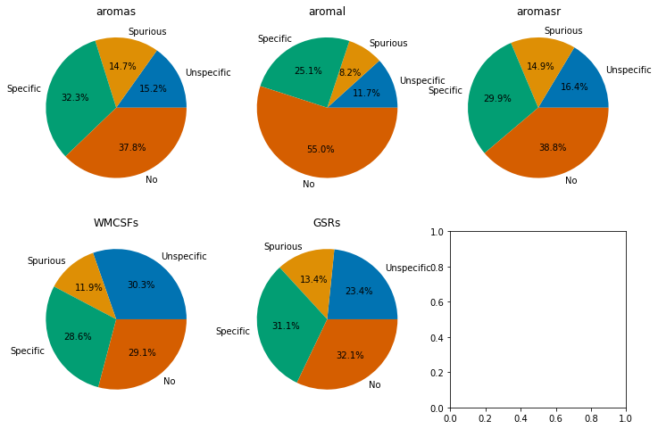
    


```python
ax6 = sns.jointplot(data=df_exclude, x='aromas_S1bf_S1bf', y='aromas_S1bf_ACA', hue='func.sequence')
ax6.plot_joint(sns.kdeplot,linestyles='dashed', zorder=0, levels=6)

ax6.fig.suptitle('Functional connectivity specificity')
ax6.fig.subplots_adjust(top=0.9)
ax6.ax_joint.set(xlabel='Specific ROI [r]', ylabel='Unspecific ROI [r]')
ax6.ax_joint.get_legend().set_title('Sequence')
ax6.ax_joint.vlines(0.1,ymin=min(df_exclude['aromas_S1bf_ACA']),ymax=max(df_exclude['aromas_S1bf_ACA']),linestyles='dashed', color='black')
ax6.ax_joint.vlines(-0.1, -0.1,0.1,linestyles='dashed', color='black')
ax6.ax_joint.hlines(-0.1, -0.1,0.1,linestyles='dashed', color='black')
ax6.ax_joint.hlines(0.1, -0.1,xmax=max(df_exclude['aromas_S1bf_S1bf']),linestyles='dashed', color='black')
ax6.ax_marg_x.axvline(x=0.1, color='black')
ax6.ax_marg_y.axhline(y=0.1, color='black')
```


    <matplotlib.lines.Line2D at 0x7fa07deb1670>


    

    


## ---- Plotting specific FC examples


```python
from nilearn import plotting
bg_img=os.path.join(analysis_folder, 
             'template',
             'SIGMA_Wistar_Rat_Brain_TemplatesAndAtlases_Version1.1',
             'SIGMA_Rat_Anatomical_Imaging',
            'SIGMA_Rat_Anatomical_InVivo_Template',
            'SIGMA_InVivo_Brain_Template_Masked.nii')

import re
df_specific = df_exclude[['rat.sub','rat.ses']][df_exclude['aromas_S1bf_cat']=='Specific'].sample(n = 3)

for i in list(range(0,df_specific.shape[0])):
    r = re.compile('/aromas/')
    seed_list_sub=list(filter(r.findall, seed_list))
    r = re.compile('S1bf')
    seed_list_sub=list(filter(r.findall, seed_list_sub))
    r = re.compile(df_specific['rat.sub'].iloc[i].astype(str))
    seed_list_sub=list(filter(r.findall, seed_list_sub))
    r = re.compile('ses-'+df_specific['rat.ses'].iloc[i].astype(str))
    seed_list_sub=list(filter(r.findall, seed_list_sub))


    plotting.plot_stat_map(seed_list_sub[0], 
                           bg_img, 
                           title='Specific FC, ID:'+
                                df_specific['rat.sub'].iloc[i].astype(str)+
                                ' ses: '+
                                df_specific['rat.ses'].iloc[i].astype(str),
                           threshold=0.1,
                           vmax=0.5,
                           symmetric_cbar=True,
                           cmap='coolwarm',
                           black_bg=False,
                           #display_mode="y",
                           cut_coords=(0,0.14,5))
```


    
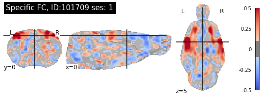
    


    
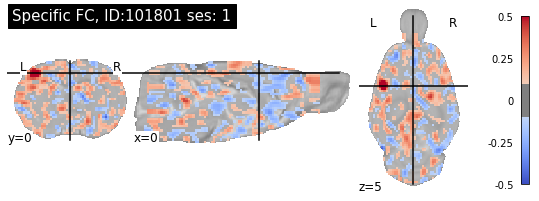
    


    
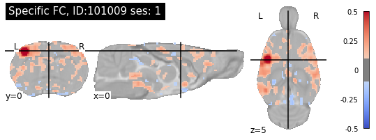
    


## ---- Plotting unspecific FC examples


```python
import re
df_specific = df_exclude[['rat.sub','rat.ses']][df_exclude['aromas_S1bf_cat']=='Unspecific'].sample(n = 3)

for i in list(range(0,df_specific.shape[0])):
    r = re.compile('/aromas/')
    seed_list_sub=list(filter(r.findall, seed_list))
    r = re.compile('S1bf')
    seed_list_sub=list(filter(r.findall, seed_list_sub))
    r = re.compile(df_specific['rat.sub'].iloc[i].astype(str))
    seed_list_sub=list(filter(r.findall, seed_list_sub))
    r = re.compile('ses-'+df_specific['rat.ses'].iloc[i].astype(str))
    seed_list_sub=list(filter(r.findall, seed_list_sub))


    plotting.plot_stat_map(seed_list_sub[0], 
                           bg_img, 
                           title='Unspecific FC, ID:'+
                                df_specific['rat.sub'].iloc[i].astype(str)+
                                ' ses: '+
                                df_specific['rat.ses'].iloc[i].astype(str),
                           threshold=0.1,
                           vmax=0.5,
                           symmetric_cbar=True,
                           cmap='coolwarm',
                           black_bg=False,
                           #display_mode="y",
                           cut_coords=(0,0.14,5))
```


    
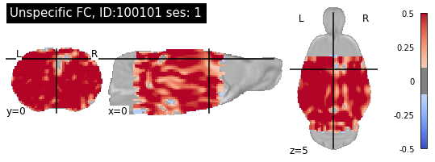
    


    
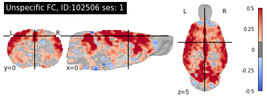
    


    
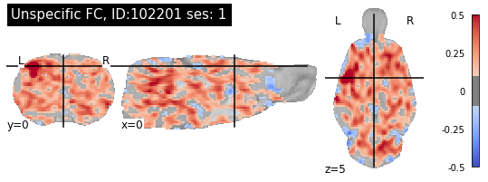
    


## ---- Plotting no FC examples


```python
import re
df_specific = df_exclude[['rat.sub','rat.ses']][df_exclude['aromas_S1bf_cat']=='No'].sample(n = 3)

for i in list(range(0,df_specific.shape[0])):
    r = re.compile('/aromas/')
    seed_list_sub=list(filter(r.findall, seed_list))
    r = re.compile('S1bf')
    seed_list_sub=list(filter(r.findall, seed_list_sub))
    r = re.compile(df_specific['rat.sub'].iloc[i].astype(str))
    seed_list_sub=list(filter(r.findall, seed_list_sub))
    r = re.compile('ses-'+df_specific['rat.ses'].iloc[i].astype(str))
    seed_list_sub=list(filter(r.findall, seed_list_sub))


    plotting.plot_stat_map(seed_list_sub[0], 
                           bg_img, 
                           title='No FC, ID:'+
                                df_specific['rat.sub'].iloc[i].astype(str)+
                                ' ses: '+
                                df_specific['rat.ses'].iloc[i].astype(str),
                           threshold=0.1,
                           vmax=0.5,
                           symmetric_cbar=True,
                           cmap='coolwarm',
                           black_bg=False,
                           #display_mode="y",
                           cut_coords=(0,0.14,5))
```


    
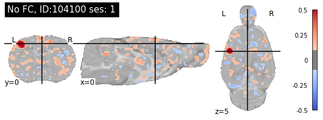
    


    
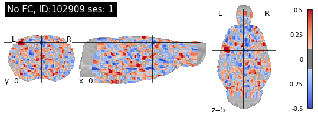
    


    
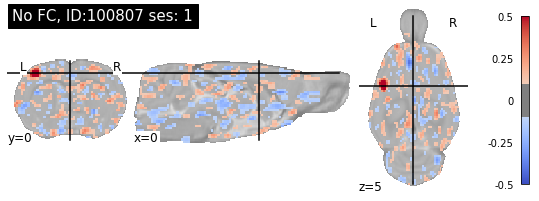
    


## ---- Plotting Spurious FC examples


```python
import re
df_specific = df_exclude[['rat.sub','rat.ses']][df_exclude['aromas_S1bf_cat']=='Spurious'].sample(n = 3)

for i in list(range(0,df_specific.shape[0])):
    r = re.compile('/aromas/')
    seed_list_sub=list(filter(r.findall, seed_list))
    r = re.compile('S1bf')
    seed_list_sub=list(filter(r.findall, seed_list_sub))
    r = re.compile(df_specific['rat.sub'].iloc[i].astype(str))
    seed_list_sub=list(filter(r.findall, seed_list_sub))
    r = re.compile('ses-'+df_specific['rat.ses'].iloc[i].astype(str))
    seed_list_sub=list(filter(r.findall, seed_list_sub))


    plotting.plot_stat_map(seed_list_sub[0], 
                           bg_img, 
                           title='Spurious FC, ID:'+
                                df_specific['rat.sub'].iloc[i].astype(str)+
                                ' ses: '+
                                df_specific['rat.ses'].iloc[i].astype(str),
                           threshold=0.1,
                           vmax=0.5,
                           symmetric_cbar=True,
                           cmap='coolwarm',
                           black_bg=False,
                           #display_mode="y",
                           cut_coords=(0,0.14,5))
```


    
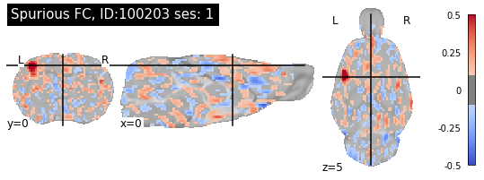
    


    
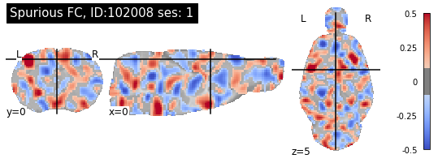
    


    
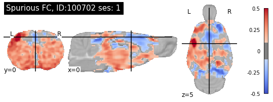
    


## Now doing a Chi2 test to see distribution of specificity among variables

From preregistration: 
"Specificity: parameter associated with connectivity specificity. 
Assuming S1 and Cg belong to distinct anti- (or minimally-) correlated networks, FC specificity will be determined the 4 quadrant system in Grandjean et al 2020. A ??2 test will be used to determine which factors (field strength, coil design, anesthesia, strain, gender) have a skewed distribution of specific FC. "


```python
from scipy.stats import chi2_contingency

# now testing strain
chi_stack = df_exclude.groupby(['rat.strain', 
                    'aromas_S1bf_cat']).size().unstack('aromas_S1bf_cat')
chi_stack = chi_stack.fillna(0)
print('')
g, p, dof, expctd  = chi2_contingency(chi_stack)
chi_stack["sum"] = chi_stack.sum(axis=1)
chi_stack["Specific_percent"]= round(chi_stack['Specific']/chi_stack["sum"],2)
print(chi_stack.sort_values(by="Specific_percent",ascending=False))
print('Strain effect: g-value = '+str(g)+' dof = '+str(dof)+' p-value = '+str(p))

# now testing sex
chi_stack = df_exclude.groupby(['rat.sex', 
                    'aromas_S1bf_cat']).size().unstack('aromas_S1bf_cat')
chi_stack = chi_stack.fillna(0)
print('')
g, p, dof, expctd  = chi2_contingency(chi_stack)
chi_stack["sum"] = chi_stack.sum(axis=1)
chi_stack["Specific_percent"]= round(chi_stack['Specific']/chi_stack["sum"],2)
print(chi_stack.sort_values(by="Specific_percent",ascending=False))
print('Sex effect: g-value = '+str(g)+' dof = '+str(dof)+' p-value = '+str(p))

# now testing age
chi_stack = df_exclude.groupby(['rat.age', 
                    'aromas_S1bf_cat']).size().unstack('aromas_S1bf_cat')
chi_stack = chi_stack.fillna(0)
print('')
g, p, dof, expctd  = chi2_contingency(chi_stack)
chi_stack["sum"] = chi_stack.sum(axis=1)
chi_stack["Specific_percent"]= round(chi_stack['Specific']/chi_stack["sum"],2)
print(chi_stack.sort_values(by="Specific_percent",ascending=False))
print('Age effect: g-value = '+str(g)+' dof = '+str(dof)+' p-value = '+str(p))

# now testing anesthesia.maintenance
chi_stack = df_exclude.groupby(['anesthesia.maintenance', 
                    'aromas_S1bf_cat']).size().unstack('aromas_S1bf_cat')
chi_stack = chi_stack.fillna(0)
print('')
g, p, dof, expctd  = chi2_contingency(chi_stack)
chi_stack["sum"] = chi_stack.sum(axis=1)
chi_stack["Specific_percent"]= round(chi_stack['Specific']/chi_stack["sum"],2)
print(chi_stack.sort_values(by="Specific_percent",ascending=False))
print('Anesthesia effect: g-value = '+str(g)+' dof = '+str(dof)+' p-value = '+str(p))

# now testing anesthesia.breathing.assistance
chi_stack = df_exclude.groupby(['anesthesia.breathing.assistance', 
                    'aromas_S1bf_cat']).size().unstack('aromas_S1bf_cat')
chi_stack = chi_stack.fillna(0)
print('')
g, p, dof, expctd  = chi2_contingency(chi_stack)
chi_stack["sum"] = chi_stack.sum(axis=1)
chi_stack["Specific_percent"]= round(chi_stack['Specific']/chi_stack["sum"],2)
print(chi_stack.sort_values(by="Specific_percent",ascending=False))
print('Breathing assistance effect: g-value = '+str(g)+' dof = '+str(dof)+' p-value = '+str(p))


# now testing field strength
chi_stack = df_exclude.groupby(['MRI.field.strength', 
                    'aromas_S1bf_cat']).size().unstack('aromas_S1bf_cat')
chi_stack = chi_stack.fillna(0)
print('')
g, p, dof, expctd  = chi2_contingency(chi_stack)
chi_stack["sum"] = chi_stack.sum(axis=1)
chi_stack["Specific_percent"]= round(chi_stack['Specific']/chi_stack["sum"],2)
print(chi_stack.sort_values(by="Specific_percent",ascending=False))
print('Field strength effect: g-value = '+str(g)+' dof = '+str(dof)+' p-value = '+str(p))

# now testing sequence
chi_stack = df_exclude.groupby(['func.sequence', 
                    'aromas_S1bf_cat']).size().unstack('aromas_S1bf_cat')
chi_stack = chi_stack.fillna(0)
print('')
g, p, dof, expctd  = chi2_contingency(chi_stack)
chi_stack["sum"] = chi_stack.sum(axis=1)
chi_stack["Specific_percent"]= round(chi_stack['Specific']/chi_stack["sum"],2)
print(chi_stack.sort_values(by="Specific_percent",ascending=False))
print('Sequence effect: g-value = '+str(g)+' dof = '+str(dof)+' p-value = '+str(p))
```

    
    aromas_S1bf_cat    No  Specific  Spurious  Unspecific    sum  Specific_percent
    rat.strain                                                                    
    Lister Hooded     1.0       6.0       3.0         0.0   10.0              0.60
    Wistar           60.0      55.0      31.0        18.0  164.0              0.34
    Sprague Dawley   35.0      34.0       9.0        25.0  103.0              0.33
    Fischer 344      31.0      19.0       5.0         4.0   59.0              0.32
    Long Evans       25.0      16.0      11.0        14.0   66.0              0.24
    Strain effect: g-value = 30.849357646757213 dof = 12 p-value = 0.0020769067063305217
    
    aromas_S1bf_cat   No  Specific  Spurious  Unspecific  sum  Specific_percent
    rat.sex                                                                    
    Male             100       100        45          56  301              0.33
    Female            52        30        14           5  101              0.30
    Sex effect: g-value = 16.312954902232146 dof = 3 p-value = 0.0009781664720448081
    
    aromas_S1bf_cat     No  Specific  Spurious  Unspecific    sum  \
    rat.age                                                         
    14-16              0.0       2.0       0.0         0.0    2.0   
    12-14              0.0       6.0       0.0         1.0    7.0   
    4-6                6.0       8.0       0.0         0.0   14.0   
    16-18              3.0       9.0       3.0         2.0   17.0   
    0-2               11.0      26.0      13.0        12.0   62.0   
    2-4              106.0      64.0      27.0        30.0  227.0   
    6-8                1.0       1.0       2.0         0.0    4.0   
    18-20              1.0       0.0       0.0         0.0    1.0   
    8-10               2.0       0.0       0.0         0.0    2.0   
    
    aromas_S1bf_cat  Specific_percent  
    rat.age                            
    14-16                        1.00  
    12-14                        0.86  
    4-6                          0.57  
    16-18                        0.53  
    0-2                          0.42  
    2-4                          0.28  
    6-8                          0.25  
    18-20                        0.00  
    8-10                         0.00  
    Age effect: g-value = 51.21523608367186 dof = 24 p-value = 0.0009891648673078985
    
    aromas_S1bf_cat              No  Specific  Spurious  Unspecific    sum  \
    anesthesia.maintenance                                                   
    isoflurane                 48.0      57.0      28.0        16.0  149.0   
    isoflurane / medetomidine  36.0      35.0       7.0        14.0   92.0   
    medetomidine               41.0      25.0      17.0        12.0   95.0   
    alpha-chloralose            2.0       2.0       0.0         5.0    9.0   
    urethane                   25.0      11.0       7.0         6.0   49.0   
    awake                       0.0       0.0       0.0         8.0    8.0   
    
    aromas_S1bf_cat            Specific_percent  
    anesthesia.maintenance                       
    isoflurane                             0.38  
    isoflurane / medetomidine              0.38  
    medetomidine                           0.26  
    alpha-chloralose                       0.22  
    urethane                               0.22  
    awake                                  0.00  
    Anesthesia effect: g-value = 74.05987916293915 dof = 15 p-value = 8.367279680364568e-10
    
    aromas_S1bf_cat                   No  Specific  Spurious  Unspecific  sum  \
    anesthesia.breathing.assistance                                             
    ventilated                        19        21         5          14   59   
    free-breathing                   133       109        54          39  335   
    
    aromas_S1bf_cat                  Specific_percent  
    anesthesia.breathing.assistance                    
    ventilated                                   0.36  
    free-breathing                               0.33  
    Breathing assistance effect: g-value = 8.279182641617219 dof = 3 p-value = 0.0405808210217766
    
    aromas_S1bf_cat       No  Specific  Spurious  Unspecific    sum  \
    MRI.field.strength                                                
    4.7                  7.0      22.0       8.0         3.0   40.0   
    14.1                 4.0      11.0       0.0        12.0   27.0   
    7.0                 88.0      62.0      32.0        25.0  207.0   
    9.4                 46.0      35.0      16.0        21.0  118.0   
    11.1                 7.0       0.0       3.0         0.0   10.0   
    
    aromas_S1bf_cat     Specific_percent  
    MRI.field.strength                    
    4.7                             0.55  
    14.1                            0.41  
    7.0                             0.30  
    9.4                             0.30  
    11.1                            0.00  
    Field strength effect: g-value = 49.61427080842324 dof = 12 p-value = 1.6327914453590141e-06
    
    aromas_S1bf_cat   No  Specific  Spurious  Unspecific  sum  Specific_percent
    func.sequence                                                              
    GE-EPI           122       119        51          60  352              0.34
    SE-EPI            30        11         8           1   50              0.22
    Sequence effect: g-value = 15.92217729442287 dof = 3 p-value = 0.0011764135188891633


```python
# check how datasets are prefroming
chi_stack = df_exclude.groupby(['rat.ds', 
                    'aromas_S1bf_cat']).size().unstack('aromas_S1bf_cat')
chi_stack = chi_stack.fillna(0)
chi_stack["sum"] = chi_stack.sum(axis=1)
chi_stack["Specific_percent"]= round(chi_stack['Specific']/chi_stack["sum"],2)

print("FC specificity distribution per dataset, armoas denoising")
print(chi_stack["Specific_percent"].quantile([0.25,0.5,0.75]))
chi_stack.sort_values(by="Specific_percent",ascending=False)

```

    FC specificity distribution per dataset, armoas denoising
    0.25    0.200
    0.50    0.300
    0.75    0.435
    Name: Specific_percent, dtype: float64


<div>
<style scoped>
    .dataframe tbody tr th:only-of-type {
        vertical-align: middle;
    }

    .dataframe tbody tr th {
        vertical-align: top;
    }

    .dataframe thead th {
        text-align: right;
    }
</style>
<table border="1" class="dataframe">
  <thead>
    <tr style="text-align: right;">
      <th>aromas_S1bf_cat</th>
      <th>No</th>
      <th>Specific</th>
      <th>Spurious</th>
      <th>Unspecific</th>
      <th>sum</th>
      <th>Specific_percent</th>
    </tr>
    <tr>
      <th>rat.ds</th>
      <th></th>
      <th></th>
      <th></th>
      <th></th>
      <th></th>
      <th></th>
    </tr>
  </thead>
  <tbody>
    <tr>
      <th>1015</th>
      <td>0.0</td>
      <td>7.0</td>
      <td>0.0</td>
      <td>2.0</td>
      <td>9.0</td>
      <td>0.78</td>
    </tr>
    <tr>
      <th>1022</th>
      <td>0.0</td>
      <td>7.0</td>
      <td>0.0</td>
      <td>3.0</td>
      <td>10.0</td>
      <td>0.70</td>
    </tr>
    <tr>
      <th>1017</th>
      <td>0.0</td>
      <td>7.0</td>
      <td>1.0</td>
      <td>2.0</td>
      <td>10.0</td>
      <td>0.70</td>
    </tr>
    <tr>
      <th>1035</th>
      <td>2.0</td>
      <td>6.0</td>
      <td>0.0</td>
      <td>1.0</td>
      <td>9.0</td>
      <td>0.67</td>
    </tr>
    <tr>
      <th>1031</th>
      <td>3.0</td>
      <td>6.0</td>
      <td>0.0</td>
      <td>0.0</td>
      <td>9.0</td>
      <td>0.67</td>
    </tr>
    <tr>
      <th>1020</th>
      <td>1.0</td>
      <td>6.0</td>
      <td>3.0</td>
      <td>0.0</td>
      <td>10.0</td>
      <td>0.60</td>
    </tr>
    <tr>
      <th>1024</th>
      <td>2.0</td>
      <td>5.0</td>
      <td>0.0</td>
      <td>3.0</td>
      <td>10.0</td>
      <td>0.50</td>
    </tr>
    <tr>
      <th>1028</th>
      <td>2.0</td>
      <td>5.0</td>
      <td>3.0</td>
      <td>0.0</td>
      <td>10.0</td>
      <td>0.50</td>
    </tr>
    <tr>
      <th>1034</th>
      <td>3.0</td>
      <td>5.0</td>
      <td>0.0</td>
      <td>2.0</td>
      <td>10.0</td>
      <td>0.50</td>
    </tr>
    <tr>
      <th>1005</th>
      <td>0.0</td>
      <td>4.0</td>
      <td>0.0</td>
      <td>5.0</td>
      <td>9.0</td>
      <td>0.44</td>
    </tr>
    <tr>
      <th>1040</th>
      <td>4.0</td>
      <td>4.0</td>
      <td>1.0</td>
      <td>0.0</td>
      <td>9.0</td>
      <td>0.44</td>
    </tr>
    <tr>
      <th>1039</th>
      <td>3.0</td>
      <td>3.0</td>
      <td>0.0</td>
      <td>1.0</td>
      <td>7.0</td>
      <td>0.43</td>
    </tr>
    <tr>
      <th>1006</th>
      <td>4.0</td>
      <td>4.0</td>
      <td>2.0</td>
      <td>0.0</td>
      <td>10.0</td>
      <td>0.40</td>
    </tr>
    <tr>
      <th>1009</th>
      <td>5.0</td>
      <td>4.0</td>
      <td>0.0</td>
      <td>1.0</td>
      <td>10.0</td>
      <td>0.40</td>
    </tr>
    <tr>
      <th>1004</th>
      <td>5.0</td>
      <td>4.0</td>
      <td>0.0</td>
      <td>1.0</td>
      <td>10.0</td>
      <td>0.40</td>
    </tr>
    <tr>
      <th>1016</th>
      <td>0.0</td>
      <td>4.0</td>
      <td>5.0</td>
      <td>1.0</td>
      <td>10.0</td>
      <td>0.40</td>
    </tr>
    <tr>
      <th>1032</th>
      <td>4.0</td>
      <td>4.0</td>
      <td>2.0</td>
      <td>0.0</td>
      <td>10.0</td>
      <td>0.40</td>
    </tr>
    <tr>
      <th>1037</th>
      <td>4.0</td>
      <td>3.0</td>
      <td>2.0</td>
      <td>0.0</td>
      <td>9.0</td>
      <td>0.33</td>
    </tr>
    <tr>
      <th>1010</th>
      <td>5.0</td>
      <td>3.0</td>
      <td>1.0</td>
      <td>0.0</td>
      <td>9.0</td>
      <td>0.33</td>
    </tr>
    <tr>
      <th>1019</th>
      <td>6.0</td>
      <td>3.0</td>
      <td>0.0</td>
      <td>0.0</td>
      <td>9.0</td>
      <td>0.33</td>
    </tr>
    <tr>
      <th>1033</th>
      <td>0.0</td>
      <td>3.0</td>
      <td>0.0</td>
      <td>7.0</td>
      <td>10.0</td>
      <td>0.30</td>
    </tr>
    <tr>
      <th>1014</th>
      <td>4.0</td>
      <td>3.0</td>
      <td>1.0</td>
      <td>2.0</td>
      <td>10.0</td>
      <td>0.30</td>
    </tr>
    <tr>
      <th>1018</th>
      <td>5.0</td>
      <td>3.0</td>
      <td>2.0</td>
      <td>0.0</td>
      <td>10.0</td>
      <td>0.30</td>
    </tr>
    <tr>
      <th>1030</th>
      <td>3.0</td>
      <td>3.0</td>
      <td>4.0</td>
      <td>0.0</td>
      <td>10.0</td>
      <td>0.30</td>
    </tr>
    <tr>
      <th>1036</th>
      <td>0.0</td>
      <td>2.0</td>
      <td>3.0</td>
      <td>2.0</td>
      <td>7.0</td>
      <td>0.29</td>
    </tr>
    <tr>
      <th>1013</th>
      <td>1.0</td>
      <td>1.0</td>
      <td>2.0</td>
      <td>0.0</td>
      <td>4.0</td>
      <td>0.25</td>
    </tr>
    <tr>
      <th>1026</th>
      <td>1.0</td>
      <td>2.0</td>
      <td>0.0</td>
      <td>5.0</td>
      <td>8.0</td>
      <td>0.25</td>
    </tr>
    <tr>
      <th>1043</th>
      <td>4.0</td>
      <td>2.0</td>
      <td>3.0</td>
      <td>0.0</td>
      <td>9.0</td>
      <td>0.22</td>
    </tr>
    <tr>
      <th>1025</th>
      <td>3.0</td>
      <td>2.0</td>
      <td>0.0</td>
      <td>5.0</td>
      <td>10.0</td>
      <td>0.20</td>
    </tr>
    <tr>
      <th>1002</th>
      <td>1.0</td>
      <td>2.0</td>
      <td>6.0</td>
      <td>1.0</td>
      <td>10.0</td>
      <td>0.20</td>
    </tr>
    <tr>
      <th>1021</th>
      <td>7.0</td>
      <td>2.0</td>
      <td>1.0</td>
      <td>0.0</td>
      <td>10.0</td>
      <td>0.20</td>
    </tr>
    <tr>
      <th>1012</th>
      <td>7.0</td>
      <td>2.0</td>
      <td>1.0</td>
      <td>0.0</td>
      <td>10.0</td>
      <td>0.20</td>
    </tr>
    <tr>
      <th>1007</th>
      <td>4.0</td>
      <td>2.0</td>
      <td>3.0</td>
      <td>1.0</td>
      <td>10.0</td>
      <td>0.20</td>
    </tr>
    <tr>
      <th>1027</th>
      <td>8.0</td>
      <td>1.0</td>
      <td>0.0</td>
      <td>0.0</td>
      <td>9.0</td>
      <td>0.11</td>
    </tr>
    <tr>
      <th>1038</th>
      <td>5.0</td>
      <td>1.0</td>
      <td>3.0</td>
      <td>0.0</td>
      <td>9.0</td>
      <td>0.11</td>
    </tr>
    <tr>
      <th>1011</th>
      <td>7.0</td>
      <td>1.0</td>
      <td>2.0</td>
      <td>0.0</td>
      <td>10.0</td>
      <td>0.10</td>
    </tr>
    <tr>
      <th>1003</th>
      <td>7.0</td>
      <td>1.0</td>
      <td>0.0</td>
      <td>2.0</td>
      <td>10.0</td>
      <td>0.10</td>
    </tr>
    <tr>
      <th>1041</th>
      <td>9.0</td>
      <td>1.0</td>
      <td>0.0</td>
      <td>0.0</td>
      <td>10.0</td>
      <td>0.10</td>
    </tr>
    <tr>
      <th>1042</th>
      <td>9.0</td>
      <td>1.0</td>
      <td>0.0</td>
      <td>0.0</td>
      <td>10.0</td>
      <td>0.10</td>
    </tr>
    <tr>
      <th>1001</th>
      <td>1.0</td>
      <td>1.0</td>
      <td>3.0</td>
      <td>5.0</td>
      <td>10.0</td>
      <td>0.10</td>
    </tr>
    <tr>
      <th>1029</th>
      <td>6.0</td>
      <td>0.0</td>
      <td>2.0</td>
      <td>1.0</td>
      <td>9.0</td>
      <td>0.00</td>
    </tr>
    <tr>
      <th>1023</th>
      <td>0.0</td>
      <td>0.0</td>
      <td>0.0</td>
      <td>8.0</td>
      <td>8.0</td>
      <td>0.00</td>
    </tr>
    <tr>
      <th>1008</th>
      <td>7.0</td>
      <td>0.0</td>
      <td>3.0</td>
      <td>0.0</td>
      <td>10.0</td>
      <td>0.00</td>
    </tr>
  </tbody>
</table>
</div>


## Now looking at FC sensitivity


```python
import matplotlib.pyplot as plt
import seaborn as sns

fig, axes = plt.subplots(nrows=2, ncols=2, figsize=(8,8))
sns.set_palette("colorblind")

ax1 = sns.distplot(df_exclude['aromas_S1bf_S1bf'],ax=axes[0,0])
ax2 = sns.distplot(df_exclude['aromas_MOp_MOp'],ax=axes[0,1])
ax3 = sns.distplot(df_exclude['aromas_CPu_CPu'],ax=axes[1,0])
ax4 = sns.distplot(df_exclude['aromas_S1bf_ACA'],ax=axes[1,1])

ax1.set(xlabel='S1bf-S1bf FC [r]', ylabel='Frequency', title='Seed-based analysis')
ax2.set(xlabel='MOp-MOp FC [r]', ylabel='Frequency', title='Seed-based analysis')
ax3.set(xlabel='CPu-CPu  FC [r]', ylabel='Frequency', title='Seed-based analysis')
ax4.set(xlabel='S1-ACA  FC [r]', ylabel='Frequency', title='Seed-based analysis')

ax1.axvline(df_exclude['aromas_S1bf_S1bf'].quantile(0.25),ls='--',alpha=0.5)
ax1.axvline(df_exclude['aromas_S1bf_S1bf'].quantile(0.50),ls='--',alpha=0.5)
ax1.axvline(df_exclude['aromas_S1bf_S1bf'].quantile(0.75),ls='--',alpha=0.5)

ax2.axvline(df_exclude['aromas_MOp_MOp'].quantile(0.25),ls='--',alpha=0.5)
ax2.axvline(df_exclude['aromas_MOp_MOp'].quantile(0.50),ls='--',alpha=0.5)
ax2.axvline(df_exclude['aromas_MOp_MOp'].quantile(0.75),ls='--',alpha=0.5)


ax3.axvline(df_exclude['aromas_CPu_CPu'].quantile(0.25),ls='--',alpha=0.5)
ax3.axvline(df_exclude['aromas_CPu_CPu'].quantile(0.50),ls='--',alpha=0.5)
ax3.axvline(df_exclude['aromas_CPu_CPu'].quantile(0.75),ls='--',alpha=0.5)

ax4.axvline(df_exclude['aromas_S1bf_ACA'].quantile(0.25),ls='--',alpha=0.5)
ax4.axvline(df_exclude['aromas_S1bf_ACA'].quantile(0.50),ls='--',alpha=0.5)
ax4.axvline(df_exclude['aromas_S1bf_ACA'].quantile(0.75),ls='--',alpha=0.5)


plt.tight_layout()
```


    
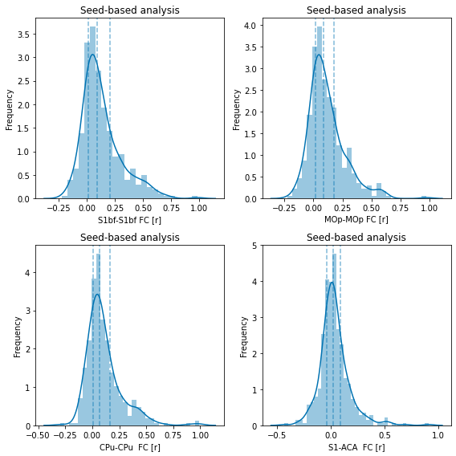
    


```python
#extracting quartiles for the functional connectivity parameters
df_exclude[['aromas_S1bf_S1bf','aromas_MOp_MOp','aromas_CPu_CPu','aromas_S1bf_ACA']].quantile([0.25,0.5,0.75])
```


<div>
<style scoped>
    .dataframe tbody tr th:only-of-type {
        vertical-align: middle;
    }

    .dataframe tbody tr th {
        vertical-align: top;
    }

    .dataframe thead th {
        text-align: right;
    }
</style>
<table border="1" class="dataframe">
  <thead>
    <tr style="text-align: right;">
      <th></th>
      <th>aromas_S1bf_S1bf</th>
      <th>aromas_MOp_MOp</th>
      <th>aromas_CPu_CPu</th>
      <th>aromas_S1bf_ACA</th>
    </tr>
  </thead>
  <tbody>
    <tr>
      <th>0.25</th>
      <td>0.014888</td>
      <td>0.018401</td>
      <td>0.005412</td>
      <td>-0.040633</td>
    </tr>
    <tr>
      <th>0.50</th>
      <td>0.088508</td>
      <td>0.084464</td>
      <td>0.067535</td>
      <td>0.019247</td>
    </tr>
    <tr>
      <th>0.75</th>
      <td>0.201822</td>
      <td>0.179565</td>
      <td>0.162290</td>
      <td>0.089021</td>
    </tr>
  </tbody>
</table>
</div>


```python
import matplotlib.pyplot as plt
import seaborn as sns
#plotting as a function of different parameters

fig, axes = plt.subplots(nrows=3, ncols=2,figsize=(16, 12),constrained_layout=True)


sns.set_palette("colorblind")
df_exclude = df.loc[(df['exclude'] != 'yes')]

ax0 = sns.swarmplot(data=df_exclude, x="rat.strain",
                    y="aromas_S1bf_S1bf", hue="func.sequence",ax=axes[0,0])
ax1 = sns.swarmplot(data=df_exclude, x="anesthesia.maintenance",
                    y="aromas_S1bf_S1bf", hue="func.sequence",ax=axes[0,1])
ax2 = sns.swarmplot(data=df_exclude, x="MRI.field.strength",
                    y="aromas_S1bf_S1bf", hue="func.sequence",ax=axes[1,0])
ax3 = sns.scatterplot(data=df_exclude, x="func.TR",
                    y="aromas_S1bf_S1bf", hue="func.sequence",ax=axes[1,1])
ax4 = sns.scatterplot(data=df_exclude, x="func.TE",
                    y="aromas_S1bf_S1bf", hue="func.sequence",ax=axes[2,0])
ax5 = sns.scatterplot(data=df_exclude, x="tsnr.S1",
                    y="aromas_S1bf_S1bf", hue="func.sequence",ax=axes[2,1])


ax0.set(xlabel='Strain', ylabel='FC [r]', title='S1bf - S1bf FC')
ax0.get_legend().set_title('Sequence')

ax1.set(xlabel='Anesthesia', ylabel='FC [r]')
ax1.get_legend().remove()
ax1.set_xticklabels(ax1.get_xticklabels(), rotation=30, ha='right')

ax2.set(xlabel='Field strength', ylabel='FC [r]')
ax2.get_legend().remove()

ax3.set(xlabel='Repetition time [s]', ylabel='FC [r]')
ax3.get_legend().remove()

ax4.set(xlabel='Echo time [s]', ylabel='FC [r]')
ax4.get_legend().remove()

ax5.set(xlabel='tSNR S1 [a.u.]', ylabel='FC [r]')
ax5.get_legend().remove()

#plt.constrained_layout()

```


    
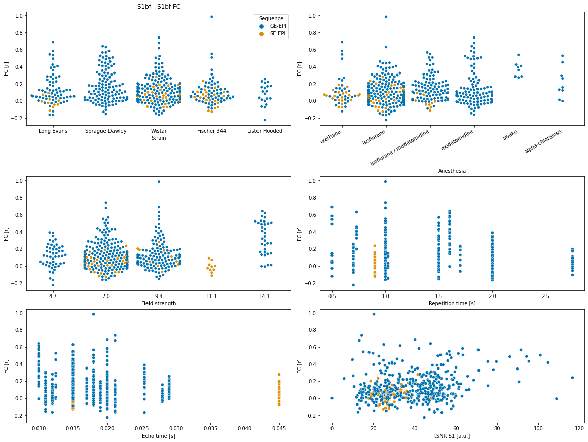
    


```python
df_sub = df_exclude[['aromas_S1bf_S1bf',
             'aromas_MOp_MOp',
             'aromas_CPu_CPu',
             'aromas_S1bf_ACA',
             'rat.sex',
             'rat.strain',
             'rat.age',
             'rat.weight',
             'exp.type',
             'anesthesia.maintenance',
            'anesthesia.breathing.rate',
            'anesthesia.heart.rate',
            'MRI.vendor',
            'MRI.field.strength',
            'func.sequence',
            'func.TR',
            'func.TE']]

df_sub['MRI.field.strength']=df_sub['MRI.field.strength'].astype('int')

```


```python
sns.pairplot(df_sub, hue="func.sequence")
```


    <seaborn.axisgrid.PairGrid at 0x7fa07c6cfc10>


    
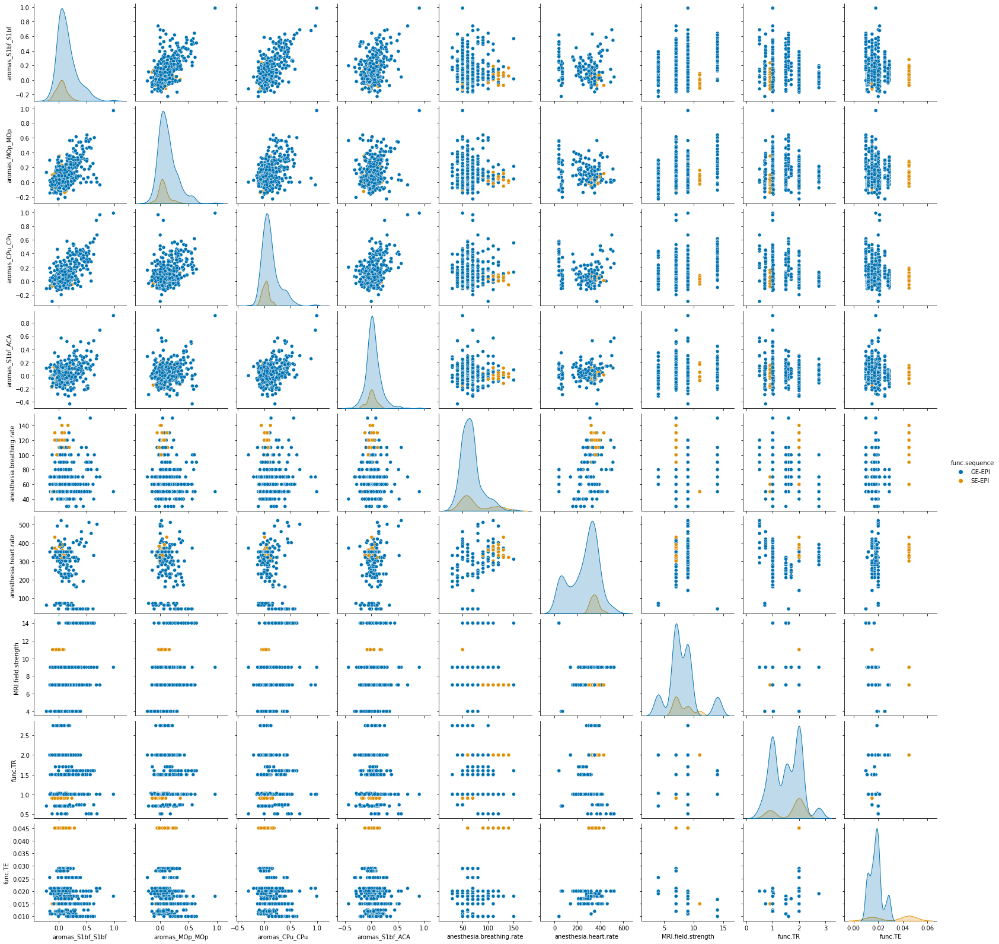
    


From the preregistration: 
"Sensitivity: parameters associated with connectivity strength.
Functional connectivity (FC) between selected region of interest (S1 - S1, Cg - Rsp), or within ICA component (S1, Cg)  will be modeled into a linear model in statistical software R. Functional connectivity parameter will be modeled as a function of strain (factorial), gender (factorial), weight (ordered factorial), cortical signal-to-noise ratio (continuous), temporal cortical signal-to-noise (continuous, if not correlated to signal-to-noise ratio), mean framewise displacement. Significance will be assessed using an analysis of variance. P-value threshold will be set at p<0.05 without additional correction.  "


```python
import pandas as pd
from statsmodels.formula.api import ols
from statsmodels.stats.anova import anova_lm

#because statsmodels doesn't like columns with dots. the stats were originally planned in R. :-( )
df_exclude.columns=df_exclude.columns.str.replace('[\.]', '')

# Full model
m01 = ols('aromas_S1bf_S1bf ~ ratstrain + ratsex + ratweight + tsnrS1 + MFW +anesthesiamaintenance', data=df_exclude).fit()
print(m01.summary())

print('testing for the effect of strain')
m02 = ols('aromas_S1bf_S1bf ~ ratsex + ratweight + tsnrS1 + MFW+anesthesiamaintenance', data=df_exclude).fit()
print(anova_lm(m02, m01))

print('')
print('testing for the effect of sex')
m02 = ols('aromas_S1bf_S1bf ~ ratstrain + ratweight + tsnrS1 + MFW+anesthesiamaintenance', data=df_exclude).fit()
print(anova_lm(m02, m01))

print('')
print('testing for the effect of weight')
m02 = ols('aromas_S1bf_S1bf ~ ratstrain + ratsex + tsnrS1 + MFW+anesthesiamaintenance', data=df_exclude).fit()
print(anova_lm(m02, m01))

print('')
print('testing for the effect of tSNR')
m02 = ols('aromas_S1bf_S1bf ~ ratstrain + ratsex + ratweight + MFW+anesthesiamaintenance', data=df_exclude).fit()
print(anova_lm(m02, m01))

print('')
print('testing for the effect of motion')
m02 = ols('aromas_S1bf_S1bf ~ ratstrain + ratsex + ratweight + tsnrS1+anesthesiamaintenance', data=df_exclude).fit()
print(anova_lm(m02, m01))

print('')
print('testing for the effect of anesthesia')
m02 = ols('aromas_S1bf_S1bf ~ ratstrain + ratsex + ratweight + tsnrS1 + MFW', data=df_exclude).fit()
print(anova_lm(m02, m01))

```

                                OLS Regression Results                            
    ==============================================================================
    Dep. Variable:       aromas_S1bf_S1bf   R-squared:                       0.233
    Model:                            OLS   Adj. R-squared:                  0.184
    Method:                 Least Squares   F-statistic:                     4.782
    Date:                Fri, 09 Jul 2021   Prob (F-statistic):           1.52e-10
    Time:                        11:35:35   Log-Likelihood:                 158.14
    No. Observations:                 353   AIC:                            -272.3
    Df Residuals:                     331   BIC:                            -187.2
    Df Model:                          21                                         
    Covariance Type:            nonrobust                                         
    ======================================================================================================================
                                                             coef    std err          t      P>|t|      [0.025      0.975]
    ----------------------------------------------------------------------------------------------------------------------
    Intercept                                              0.1417      0.131      1.079      0.282      -0.117       0.400
    ratstrain[T.Lister Hooded]                            -0.0181      0.060     -0.302      0.763      -0.136       0.100
    ratstrain[T.Long Evans]                                0.0025      0.041      0.061      0.951      -0.078       0.083
    ratstrain[T.Sprague Dawley]                            0.1059      0.033      3.198      0.002       0.041       0.171
    ratstrain[T.Wistar]                                   -0.0064      0.030     -0.215      0.830      -0.065       0.052
    ratsex[T.Male]                                         0.0324      0.030      1.080      0.281      -0.027       0.091
    ratweight[T.200-250]                                   0.0398      0.040      0.997      0.320      -0.039       0.118
    ratweight[T.250-300]                                   0.0913      0.042      2.159      0.032       0.008       0.175
    ratweight[T.300-350]                                   0.0488      0.043      1.128      0.260      -0.036       0.134
    ratweight[T.350-350]                                  -0.0973      0.168     -0.580      0.562      -0.427       0.233
    ratweight[T.350-400]                                   0.0173      0.048      0.357      0.721      -0.078       0.112
    ratweight[T.400-450]                                  -0.0559      0.061     -0.922      0.357      -0.175       0.063
    ratweight[T.450-500]                                  -0.0739      0.059     -1.256      0.210      -0.190       0.042
    ratweight[T.500-550]                                  -0.1250      0.124     -1.006      0.315      -0.370       0.119
    ratweight[T.550-600]                                   0.1316      0.123      1.072      0.285      -0.110       0.373
    anesthesiamaintenance[T.awake]                        -0.0190      0.158     -0.120      0.905      -0.331       0.293
    anesthesiamaintenance[T.isoflurane]                   -0.2363      0.125     -1.892      0.059      -0.482       0.009
    anesthesiamaintenance[T.isoflurane / medetomidine]    -0.2046      0.128     -1.604      0.110      -0.456       0.046
    anesthesiamaintenance[T.medetomidine]                 -0.1859      0.128     -1.452      0.147      -0.438       0.066
    anesthesiamaintenance[T.urethane]                     -0.2517      0.129     -1.957      0.051      -0.505       0.001
    tsnrS1                                                 0.0016      0.001      2.846      0.005       0.001       0.003
    MFW                                                    2.9535      0.663      4.454      0.000       1.649       4.258
    ==============================================================================
    Omnibus:                       83.144   Durbin-Watson:                   1.792
    Prob(Omnibus):                  0.000   Jarque-Bera (JB):              254.508
    Skew:                           1.054   Prob(JB):                     5.42e-56
    Kurtosis:                       6.586   Cond. No.                     3.30e+03
    ==============================================================================
    
    Notes:
    [1] Standard Errors assume that the covariance matrix of the errors is correctly specified.
    [2] The condition number is large, 3.3e+03. This might indicate that there are
    strong multicollinearity or other numerical problems.
    testing for the effect of strain
       df_resid       ssr  df_diff  ss_diff         F    Pr(>F)
    0     335.0  8.945756      0.0      NaN       NaN       NaN
    1     331.0  8.436996      4.0  0.50876  4.989913  0.000644
    
    testing for the effect of sex
       df_resid       ssr  df_diff   ss_diff         F    Pr(>F)
    0     332.0  8.466730      0.0       NaN       NaN       NaN
    1     331.0  8.436996      1.0  0.029735  1.166545  0.280899
    
    testing for the effect of weight
       df_resid       ssr  df_diff   ss_diff        F    Pr(>F)
    0     389.0  9.592310      0.0       NaN      NaN       NaN
    1     331.0  8.436996     58.0  1.155314  0.78147  0.872968
    
    testing for the effect of tSNR
       df_resid       ssr  df_diff  ss_diff        F    Pr(>F)
    0     332.0  8.643476      0.0      NaN      NaN       NaN
    1     331.0  8.436996      1.0  0.20648  8.10062  0.004701
    
    testing for the effect of motion
       df_resid       ssr  df_diff   ss_diff          F    Pr(>F)
    0     332.0  8.942754      0.0       NaN        NaN       NaN
    1     331.0  8.436996      1.0  0.505758  19.841884  0.000012
    
    testing for the effect of anesthesia
       df_resid       ssr  df_diff   ss_diff         F    Pr(>F)
    0     336.0  8.789369      0.0       NaN       NaN       NaN
    1     331.0  8.436996      5.0  0.352374  2.764862  0.018327


## Group analysis. Estimating one sample t-test maps per datasets (session 1 exclusively). 
Images are exported as z-score image, thresholded z > 1.9 corresponding to p =< 0.05, one tailed, uncorrected (a very liberal threshold!) 

From preregistration: 
"Seed-based analysis voxel-wise analysis across the individual datasets
The seed-based analysis from the individual datasets (each consisting of n=10) will be examined with a more lenient parametric one-sample t-test (fsl_glm), without cluster correction and p-value threshold 0.05. This is to ensure that no FC is rejected (low false negative), but at the expense of a higher false-positive rate. The analysis across individual datasets will be summarized in an overlap map denoting the percentage of datasets reaching significance for each voxel. "


```python
import re
from nilearn.glm.second_level import SecondLevelModel
from nilearn.plotting import plot_stat_map
import matplotlib.pyplot as plt
import pandas as pd


bg_img = os.path.join(analysis_folder,
                      'template',
                      'SIGMA_Wistar_Rat_Brain_TemplatesAndAtlases_Version1.1',
                      'SIGMA_Rat_Anatomical_Imaging',
                      'SIGMA_Rat_Anatomical_InVivo_Template',
                      'SIGMA_InVivo_Brain_Template_Masked.nii')

# output folders
output_nii = os.path.join(analysis_folder, 'scratch', 'group_SBA')
output_img = os.path.join(analysis_folder, 'scratch', 'group_SBA_img')
os.makedirs(output_nii, exist_ok=True)
os.makedirs(output_img, exist_ok=True)

# re-read the table
df_exclude = df.loc[(df['exclude'] != 'yes')].loc[(
    df['exp.type'] == 'resting-state')].loc[(df['rat.ses']) == 1]

# re-read all seed files in the path.
condtion = 'aromas'
seed_list = glob.glob(
    (os.path.join(analysis_folder, 'scratch', 'seed', condtion))+'/*')
seed_group = ['S1bf','ACA', 'CPu','MOp']
y_stack = [0.14, 2.2, 1.6, 3.1]

for i in list(df_exclude['rat.ds'].unique()):
    for count, seed in enumerate(seed_group):

        r = re.compile(seed)
        seed_list_sub = list(filter(r.findall, seed_list))
        r = re.compile(str(i))
        seed_list_sub = list(filter(r.findall, seed_list_sub))
        r = re.compile('ses-1')
        seed_list_sub = list(filter(r.findall, seed_list_sub))
        r = re.compile("(?=(" + "|".join(map(re.escape, map(str,
               df_exclude['rat.sub'].loc[(df_exclude['rat.ds'] == i)]))) + "))")
        seed_list_sub = list(filter(r.findall, seed_list_sub))


        second_level_input = seed_list_sub
        design_matrix = pd.DataFrame([1] * len(second_level_input),
                             columns=['intercept'])


        second_level_model = SecondLevelModel()
        second_level_model = second_level_model.fit(second_level_input,
                                            design_matrix=design_matrix)

        z_map = second_level_model.compute_contrast(output_type='z_score')

        filename_export = 'DS-'+str(i)+"_seed-"+seed
        filename_path = os.path.join(
            analysis_folder, 'scratch', output_nii, filename_export)

        z_map.to_filename(filename_path+'.nii.gz')

        filename_path = os.path.join(
            analysis_folder, 'scratch', output_img, filename_export)
        plot_stat_map(z_map,
              bg_img,
              title='DS:' + str(i) +
              ', seed: ' + seed + ', n = '+ str(len(second_level_input)),
              threshold=1.9,
              vmax=5,
              symmetric_cbar=True,
              cmap='coolwarm',
              black_bg=False,
              # display_mode="y",
              cut_coords=(0, y_stack[count], 5),
              output_file=filename_path+'.svg')
        #remake plot with output to jupyter notebook if S1bf seed
        if(seed == 'S1bf'):
            plot_stat_map(z_map,
              bg_img,
              title='DS:' + str(i) +
              ', seed: ' + seed + ', n = '+ str(len(second_level_input)),
              threshold=1.9,
              vmax=5,
              symmetric_cbar=True,
              cmap='coolwarm',
              black_bg=False,
              # display_mode="y",
              cut_coords=(0, y_stack[count], 5))
```


    
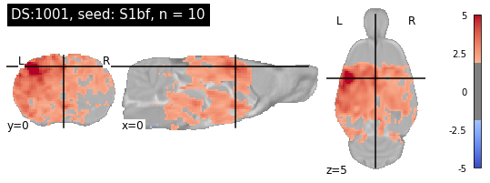
    


    
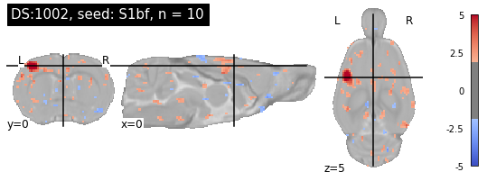
    


    
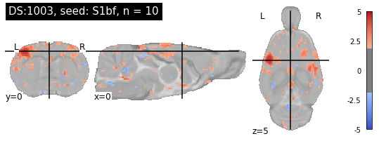
    


    
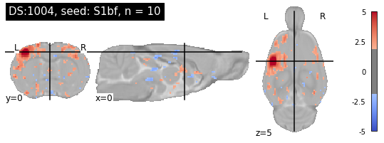
    


    
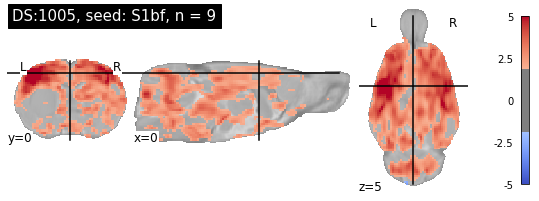
    


    
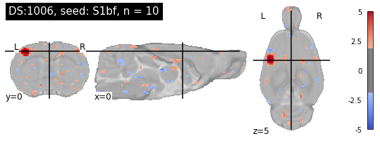
    


    
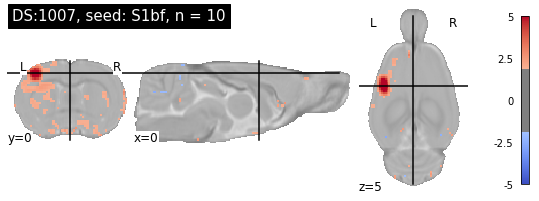
    


    
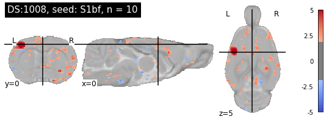
    


    
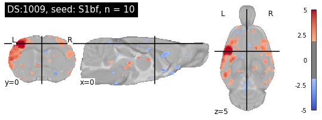
    


    
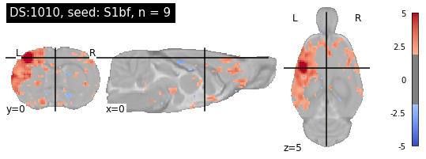
    


    
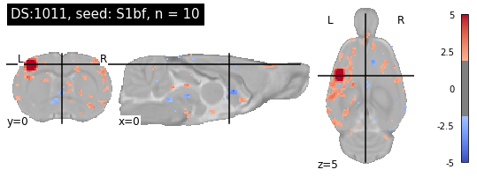
    


    
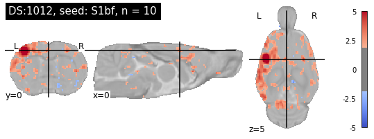
    


    
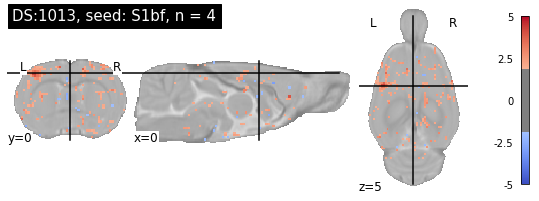
    


    
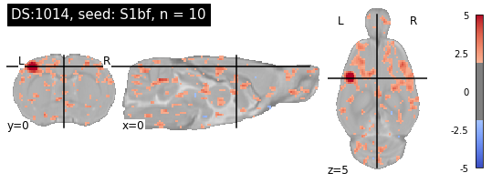
    


    
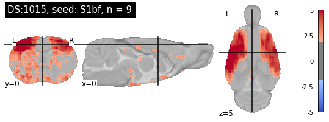
    


    
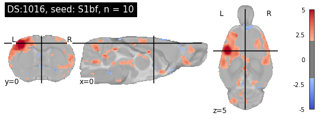
    


    
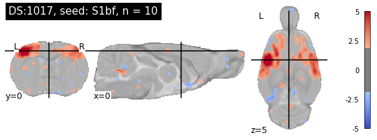
    


    
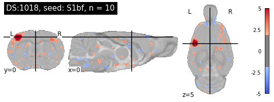
    


    
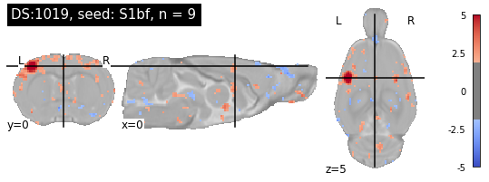
    


    
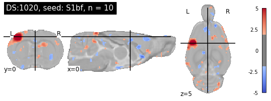
    


    
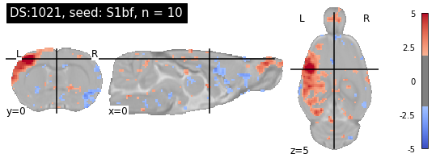
    


    
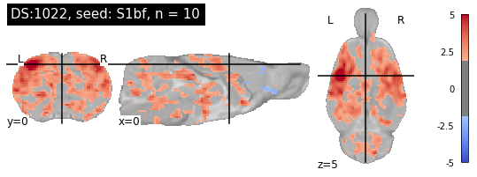
    


    
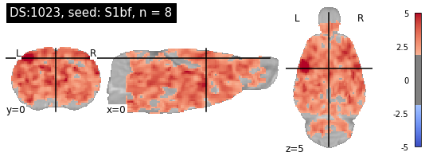
    


    
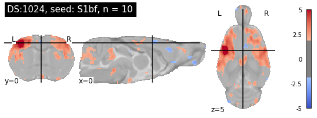
    


    
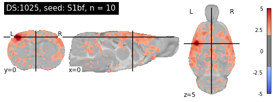
    


    
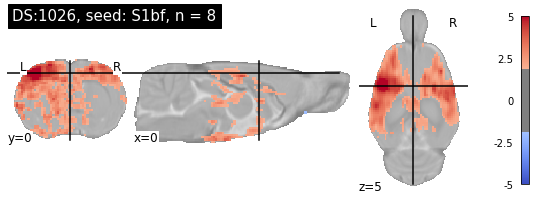
    


    
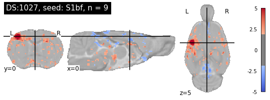
    


    
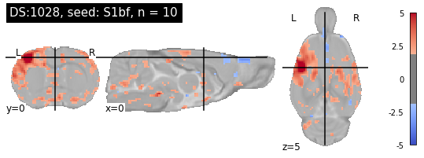
    


    
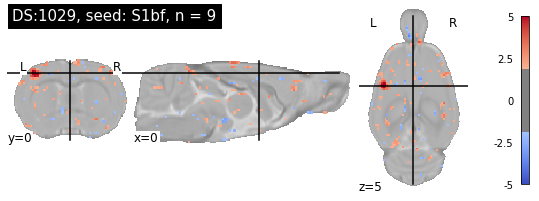
    


    
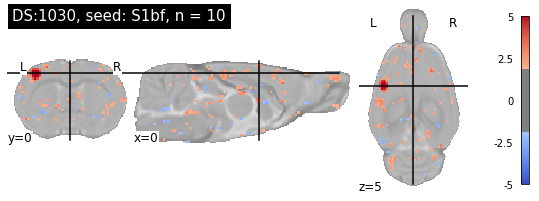
    


    
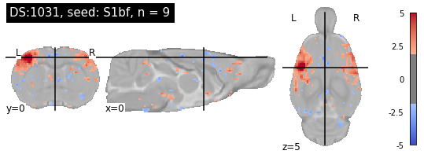
    


    
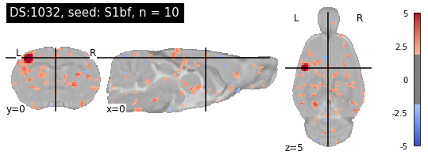
    


    

    


    
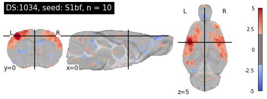
    


    
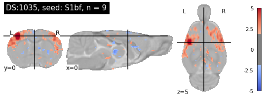
    


    

    


    

    


    

    


    

    


    

    


    

    


    

    


    

    


## Estimate incidence maps
Load one-sample t-test, threshold and perform mean across 4th dimension. 


```python
import re
from nilearn.image import concat_imgs, threshold_img,math_img
from nilearn.plotting import plot_stat_map
import numpy as np
import pandas as pd
import matplotlib.pyplot as plt
import matplotlib.colors as mcolors

# combine jet colormap for plot_stat_map (see https://stackoverflow.com/a/31052741)
# select to color scheme to use
colors1 = plt.cm.jet(np.linspace(0., 1, 128))
colors = np.vstack((colors1, colors1))
mymap = mcolors.LinearSegmentedColormap.from_list('my_colormap', colors)


bg_img = os.path.join(analysis_folder,
                      'template',
                      'SIGMA_Wistar_Rat_Brain_TemplatesAndAtlases_Version1.1',
                      'SIGMA_Rat_Anatomical_Imaging',
                      'SIGMA_Rat_Anatomical_InVivo_Template',
                      'SIGMA_InVivo_Brain_Template_Masked.nii')

# output folders
output_incidence = os.path.join(analysis_folder, 'scratch', 'group_SBA_incidence')
os.makedirs(output_incidence, exist_ok=True)

# read all one sample t-test files in the path.
seed_list = glob.glob(
    (os.path.join(analysis_folder, 'scratch', 'group_SBA'))+'/*')
seed_group = ['S1bf','ACA', 'CPu','MOp']
y_stack = [0.14, 2.2, 1.6, 3.1]

for count,seed in enumerate(seed_group):

    filename_export = "seed-"+seed
    filename_path = os.path.join(analysis_folder, 'scratch', output_incidence, filename_export)

    r = re.compile(seed)
    seed_list_sub = list(filter(r.findall, seed_list))

    con_img = concat_imgs(seed_list_sub, auto_resample=True)
    th_img = math_img("img >=  1.9", img=con_img)
    ma_img = math_img("np.mean(img, axis=-1)", img=th_img)
    ma_img.to_filename(filename_path+'.nii.gz')

    #one for the save
    plot_stat_map(ma_img,
              bg_img,
              title='Indicence map, seed: ' + seed + ', n = '+ str(len(seed_list_sub)),
              threshold=0.2,
             vmax=1,
              symmetric_cbar=False,
              cmap=mymap,
              black_bg=False,
              # display_mode="y",
              cut_coords=(0, y_stack[count], 5))

    #one for jupyter export..    teeeeedious
    plot_stat_map(ma_img,
              bg_img,
              title='Indicence map, seed: ' + seed + ', n = '+ str(len(seed_list_sub)),
              threshold=0.2,
             vmax=1,
              symmetric_cbar=False,
              cmap=mymap,
              black_bg=False,
              # display_mode="y",
              cut_coords=(0,  y_stack[count], 5),
              output_file=filename_path+'.svg')
```


    

    


    

    


    

    


    

    


## perform one sample t-test across the whole sample. 
Same as with one sample t-test above, but without dataset selection. 
A bit buggy...  leave that out for now. 

From preregistration: 
"Seed-based analysis voxel-wise analysis across the collective dataset.
A one-sample t-test will be performed across the collective dataset for seeds in the S1 barrel field area, Cingulate area, Retrosplenial area, Insula area, motor area, dorsal hippocampus, caudate putamen, amygdala, striatum, thalamus. Non-parametric statistical test (Randomize) will be used to estimate one-sample t-test, with TFCE cluster correction. Because of the high anticipated degrees of freedom (n>200), we will use a p-value threshold of 0.0001. The map will be indicated as a thresholded z-statistics map overlaid on the template. "


```python
import re
from nilearn.glm.second_level import SecondLevelModel
from nilearn.plotting import plot_stat_map
from nilearn.image import concat_imgs
import matplotlib.pyplot as plt
import pandas as pd


bg_img = os.path.join(analysis_folder,
                      'template',
                      'SIGMA_Wistar_Rat_Brain_TemplatesAndAtlases_Version1.1',
                      'SIGMA_Rat_Anatomical_Imaging',
                      'SIGMA_Rat_Anatomical_InVivo_Template',
                      'SIGMA_InVivo_Brain_Template_Masked.nii')

# output folders
output_incidence = os.path.join(
    analysis_folder, 'scratch', 'group_SBA_incidence')
os.makedirs(output_incidence, exist_ok=True)

# re-read the table
df_exclude = df.loc[(df['exclude'] != 'yes')].loc[(
    df['exp.type'] == 'resting-state')].loc[(df['rat.ses']) == 1]

# re-read all seed files in the path.
condtion = 'aromas'
seed_list = glob.glob(
    (os.path.join(analysis_folder, 'scratch', 'seed', condtion))+'/*')
seed_group = ['S1bf', 'ACA', 'CPu', 'MOp']
y_stack = [0.14, 2.2, 1.6, 3.1]

for count, seed in enumerate(seed_group):

    r = re.compile(seed)
    seed_list_sub = list(filter(r.findall, seed_list))
   # r = re.compile(str(i))
   # seed_list_sub = list(filter(r.findall, seed_list_sub))
    r = re.compile('ses-1')
    seed_list_sub = list(filter(r.findall, seed_list_sub))
    r = re.compile("(?=(" + "|".join(map(re.escape, map(str,
                                                        df_exclude['rat.sub']))) + "))")
    seed_list_sub = list(filter(r.findall, seed_list_sub))

    second_level_input = concat_imgs(seed_list_sub, auto_resample=True)
    design_matrix = pd.DataFrame([1] * len(seed_list_sub),
                                 columns=['intercept'])
    ma_img = math_img("np.mean(img, axis=-1) / (np.var(img,axis=-1)*np.sqrt(2/np.shape(img)[3]))",
                      img=second_level_input)
    
    #usual way of doing one sample t-test was buggy. Downside, cannot use z-score :-(
    #second_level_model = SecondLevelModel()
    # second_level_model = second_level_model.fit(second_level_input,
    #                                       design_matrix=design_matrix)

    #z_map = second_level_model.compute_contrast(output_type='z_score')

    filename_export = "Onesample_seed-"+seed
    filename_path = os.path.join(
        analysis_folder, 'scratch', output_incidence, filename_export)

    ma_img.to_filename(filename_path+'.nii.gz')

    filename_path = os.path.join(
        analysis_folder, 'scratch', output_incidence, filename_export)
    plot_stat_map(ma_img,
                  bg_img,
                  title='One-sample t-test, seed: ' + seed +
                  ', n = ' + str(len(seed_list_sub)),
                  threshold=3,
                  vmax=50,
                  symmetric_cbar=True,
                  cmap='coolwarm',
                  black_bg=False,
                  # display_mode="y",
                  cut_coords=(0, y_stack[count], 5),
                  output_file=filename_path+'.svg')

    # remake plot with output to jupyter notebook
    plot_stat_map(ma_img,
                  bg_img,
                  title='One-sample t-test, seed: ' + seed +
                  ', n = ' + str(len(seed_list_sub)),
                  threshold=3,
                  vmax=50,
                  symmetric_cbar=True,
                  cmap='coolwarm',
                  black_bg=False,
                  # display_mode="y",
                  cut_coords=(0, y_stack[count], 5))
```


    

    


    

    


    

    


    

    


```python
import re
from nilearn.glm.second_level import SecondLevelModel
from nilearn.plotting import plot_stat_map
from nilearn.image import concat_imgs, load_img, resample_to_img
import matplotlib.pyplot as plt
import pandas as pd
import os
import shutil


bg_img = os.path.join(analysis_folder,
                      'template',
                      'SIGMA_Wistar_Rat_Brain_TemplatesAndAtlases_Version1.1',
                      'SIGMA_Rat_Anatomical_Imaging',
                      'SIGMA_Rat_Anatomical_InVivo_Template',
                      'SIGMA_InVivo_Brain_Template_Masked.nii')

# output folders
output_incidence = os.path.join(
    analysis_folder, 'scratch', 'group_SBA_incidence')
os.makedirs(output_incidence, exist_ok=True)

# re-read the table
df_exclude = df.loc[(df['exclude'] != 'yes')].loc[(
    df['exp.type'] == 'resting-state')].loc[(df['rat.ses']) == 1]

# re-read all seed files in the path.
condtion = 'aromas'
seed_list = glob.glob(
    (os.path.join(analysis_folder, 'scratch', 'seed', condtion))+'/*')
seed_group = ['S1bf', 'ACA', 'CPu', 'MOp']
y_stack = [0.14, 2.2, 1.6, 3.1]

for count, seed in enumerate(seed_group):

    dir = os.path.join(analysis_folder,"scratch","tmp")
    if os.path.exists(dir):
        shutil.rmtree(dir)
    os.mkdir(dir)

    r = re.compile(seed)
    seed_list_sub = list(filter(r.findall, seed_list))
    r = re.compile('ses-1')
    seed_list_sub = list(filter(r.findall, seed_list_sub))
    r = re.compile("(?=(" + "|".join(map(re.escape, map(str,
                                                        df_exclude['rat.sub']))) + "))")
    seed_list_sub = list(filter(r.findall, seed_list_sub))

    second_level_input =load_img(seed_list_sub[0])  

    for i in range(1, len(seed_list_sub)):
        resample_to_img(seed_list_sub[i], seed_list_sub[0]).to_filename(os.path.join(analysis_folder, 'scratch', 'tmp', os.path.basename(seed_list_sub[i])))

    

    second_level_list =  glob.glob(
        (os.path.join(analysis_folder, 'scratch', 'tmp'))+'/*')
    
    design_matrix = pd.DataFrame([1] * len(second_level_list),columns=['intercept'])

#second_level_model =  non_parametric_inference(second_level_list,
#                             design_matrix=design_matrix,
#                             model_intercept=True, n_perm=5000,
#                             two_sided_test=False, n_jobs=-1)


    second_level_model = SecondLevelModel()
    second_level_model = second_level_model.fit(second_level_list,
                                           design_matrix=design_matrix)

    z_map = second_level_model.compute_contrast(output_type='z_score')
    
    filename_export = "Onesample_seed-"+seed
    filename_path = os.path.join(
        analysis_folder, 'scratch', output_incidence, filename_export)
    
    plot_stat_map(z_map,
                  bg_img,
                  title='One-sample t-test, seed: ' + seed +
                  ', n = ' + str(len(seed_list_sub)),
                  threshold=3.2,
                  vmax=10,
                  symmetric_cbar=True,
                  cmap='coolwarm',
                  black_bg=False,
                  # display_mode="y",
                  cut_coords=(0, y_stack[count], 5),
                  output_file=filename_path+'.svg')

    plot_stat_map(z_map,
                  bg_img,
                  title='One-sample t-test, seed: ' + seed +
                  ', n = ' + str(len(seed_list_sub)),
                  symmetric_cbar=True,
                  cmap='coolwarm',
                  black_bg=False,
                  threshold=3.2,
                  vmax=10,
                  # display_mode="y",
                  cut_coords=(0, y_stack[count], 5))
    
    if os.path.exists(dir):
        shutil.rmtree(dir)


```


    ---------------------------------------------------------------------------

    UFuncTypeError                            Traceback (most recent call last)

    <ipython-input-101-48ca3f9ec0f5> in <module>
         67 
         68     second_level_model = SecondLevelModel()
    ---> 69     second_level_model = second_level_model.fit(second_level_list,
         70                                            design_matrix=design_matrix)
         71 


    ~/.conda/envs/multirat/lib/python3.9/site-packages/nilearn/glm/second_level/second_level.py in fit(self, second_level_input, confounds, design_matrix)
        394         else:
        395             # In this case design matrix had to be provided
    --> 396             sample_map = mean_img(second_level_input)
        397 
        398         # Create and set design matrix, if not given


    ~/.conda/envs/multirat/lib/python3.9/site-packages/nilearn/image/image.py in mean_img(imgs, target_affine, target_shape, verbose, n_jobs)
        569         # _compute_mean returns (mean_img, affine)
        570         this_mean = this_mean[0]
    --> 571         running_mean += this_mean
        572 
        573     running_mean = running_mean / float(n_imgs)


    UFuncTypeError: Cannot cast ufunc 'add' output from dtype('float64') to dtype('<i2') with casting rule 'same_kind'


    

    


    

    


    

    


