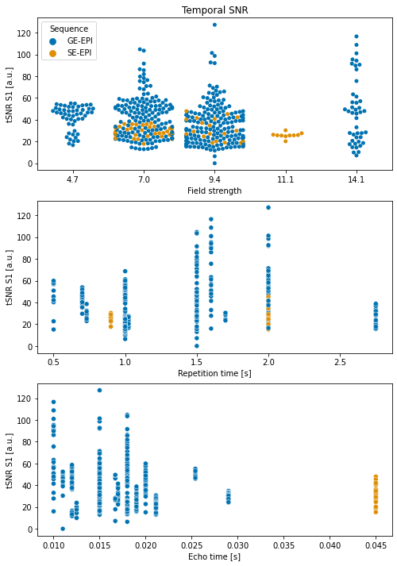

MultiRAT analysis code
================
Joanes Grandjean


# Foreword

This is a R markdown file which contains all the code for reproducing my
analysis. The code is meant to be followed step-wise. The raw fMRI
dataset will not be publicly available before the project preprint
publication on BioArxiv. The raw fMRI dataset can be made available
prior to publication upon request and review from the authors.

If re-using some of the scripts, please follow citations guidelines for
the software used. I’ve provided the links to the software wherever
possible. See also the [license](../LICENSE.md) for this software.


```python
# init variables
init_folder='/home/traaffneu/joagra/code/MultiRat'
analysis_folder='/project/4180000.19/multiRat'
```


```python
import os
import pandas as pd
import numpy as np

df = pd.read_csv('../assets/table/meta_data_20210411.tsv', sep='\t')
```


```python
tsnr_map_path = os.path.join(analysis_folder, 'scratch', 'snr', 'tsnr', 'pre')
tsnr_map = os.listdir(tsnr_map_path)

roiL = 520  # left barrel field cortex
roiR = 521  # right barrel field cortex
```


```python
# create empty tSNR column
df["tsnr.S1"] = np.nan
```


```python
# read the tSNR file output from RABIES and put them in the correct rows
for i in tsnr_map:
    tnsr_list = pd.read_csv(os.path.join(tsnr_map_path, i),
                            delim_whitespace=True, header=None)
    tsnr_mean = np.mean([tnsr_list[roiL], tnsr_list[roiR]])
    sub=int(i.split('_')[7].split('-')[1])
    ses=int(i.split('_')[8].split('-')[1])
    df.loc[(df['rat.sub'] == sub) & (
        df['rat.ses'] == ses), ['tsnr.S1']]=np.double(tsnr_mean)
```


```python
df.to_csv('../assets/table/meta_data_20210411_snr.tsv', sep='\t', index=False)
```


```python
#remove excluded scans
df_exclude = df.loc[(df['exclude'] != 'yes')]
```


```python
import matplotlib.pyplot as plt
import seaborn as sns


fig, axes = plt.subplots(nrows=3, ncols=1,figsize=(8, 12))

sns.set_palette("colorblind")


ax1 = sns.swarmplot(data=df_exclude, x="MRI.field.strength",
                    y="tsnr.S1", hue="func.sequence",ax=axes[0])
ax2 = sns.scatterplot(data=df_exclude, x="func.TR",
                    y="tsnr.S1", hue="func.sequence",ax=axes[1])
ax3 = sns.scatterplot(data=df_exclude, x="func.TE",
                    y="tsnr.S1", hue="func.sequence",ax=axes[2])


ax1.set(xlabel='Field strength', ylabel='tSNR S1 [a.u.]', title='Temporal SNR')
ax1.get_legend().set_title('Sequence')

ax2.set(xlabel='Repetition time [s]', ylabel='tSNR S1 [a.u.]')
ax2.get_legend().remove()

ax3.set(xlabel='Echo time [s]', ylabel='tSNR S1 [a.u.]')
ax3.get_legend().remove()
```

    /home/traaffneu/joagra/.conda/envs/multirat/lib/python3.9/site-packages/seaborn/categorical.py:1296: UserWarning: 15.4% of the points cannot be placed; you may want to decrease the size of the markers or use stripplot.
      warnings.warn(msg, UserWarning)
    /home/traaffneu/joagra/.conda/envs/multirat/lib/python3.9/site-packages/seaborn/categorical.py:1296: UserWarning: 18.9% of the points cannot be placed; you may want to decrease the size of the markers or use stripplot.
      warnings.warn(msg, UserWarning)


    

    


```python
import pandas as pd
from statsmodels.formula.api import ols
from statsmodels.stats.anova import anova_lm

df_exclude.columns=df_exclude.columns.str.replace('[\.]', '')

print('testing for the effect of field strength')
m01 = ols('tsnrS1 ~ MRIfieldstrength + funcsequence + funcTR + funcTE', data=df_exclude).fit()
m02 = ols('tsnrS1 ~ funcsequence + funcTR + funcTE', data=df_exclude).fit()
print(anova_lm(m02, m01))

print('')
print('testing for the effect of sequence')
m02 = ols('tsnrS1 ~ MRIfieldstrength + funcTR + funcTE', data=df_exclude).fit()
print(anova_lm(m02, m01))

print('')
print('testing for the effect of TR')
m02 = ols('tsnrS1 ~ MRIfieldstrength + funcsequence + funcTE', data=df_exclude).fit()
print(anova_lm(m02, m01))

print('')
print('testing for the effect of TE')
m02 = ols('tsnrS1 ~ MRIfieldstrength + funcsequence + funcTR', data=df_exclude).fit()
print(anova_lm(m02, m01))

```

    <ipython-input-11-73bad63f9d69>:5: FutureWarning: The default value of regex will change from True to False in a future version.
      df_exclude.columns=df_exclude.columns.str.replace('[\.]', '')


    testing for the effect of field strength
       df_resid            ssr  df_diff     ss_diff         F    Pr(>F)
    0     492.0  168115.356843      0.0         NaN       NaN       NaN
    1     491.0  167726.118761      1.0  389.238082  1.139452  0.286293
    
    testing for the effect of sequence
       df_resid            ssr  df_diff      ss_diff         F    Pr(>F)
    0     492.0  169578.595162      0.0          NaN       NaN       NaN
    1     491.0  167726.118761      1.0  1852.476401  5.422924  0.020279
    
    testing for the effect of TR
       df_resid            ssr  df_diff      ss_diff          F    Pr(>F)
    0     492.0  173506.878314      0.0          NaN        NaN       NaN
    1     491.0  167726.118761      1.0  5780.759553  16.922546  0.000046
    
    testing for the effect of TE
       df_resid            ssr  df_diff      ss_diff         F    Pr(>F)
    0     492.0  170545.098097      0.0          NaN       NaN       NaN
    1     491.0  167726.118761      1.0  2818.979336  8.252256  0.004246

