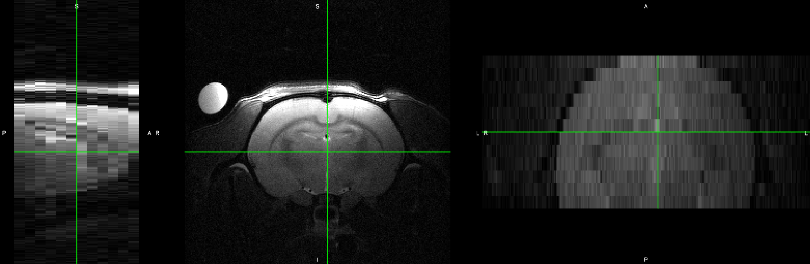

MultiRAT asset preparation
================
Joanes Grandjean


## Dowload and prepare the template

For this project, I will use the SIGMA rat template available
[here](https://www.nitrc.org/projects/sigma_template) The reference for
the template is: Barrière, D.A., Magalhães, R., Novais, A. et al. The
SIGMA rat brain templates and atlases for multimodal MRI data analysis
and visualization. Nat Commun 10, 5699 (2019).
<https://doi.org/10.1038/s41467-019-13575-7>

Originally, I intended to use the [WHS
atlas](doi%2010.1016/j.neuroimage.2014.04.001) but differences in
contrast with the majority of the dataset, ex vivo template with empty
ventricles, and image artifacts rendered image registration complicated.
This is a deviation from the [preregistration](https://osf.io/emq4b).

``` bash
source bash_env.sh

mkdir -p $analysis_folder'/template'

# the following requires NITRC login credentials
wget https://www.nitrc.org/frs/download.php/11708/SIGMA_Wistar_Rat_Brain_TemplatesAndAtlases_Version1.1.zip -O $analysis_folder'/template'
unzip -d $analysis_folder'/template/' $analysis_folder'/template/SIGMA_Wistar_Rat_Brain_TemplatesAndAtlases_Version1.1.zip' 
rm $analysis_folder'/template/SIGMA_Wistar_Rat_Brain_TemplatesAndAtlases_Version1.1.zip' 
```

## ROI generation

Here, I create regions-of-interest for seed-based analysis. The
preregistration specifies the seeds should be 0.9 mm3 and placed on both
hemispheres. It specifies the following ROIs: S1 barrel field area,
Cingulate area, Retrosplenial area, Insula area, motor area,
caudate-putamen, dorsal hippocampus, amygdala, thalamus.

``` bash
source bash_env.sh

# JG 11.12.2020, update ROI to new template specs. 
mkdir -p $ROI
roi_name='S1bf_l'
fslmaths $template -mul 0 -add 1 -roi 33 9 237 9 134 9 0 1 $ROI$roi_name -odt int
roi_name='S1bf_r'
fslmaths $template -mul 0 -add 1 -roi 147 9 237 9 134 9 0 1 $ROI$roi_name -odt int

roi_name='ACA_l'
fslmaths $template -mul 0 -add 1 -roi 92 9 256 9 143 9 0 1 $ROI$roi_name -odt int
roi_name='RSP_l'
fslmaths $template -mul 0 -add 1 -roi 89 9 208 9 157 9 0 1 $ROI$roi_name -odt int

roi_name='AI_l'
fslmaths $template -mul 0 -add 1 -roi 45 9 268 9 99 9 0 1 $ROI$roi_name -odt int
roi_name='AI_r'
fslmaths $template -mul 0 -add 1 -roi 139 9 268 9 99 9 0 1 $ROI$roi_name -odt int

roi_name='MOp_l'
fslmaths $template -mul 0 -add 1 -roi 65 9 268 9 143 9 0 1 $ROI$roi_name -odt int
roi_name='MOp_r'
fslmaths $template -mul 0 -add 1 -roi 126 9 268 9 143 9 0 1 $ROI$roi_name -odt int

roi_name='CPu_l'
fslmaths $template -mul 0 -add 1 -roi 62 9 250 9 112 9 0 1 $ROI$roi_name -odt int
roi_name='CPu_r'
fslmaths $template -mul 0 -add 1 -roi 129 9 250 9 112 9 0 1 $ROI$roi_name -odt int

roi_name='dHC_l'
fslmaths $template -mul 0 -add 1 -roi 63 9 209 9 142 9 0 1 $ROI$roi_name -odt int
roi_name='dHC_r'
fslmaths $template -mul 0 -add 1 -roi 122 9 209 9 142 9 0 1 $ROI$roi_name -odt int

roi_name='AMG_l'
fslmaths $template -mul 0 -add 1 -roi 42 9 215 9 80 9 0 1 $ROI$roi_name -odt int
roi_name='AMG_r'
fslmaths $template -mul 0 -add 1 -roi 145 9 215 9 80 9 0 1 $ROI$roi_name -odt int

roi_name='TH_l'
fslmaths $template -mul 0 -add 1 -roi 63 9 215 9 113 9 0 1 $ROI$roi_name -odt int
roi_name='TH_r'
fslmaths $template -mul 0 -add 1 -roi 122 9 215 9 113 9 0 1 $ROI$roi_name -odt int
```

## Dataset preparation

Datasets included in this study were accepted in any format (bruker,
dicom, nifti, minc). The first step consists of arranging all datasets
within the same convention. I opted for true voxel size and
**A**nterior-**P**osterior axis defined as the rostro-caudal axis. Some
datasets were provided with x10 inflated voxels and the
**S**uperior-**I**nferior axis defined as the rostro-caudal axis
instead, e.g.:


These had to be corrected, and organized into
[BIDS](https://bids.neuroimaging.io/) format manually. To do so, I wrote
scripts using a combination of the following FSL and AFNI commands,
`fslinfo`, `fslmerge`, `fslorient`, `fslchpixdim`, `fslswapdim`, and
`3dresample`.

Two scripts used to convert datasets are provided as examples. [Convert
raw Bruker data](../assets/script/convert_bruker.sh) and [convert nifti
data](../assets/script/convert_nifti.sh). Raw Bruker data were converted
using the [Bruker2NIfTI](https://github.com/neurolabusc/Bru2Nii)
v1.0.20180303 package, written by Matthew Brett, Andrew Janke, Mikaël
Naveau, Chris Rorden. Please note that this software is no longer
supported. New users are invited to try
[BrkRaw](https://github.com/BrkRaw/bruker) instead.

Below is an example of a corrected structural image. Note how the
**S**uperior, **I**nferior, **A**nterior, **P**osterior axis labels are
indicated in `fsleyes`.



## Dataset preparation limiation

Unfortunately, I cannot ensure the **L**eft / **R**ight axis are
represented correctly across all datasets. While this is less of an
issue for resting-state fMRI, this is a caveat in the stimulus-evoked
fMRI arm of this study, and should be acknowledged as a limitation.
Similarly, I cannot ensure the slicing acquisition order, hence,
preprocessing is performed without slice timing correction.
