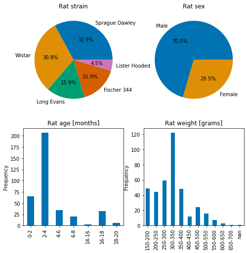
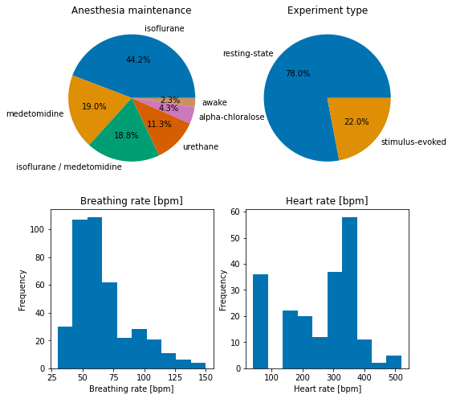
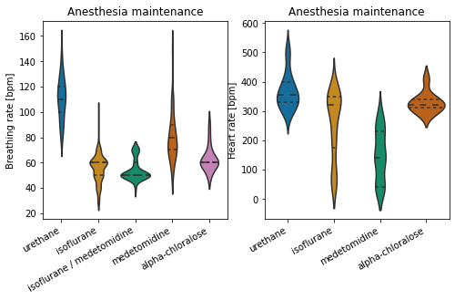
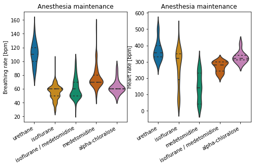
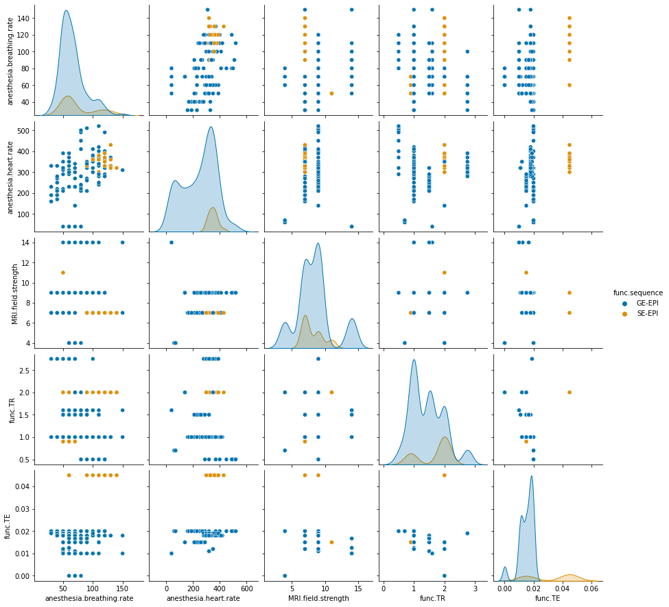

MultiRAT dataset description code
================
Joanes Grandjean


In this section, I provide a brief summary of the datasets that were
supplied for this study.

Normalization steps: - Columns with .orig have been left unaltered from
how it was provided by the dataset owner. - Strain was simplified. - Age
normalized to months, in 2 month bins. When long range are provided, the
middle bin is selected. - Weight normalized to in 50 g bins. When long
range are provided, the middle bin is selected. - Dexmedetomidine dose
converted to medetomidine (\*0.5) for simplicity. - Injectable
anesthesia dose converted to mg/kg - Bolus injectable added to induction
column, infusions kept in maintenance column. - Multiple anesthesia
agents for either induction or maintenance indicated with ‘/’.
Corresponding doses follow same order. - Measurement post induction,
breathing rate, heart rate rounded to the nearest tenth - TR and TE
converted to s - Bandwidth converted to Hz

First, I examine subject distribution


```python
# init variables
init_folder='/home/traaffneu/joagra/code/MultiRat'
analysis_folder='/project/4180000.19/multiRat'
```


```python
import pandas as pd
df = pd.read_csv('../assets/table/meta_data_20210411.tsv', sep='\t')
```


```python
# age 2-4 months is the most common in this dataset
df['rat.age'].value_counts()
```


    2-4      277
    0-2       65
    4-6       44
    16-18     32
    6-8       20
    8-10      12
    12-14      8
    18-20      6
    14-16      2
    Name: rat.age, dtype: int64


```python
# as expected there is a strong male to female bias
df['rat.sex'].value_counts()
```


    Male      311
    Female    130
    Name: rat.sex, dtype: int64


```python
# isoflurane remains the most common anesthesia for maintenance.
df['anesthesia.maintenance'].value_counts()
```


    isoflurane                   195
    medetomidine                  84
    isoflurane / medetomidine     83
    urethane                      50
    alpha-chloralose              19
    awake                         10
    Name: anesthesia.maintenance, dtype: int64


```python
# Sprage Dawley and Wistar are the two most common strains in this dataset
df['rat.strain'].value_counts()
```


    Sprague Dawley    145
    Wistar            136
    Long Evans         70
    Fischer 344        70
    Lister Hooded      20
    Name: rat.strain, dtype: int64


```python
import matplotlib.pyplot as plt
import seaborn as sns

sns.set_palette("colorblind")

fig, axes = plt.subplots(nrows=2, ncols=2, figsize=(8,8))

df_age= df['rat.age'].value_counts().rename_axis('age').reset_index(name='counts')
df_age['age'] = pd.Categorical(df_age['age'], ["0-2", "2-4", "4-6","6-8","8-10","10-12","12-14","14-16","16-18","18-20"])

df_weight= df['rat.weight'].value_counts().rename_axis('weight').reset_index(name='counts')
df_weight['weight'] = pd.Categorical(df_weight['weight'] , ["150-200", 
                                                            "200-250", 
                                                            "250-300",
                                                            "300-350",
                                                            "350-400",
                                                            "400-450",
                                                            "450-500",
                                                            "500-550",
                                                            "550-600",
                                                            "600-650",
                                                            "650-700"])


ax1 = df['rat.sex'].value_counts().plot.pie(title='Rat sex',ax=axes[0,1],autopct="%.1f%%")
ax2 = df['rat.strain'].value_counts().plot.pie(title='Rat strain',ax=axes[0,0],autopct="%.1f%%")
ax3 = df_age.sort_values(by=['age']).plot.bar(x='age',y='counts', title='Rat age [months]',ax=axes[1,0])
ax4 = df_weight.sort_values(by=['weight']).plot.bar(x='weight',y='counts', title='Rat weight [grams]',ax=axes[1,1])

ax1.set(xlabel="", ylabel="")
ax2.set(xlabel="", ylabel="")
ax3.set(xlabel="", ylabel="Frequency")
ax4.set(xlabel="", ylabel="Frequency")
ax3.get_legend().remove()
ax4.get_legend().remove()
```

    /home/traaffneu/joagra/.conda/envs/multirat/lib/python3.9/site-packages/pandas/plotting/_matplotlib/tools.py:400: MatplotlibDeprecationWarning: 
    The is_first_col function was deprecated in Matplotlib 3.4 and will be removed two minor releases later. Use ax.get_subplotspec().is_first_col() instead.
      if ax.is_first_col():
    /home/traaffneu/joagra/.conda/envs/multirat/lib/python3.9/site-packages/pandas/plotting/_matplotlib/tools.py:400: MatplotlibDeprecationWarning: 
    The is_first_col function was deprecated in Matplotlib 3.4 and will be removed two minor releases later. Use ax.get_subplotspec().is_first_col() instead.
      if ax.is_first_col():


    

    


```python
fig, axes = plt.subplots(nrows=2, ncols=2, figsize=(8,8))

sns.set_palette("colorblind")

ax1 = df['exp.type'].value_counts().plot.pie(title='Experiment type',ax=axes[0,1], autopct="%.1f%%")
ax2 = df['anesthesia.maintenance'].value_counts().plot.pie(title='Anesthesia maintenance',ax=axes[0,0],autopct="%.1f%%")    
ax3 = df['anesthesia.breathing.rate'].plot.hist(title='Breathing rate [bpm]',ax=axes[1,0])
ax4 = df['anesthesia.heart.rate'].plot.hist(title='Heart rate [bpm]',ax=axes[1,1])

ax1.set(xlabel="", ylabel="")
ax2.set(xlabel="", ylabel="")
ax3.set(xlabel="Breathing rate [bpm]")
ax4.set(xlabel="Heart rate [bpm]")
```

    /home/traaffneu/joagra/.conda/envs/multirat/lib/python3.9/site-packages/pandas/plotting/_matplotlib/tools.py:400: MatplotlibDeprecationWarning: 
    The is_first_col function was deprecated in Matplotlib 3.4 and will be removed two minor releases later. Use ax.get_subplotspec().is_first_col() instead.
      if ax.is_first_col():
    /home/traaffneu/joagra/.conda/envs/multirat/lib/python3.9/site-packages/pandas/plotting/_matplotlib/tools.py:400: MatplotlibDeprecationWarning: 
    The is_first_col function was deprecated in Matplotlib 3.4 and will be removed two minor releases later. Use ax.get_subplotspec().is_first_col() instead.
      if ax.is_first_col():


    [Text(0.5, 0, 'Heart rate [bpm]')]


    

    


```python
fig, axes = plt.subplots(1, 2, figsize=(8, 4))

sns.set_palette("colorblind")

df_tmp = df.dropna(subset=['anesthesia.breathing.rate'])
ax1 = sns.violinplot(x="anesthesia.maintenance", y="anesthesia.breathing.rate", data=df_tmp, inner="quartile",ax=axes[0])

df_tmp2 = df.dropna(subset=['anesthesia.heart.rate'])
ax2 = sns.violinplot(x="anesthesia.maintenance", y="anesthesia.heart.rate",  data=df_tmp2, inner="quartile", ax=axes[1])

                         
ax1.set_xticklabels(ax1.get_xticklabels(), rotation=30, ha='right')
ax1.set(xlabel='', ylabel='Breathing rate [bpm]', title='Anesthesia maintenance')

ax2.set_xticklabels(ax2.get_xticklabels(), rotation=30, ha='right')
ax2.set(xlabel='', ylabel='Heart rate [bpm]', title='Anesthesia maintenance')
```


    [Text(0.5, 0, ''),
     Text(0, 0.5, 'Heart rate [bpm]'),
     Text(0.5, 1.0, 'Anesthesia maintenance')]


    

    


```python
fig, axes = plt.subplots(nrows=2, ncols=2, figsize=(8,8))

sns.set_palette("colorblind")

ax1 = df['MRI.field.strength'].value_counts().plot.pie(title='Field strength [Tesla]',ax=axes[0,0], autopct="%.1f%%")
ax2 = df['func.sequence'].value_counts().plot.pie(title='Sequence',ax=axes[0,1], autopct="%.1f%%")
ax3 = sns.histplot(data=df, x="func.TR", hue="func.sequence", multiple="stack",ax=axes[1,0])
ax4 = sns.histplot(data=df, x="func.TE", hue="func.sequence", multiple="stack",ax=axes[1,1])

ax1.set(xlabel="", ylabel="")
ax2.set(xlabel="", ylabel="")
ax3.set(xlabel="Repetition time [s]", ylabel="Frequency")
ax4.set(xlabel="Echo time [s]", ylabel="Frequency")
ax4.get_legend().set_title('Sequence')
ax3.get_legend().remove()

```

    /home/traaffneu/joagra/.conda/envs/multirat/lib/python3.9/site-packages/pandas/plotting/_matplotlib/tools.py:400: MatplotlibDeprecationWarning: 
    The is_first_col function was deprecated in Matplotlib 3.4 and will be removed two minor releases later. Use ax.get_subplotspec().is_first_col() instead.
      if ax.is_first_col():
    /home/traaffneu/joagra/.conda/envs/multirat/lib/python3.9/site-packages/pandas/plotting/_matplotlib/tools.py:400: MatplotlibDeprecationWarning: 
    The is_first_col function was deprecated in Matplotlib 3.4 and will be removed two minor releases later. Use ax.get_subplotspec().is_first_col() instead.
      if ax.is_first_col():


    

    


Overall, the dataset parameter distribution is aligned with our previous
observations about [fMRI in rodents](https://www.frontiersin.org/articles/10.3389/fninf.2019.00078/full)

We observe the classic 'male bias' found in neuroscience. Isoflurane remains the main anesthesia. Heart rate is lowest with medetomidine.  

Most common field strength are 7 and 9.4T. Gradient echo EPI is the most common acquisition, with TR between 1 and 2 s. 


```python
df_sub = df[['rat.sex',
             'rat.strain',
             'rat.age',
             'rat.weight',
             'exp.type',
             'anesthesia.maintenance',
            'anesthesia.breathing.rate',
            'anesthesia.heart.rate',
            'MRI.vendor',
            'MRI.field.strength',
            'func.sequence',
            'func.TR',
            'func.TE']]

df_sub['MRI.field.strength']=df_sub['MRI.field.strength'].astype('int')

df_sub.describe()
```

    <ipython-input-11-28dd47393326>:15: SettingWithCopyWarning: 
    A value is trying to be set on a copy of a slice from a DataFrame.
    Try using .loc[row_indexer,col_indexer] = value instead
    
    See the caveats in the documentation: https://pandas.pydata.org/pandas-docs/stable/user_guide/indexing.html#returning-a-view-versus-a-copy
      df_sub['MRI.field.strength']=df_sub['MRI.field.strength'].astype('int')


<div>
<style scoped>
    .dataframe tbody tr th:only-of-type {
        vertical-align: middle;
    }

    .dataframe tbody tr th {
        vertical-align: top;
    }

    .dataframe thead th {
        text-align: right;
    }
</style>
<table border="1" class="dataframe">
  <thead>
    <tr style="text-align: right;">
      <th></th>
      <th>anesthesia.breathing.rate</th>
      <th>anesthesia.heart.rate</th>
      <th>MRI.field.strength</th>
      <th>func.TR</th>
      <th>func.TE</th>
    </tr>
  </thead>
  <tbody>
    <tr>
      <th>count</th>
      <td>400.000000</td>
      <td>203.000000</td>
      <td>441.000000</td>
      <td>441.000000</td>
      <td>441.000000</td>
    </tr>
    <tr>
      <th>mean</th>
      <td>66.825000</td>
      <td>255.172414</td>
      <td>8.346939</td>
      <td>1.462812</td>
      <td>0.017669</td>
    </tr>
    <tr>
      <th>std</th>
      <td>22.681612</td>
      <td>121.656654</td>
      <td>2.467018</td>
      <td>0.539149</td>
      <td>0.009715</td>
    </tr>
    <tr>
      <th>min</th>
      <td>30.000000</td>
      <td>40.000000</td>
      <td>4.000000</td>
      <td>0.500000</td>
      <td>0.000000</td>
    </tr>
    <tr>
      <th>25%</th>
      <td>50.000000</td>
      <td>140.000000</td>
      <td>7.000000</td>
      <td>1.000000</td>
      <td>0.012000</td>
    </tr>
    <tr>
      <th>50%</th>
      <td>60.000000</td>
      <td>300.000000</td>
      <td>9.000000</td>
      <td>1.500000</td>
      <td>0.015000</td>
    </tr>
    <tr>
      <th>75%</th>
      <td>70.000000</td>
      <td>350.000000</td>
      <td>9.000000</td>
      <td>2.000000</td>
      <td>0.019000</td>
    </tr>
    <tr>
      <th>max</th>
      <td>150.000000</td>
      <td>520.000000</td>
      <td>14.000000</td>
      <td>2.750000</td>
      <td>0.045000</td>
    </tr>
  </tbody>
</table>
</div>


```python
df_sub.describe(include=[object])
```


<div>
<style scoped>
    .dataframe tbody tr th:only-of-type {
        vertical-align: middle;
    }

    .dataframe tbody tr th {
        vertical-align: top;
    }

    .dataframe thead th {
        text-align: right;
    }
</style>
<table border="1" class="dataframe">
  <thead>
    <tr style="text-align: right;">
      <th></th>
      <th>rat.sex</th>
      <th>rat.strain</th>
      <th>rat.age</th>
      <th>rat.weight</th>
      <th>exp.type</th>
      <th>anesthesia.maintenance</th>
      <th>MRI.vendor</th>
      <th>func.sequence</th>
    </tr>
  </thead>
  <tbody>
    <tr>
      <th>count</th>
      <td>441</td>
      <td>441</td>
      <td>366</td>
      <td>386</td>
      <td>441</td>
      <td>441</td>
      <td>441</td>
      <td>441</td>
    </tr>
    <tr>
      <th>unique</th>
      <td>2</td>
      <td>5</td>
      <td>7</td>
      <td>12</td>
      <td>2</td>
      <td>6</td>
      <td>3</td>
      <td>2</td>
    </tr>
    <tr>
      <th>top</th>
      <td>Male</td>
      <td>Sprague Dawley</td>
      <td>2-4</td>
      <td>300-350</td>
      <td>resting-state</td>
      <td>isoflurane</td>
      <td>Bruker</td>
      <td>GE-EPI</td>
    </tr>
    <tr>
      <th>freq</th>
      <td>311</td>
      <td>145</td>
      <td>207</td>
      <td>122</td>
      <td>344</td>
      <td>195</td>
      <td>345</td>
      <td>371</td>
    </tr>
  </tbody>
</table>
</div>


```python
sns.pairplot(df_sub, hue="func.sequence")
```


    <seaborn.axisgrid.PairGrid at 0x7fd5721419a0>


    

    

