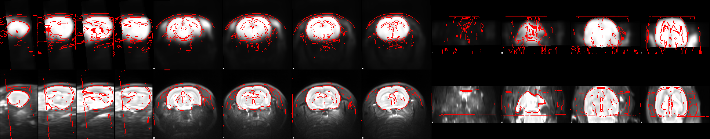
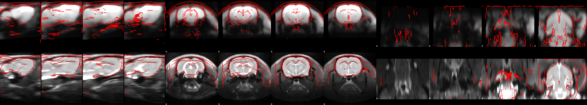
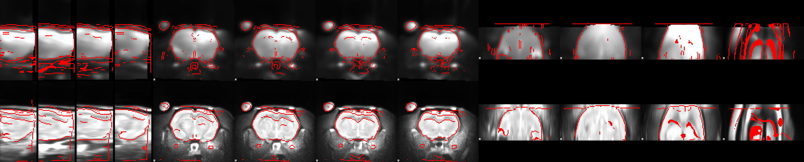
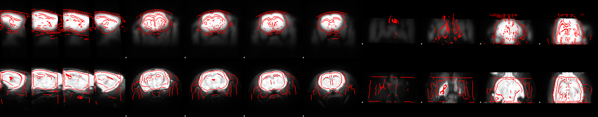
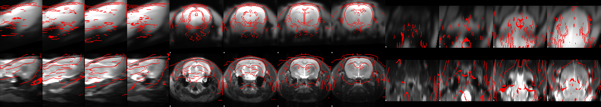
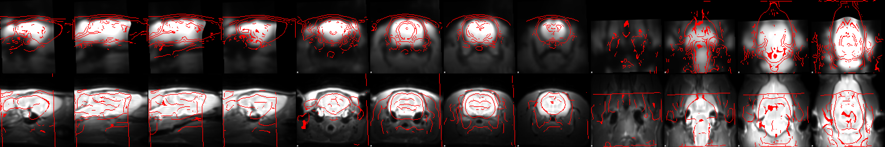

MultiRAT Quality Control
================
Joanes Grandjean

### Quality control

RABIES outputs several QA/QC images that are directly relevant to assess
image registration (Func to Anat, Anat to template, template to
commonspace), and motion parameters.

Below are several examples of Func (top row) to Anat (bottom row) for
several datasets being preprocessed. While the majority of currently
processed scans passed quality control on the basis of Func to Anat
registration, some did not. Either RABIES will need optimization to
improve the registration generalization across datasets, or scans will
need to be excluded. Importantly, the study preregistration did not make
contingency in case some scans must be excluded.

#### Passed QC

\#\#\#\#Failed QC

