MultiRAT Quality Control
================
Joanes Grandjean


### Quality control

RABIES outputs several QA/QC images that are directly relevant to assess
image registration (func to anat, anat to template, template to
standard), and motion parameters.

Below are several examples of QA/QC registration plots that have failed
the test. I have re-ran preprocessing for datasets with at least 2
failed QA/QC scans, or datasets that entirely failed QA/QC, as
registrations steps are non-deterministic. Failed registrations happen
despite consequential time was devoted to optimize the procedure. These
are often due to poor image quality or strong image artifacts.
Importantly, the study preregistration did not make contingency in case
some scans must be excluded.


```python
# init variables
init_folder='/home/traaffneu/joagra/code/MultiRat'
analysis_folder='/project/4180000.19/multiRat'
```


```python
import pandas as pd

df = pd.read_csv('../assets/table/meta_data_20210411.tsv', sep='\t')
```


```python
#so I excluded 10% of the scans. 
df['exclude'].value_counts()
```


    yes    57
    Name: exclude, dtype: int64


```python
#The major cause for exlusion are improper epi2anat corregistration 
df['exclude.reason'].value_counts()
```


    epi2anat            48
    anat2template        4
    inconsistant FOV     3
    empty files          1
    anat2tempalte        1
    Name: exclude.reason, dtype: int64


```python
#half the excluded scans from from 5 / 50 datasets
ds_exclude = df[['rat.ds', 'exclude.reason']].groupby(['rat.ds']).describe()
ds_exclude.dropna(subset=[('exclude.reason', 'top')]).sort_values(by=[('exclude.reason', 'count')],ascending=False)
```


<div>
<style scoped>
    .dataframe tbody tr th:only-of-type {
        vertical-align: middle;
    }

    .dataframe tbody tr th {
        vertical-align: top;
    }

    .dataframe thead tr th {
        text-align: left;
    }

    .dataframe thead tr:last-of-type th {
        text-align: right;
    }
</style>
<table border="1" class="dataframe">
  <thead>
    <tr>
      <th></th>
      <th colspan="4" halign="left">exclude.reason</th>
    </tr>
    <tr>
      <th></th>
      <th>count</th>
      <th>unique</th>
      <th>top</th>
      <th>freq</th>
    </tr>
    <tr>
      <th>rat.ds</th>
      <th></th>
      <th></th>
      <th></th>
      <th></th>
    </tr>
  </thead>
  <tbody>
    <tr>
      <th>2006</th>
      <td>6</td>
      <td>1</td>
      <td>epi2anat</td>
      <td>6</td>
    </tr>
    <tr>
      <th>1038</th>
      <td>6</td>
      <td>1</td>
      <td>epi2anat</td>
      <td>6</td>
    </tr>
    <tr>
      <th>1013</th>
      <td>5</td>
      <td>1</td>
      <td>epi2anat</td>
      <td>5</td>
    </tr>
    <tr>
      <th>2005</th>
      <td>5</td>
      <td>1</td>
      <td>epi2anat</td>
      <td>5</td>
    </tr>
    <tr>
      <th>1023</th>
      <td>4</td>
      <td>1</td>
      <td>epi2anat</td>
      <td>4</td>
    </tr>
    <tr>
      <th>2008</th>
      <td>3</td>
      <td>2</td>
      <td>epi2anat</td>
      <td>2</td>
    </tr>
    <tr>
      <th>2007</th>
      <td>3</td>
      <td>1</td>
      <td>inconsistant FOV</td>
      <td>3</td>
    </tr>
    <tr>
      <th>1036</th>
      <td>3</td>
      <td>1</td>
      <td>epi2anat</td>
      <td>3</td>
    </tr>
    <tr>
      <th>1031</th>
      <td>2</td>
      <td>1</td>
      <td>epi2anat</td>
      <td>2</td>
    </tr>
    <tr>
      <th>1039</th>
      <td>2</td>
      <td>1</td>
      <td>epi2anat</td>
      <td>2</td>
    </tr>
    <tr>
      <th>1014</th>
      <td>2</td>
      <td>1</td>
      <td>epi2anat</td>
      <td>2</td>
    </tr>
    <tr>
      <th>1017</th>
      <td>2</td>
      <td>1</td>
      <td>epi2anat</td>
      <td>2</td>
    </tr>
    <tr>
      <th>1037</th>
      <td>2</td>
      <td>1</td>
      <td>epi2anat</td>
      <td>2</td>
    </tr>
    <tr>
      <th>2004</th>
      <td>1</td>
      <td>1</td>
      <td>epi2anat</td>
      <td>1</td>
    </tr>
    <tr>
      <th>2003</th>
      <td>1</td>
      <td>1</td>
      <td>anat2tempalte</td>
      <td>1</td>
    </tr>
    <tr>
      <th>1040</th>
      <td>1</td>
      <td>1</td>
      <td>epi2anat</td>
      <td>1</td>
    </tr>
    <tr>
      <th>1003</th>
      <td>1</td>
      <td>1</td>
      <td>anat2template</td>
      <td>1</td>
    </tr>
    <tr>
      <th>1005</th>
      <td>1</td>
      <td>1</td>
      <td>epi2anat</td>
      <td>1</td>
    </tr>
    <tr>
      <th>1029</th>
      <td>1</td>
      <td>1</td>
      <td>epi2anat</td>
      <td>1</td>
    </tr>
    <tr>
      <th>1026</th>
      <td>1</td>
      <td>1</td>
      <td>anat2template</td>
      <td>1</td>
    </tr>
    <tr>
      <th>1021</th>
      <td>1</td>
      <td>1</td>
      <td>anat2template</td>
      <td>1</td>
    </tr>
    <tr>
      <th>1019</th>
      <td>1</td>
      <td>1</td>
      <td>epi2anat</td>
      <td>1</td>
    </tr>
    <tr>
      <th>1015</th>
      <td>1</td>
      <td>1</td>
      <td>anat2template</td>
      <td>1</td>
    </tr>
    <tr>
      <th>1010</th>
      <td>1</td>
      <td>1</td>
      <td>epi2anat</td>
      <td>1</td>
    </tr>
    <tr>
      <th>2009</th>
      <td>1</td>
      <td>1</td>
      <td>epi2anat</td>
      <td>1</td>
    </tr>
  </tbody>
</table>
</div>


Here is a summary of the excluded datasets, grouped by exclusion reasons
and datasets. Currently including only stimulus-evoked datasets.

Below are the detailed failed QA/QC tests

#### Failed template2std registration

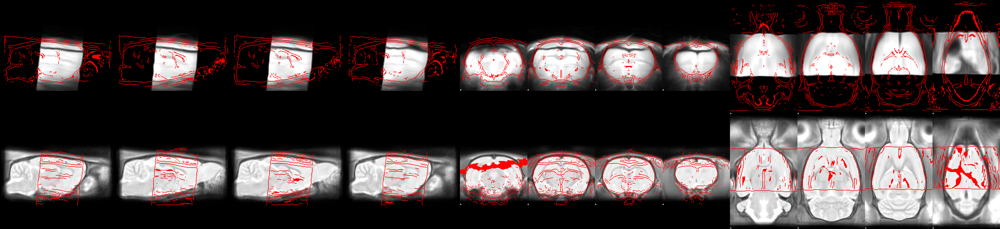
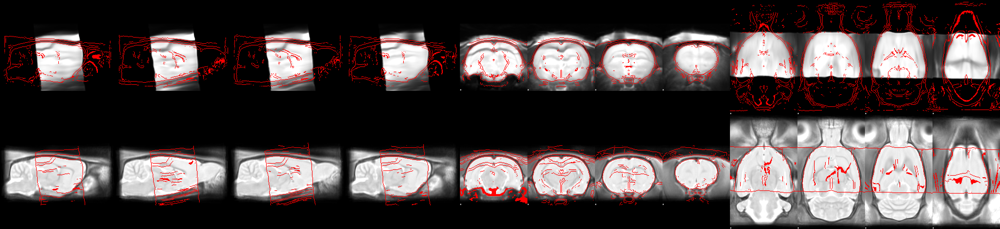

#### Failed anat2tempalte registration

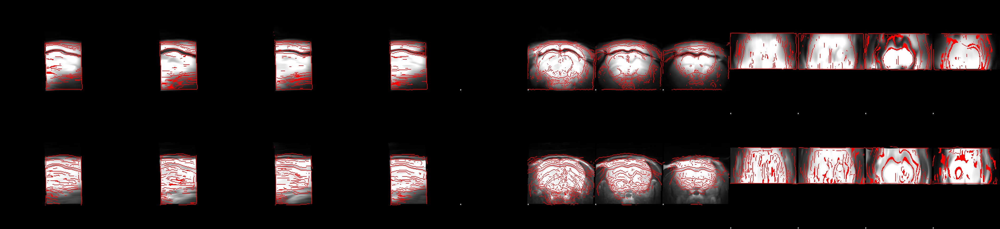

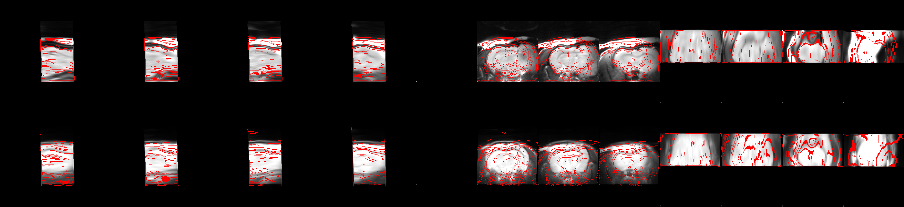

#### Failed epi2anat registration

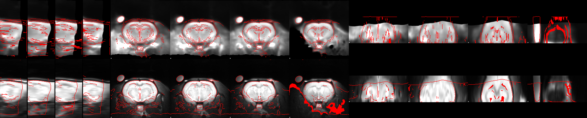

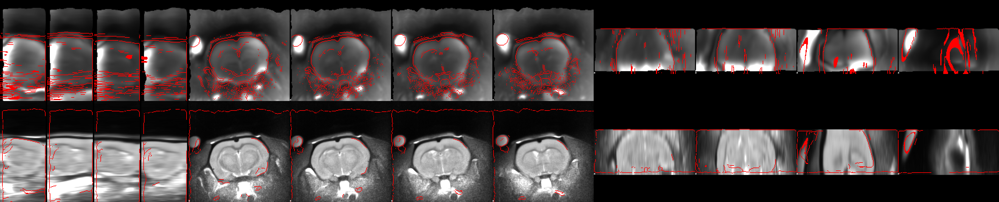

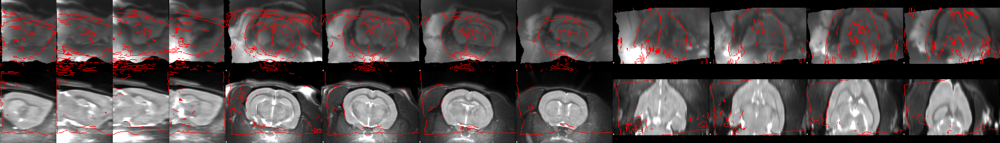

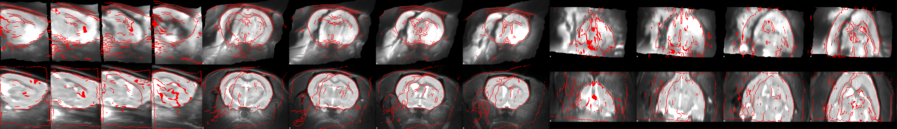

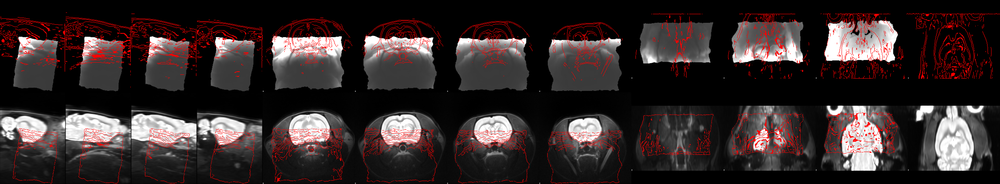

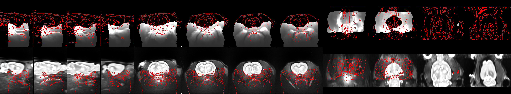

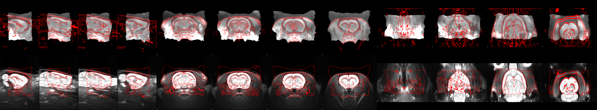

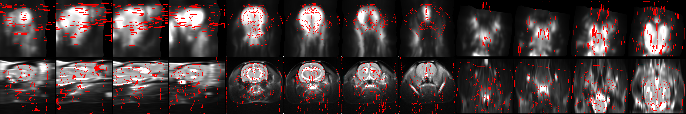
